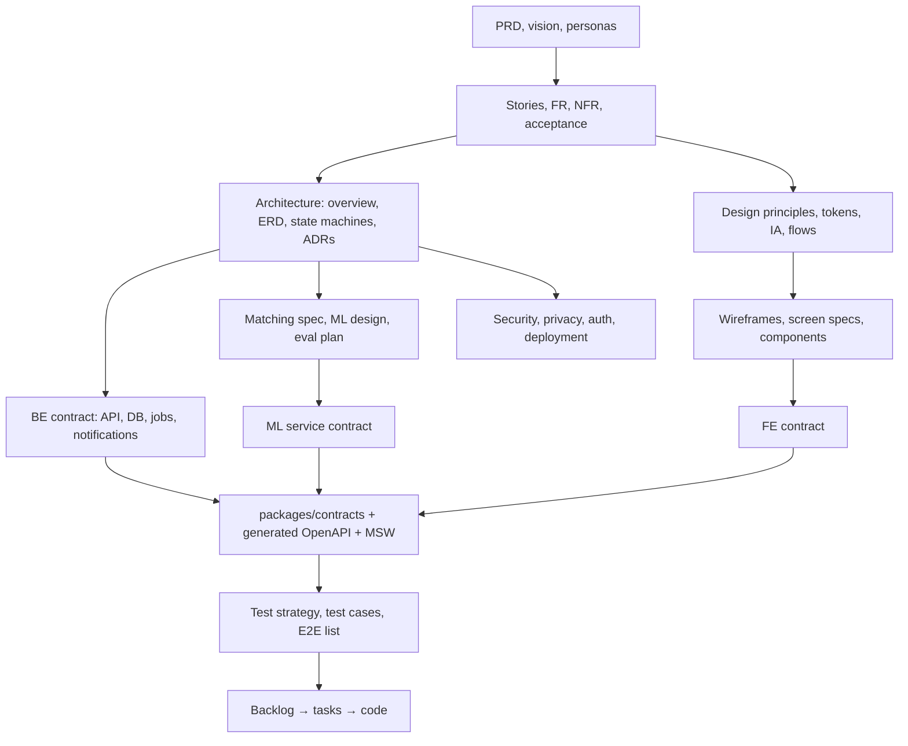
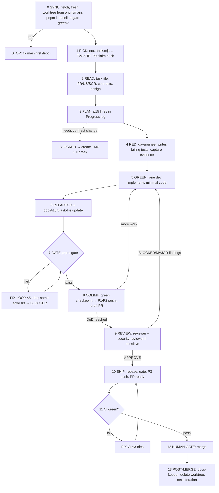

# TemuUNAIR — Agentic Build Blueprint

> One file to bootstrap the whole build: **which documents must exist** (and in what order), **the backend and frontend contracts**, **the OpenCode agent configuration**, and **the loop that ships code to git** using Orca worktrees.
> Put this file at `docs/00-BLUEPRINT.md`. Every other document is generated from it.

## Table of contents

0. How to use this file
1. Product snapshot, PDF gaps, and default decisions
2. Architecture at a glance
3. Repository layout
4. Documentation manifest (every doc the agents must write)
5. Contracts — 5A Backend · 5B Frontend · 5C Cross-boundary rules
6. Agent configuration (AGENTS.md, opencode.json, agents, commands, skills)
7. Git workflow and the agent loop (when to commit / push / PR)
8. Backlog: milestones and tasks
9. Quality, security and privacy requirements
10. Prompt pack (copy-paste prompts)
11. Templates
12. Acceptance traceability back to the PDF

---

## 0. How to use this file

### 0.1 Bootstrap in 6 steps

1. `git init temuunair`, add this file as `docs/00-BLUEPRINT.md`, add the PDF as `docs/_source/proposal.pdf` and the logo as `docs/_source/logo.png`. Push to a private GitHub repo. Turn on branch protection for `main` (§7.10).
2. Read **§1.3**. Accept the default decisions or change them now — agents treat them as law until an ADR supersedes them.
3. Open the repo in **Orca**, create a worktree `docs/bootstrap`, launch **OpenCode** in it.
4. Paste the **M0 kickoff prompt (§10.1)**. It creates every file listed in §6 (AGENTS.md, opencode.json, agents, commands, skills) plus `scripts/` and CI.
5. Run milestone M1 → M2 (docs, then contracts) **before any feature code** (§8). Merge those PRs yourself; that is the "docs approved" signal.
6. From M3 onward, fan out one Orca worktree per task/lane (§7.5) and run the loop (§7.6).

### 0.2 Tool assumptions (verify once)

| Tool | Assumption used here | Notes |
|---|---|---|
| **Orca** | The Orca ADE by `stablyai/orca`: runs CLI agents (including OpenCode) side-by-side, one git worktree per task, built-in diff review and GitHub PR/checks integration, plus an Orca CLI that agents can call. | Other projects are also called "Orca". If you meant a different one, everything still works with plain `git worktree` (fallback commands are given). Check `orca --help` for exact flags. |
| **OpenCode** | Reads `AGENTS.md` and `opencode.json` on launch; custom agents in `.opencode/agents/*.md`, slash commands in `.opencode/commands/*.md`, skills in `.opencode/skills/<name>/SKILL.md`; `permission` rules per agent; MCP servers under `mcp`. | OpenCode changes fast (a "V2" config schema with `agents`/`permissions` arrays is documented). Start it once and let it validate `opencode.json` against `$schema`; adjust key names if it complains. Glob permission semantics ("last matching rule wins") should be confirmed with a quick test. |

### 0.3 Operating principles (agents must obey; repeated in AGENTS.md)

| # | Principle |
|---|---|
| P1 | **Docs before code.** No implementation task starts until its inputs (FR, design, contract) are merged to `main`. |
| P2 | **Contracts before implementation.** Frontend and backend meet *only* through `packages/contracts` (§5C). |
| P3 | **One task = one branch = one worktree = one PR.** |
| P4 | **Test first.** "Done" means the Definition of Done gate is green and a *different* agent reviewed it. |
| P5 | **Agents never merge to `main`, never force-push shared branches, never edit outside their lane.** |
| P6 | **No silent guessing.** Every ambiguity becomes a DEC/ADR entry or a blocker file. |
| P7 | **Resumable.** Each task file has a Progress log so a fresh session can continue after a crash. |
| P8 | **The loop has hard stops**: iteration caps, stuck detection, a `.agent/STOP` file. |
| P9 | **Privacy by default.** Private verification details of found items never leave the server except through the claim rules (§5A.6). |
| P10 | **Human gates** at: contract changes, merges to `main`, migrations on shared environments, deploys, matching-threshold sign-off. |

---

## 1. Product snapshot, PDF gaps, and default decisions

### 1.1 What is being built

**TemuUNAIR** ("Lost Today, Found Together") is a web platform for Universitas Airlangga (UNAIR) where civitas akademika report lost items ("Saya Kehilangan") and found items ("Saya Menemukan"). An AI service compares reports using text, photo, location and time (multimodal matching), notifies likely matches, lets both sides verify ownership and arrange a return, and marks the case *Returned/Resolved*. Admins can verify and moderate reports. Campuses: **Kampus A, B, C, and Banyuwangi (FIKKIA)**.

### 1.2 PDF → build mapping

| PDF item | Becomes | ID prefix |
|---|---|---|
| Fitur *Pelaporan Barang* | Module REPORT | `FR-REP-*` |
| Fitur *Pencarian & Pencocokan Barang* | Modules SEARCH + MATCH (AI) | `FR-SRC-*`, `FR-MAT-*` |
| Fitur *Komunikasi & Pengembalian Barang* | Modules CLAIM (verification) + CHAT + HANDOVER | `FR-CLM-*`, `FR-CHT-*`, `FR-HND-*` |
| Fitur *Manajemen Laporan* (+ admin verification) | Modules MANAGE + ADMIN | `FR-MGT-*`, `FR-ADM-*` |
| Cara Kerja step 1 (Login UNAIR) | Module AUTH | `FR-AUTH-*` |
| Cara Kerja step 5 (Notifikasi) | Module NOTIFICATION | `FR-NTF-*` |
| Tujuan 1–5 | Project goals G1–G5 (acceptance in §12) | `G1..G5` |
| Target pengguna: Loser, Finder | Personas `P-LOSER`, `P-FINDER` (+ `P-ADMIN` added) | — |
| Tech: Next.js, Tailwind, NLP, YOLO, CLIP, RDBMS | Stack (§2) | — |
| Peran anggota | Human reviewers per lane in CODEOWNERS (§7.5) | — |

Report status vocabulary from the PDF (created → match found → returned/resolved) is preserved and extended in §5A.6.

### 1.3 Gaps in the PDF and the default decisions agents will use

| ID | Gap / risk in the PDF | Default (change here before M1 if you disagree) | Confirm with |
|---|---|---|---|
| DEC-001 | "Login with UNAIR identity" is not specified. | Auth.js with Google OAuth, restricted server-side to an allowlist of email domains from env `AUTH_ALLOWED_DOMAINS` (e.g. `unair.ac.id`, `student.unair.ac.id` — **confirm real domains**). Dev-only email magic link for non-UNAIR test accounts. | UNAIR DTI / advisor |
| DEC-002 | "MySQL/PostgreSQL". | **PostgreSQL 16 + pgvector** (relational data and embeddings in one store). | Team |
| DEC-003 | OpenAI CLIP's text encoder is English-centric; reports are in Bahasa Indonesia. | Use a **multilingual CLIP text encoder aligned to ViT-B/32** (e.g. `sentence-transformers/clip-ViT-B-32-multilingual-v1` — verify) for text↔image, plus a multilingual sentence encoder for text↔text. Decide by the eval set (ADR-0004). | ML owner |
| DEC-004 | "Verify ownership" has no mechanism. | **Hidden-detail challenge:** the finder writes 1–3 private prompts+answers (e.g. "What is the wallpaper?") that are never shown publicly. A claimant answers; the finder compares with their own answers and approves/rejects; admin arbitrates disputes. | Team |
| DEC-005 | Physical custody is unspecified. | FOUND reports declare custody: `HELD_BY_FINDER` or `AT_DROP_POINT` (admin-managed drop points, e.g. security posts). Real drop points come from UNAIR. | Stakeholders |
| DEC-006 | Roles: PDF only says "admin". | `USER`, `MODERATOR` (campus-scoped), `ADMIN`. | Team |
| DEC-007 | Report lifetime unspecified. | Auto-expire after **90 days**, warning at day 76, 30-day renew grace. Env-configurable. | Team |
| DEC-008 | Language. | UI **Bahasa Indonesia default**, English secondary; i18n from day one. | Team |
| DEC-009 | Communication channel. | **In-app chat only**, text only, tied to a claim. No phone/email shown unless a user chooses to type it. | Team |
| DEC-010 | Photo privacy. | Strip EXIF (GPS!) on upload, generate thumbnails, blur/mask photos of sensitive categories (ID/bank cards) for public views. | Team |
| DEC-011 | Hosting is unspecified. | Docker Compose for dev/staging; production target TBD (VPS or UNAIR server). ML runs on CPU (ViT-B/32 + small YOLO are fine at campus scale). | Advisor |
| DEC-012 | Matching authority. | AI output is **suggestion only**. The system never releases an item or reveals private details automatically. | Team |
| DEC-013 | Async work (matching, email). | `pg-boss` queue on PostgreSQL; separate `apps/worker`. No Redis. | Team |
| DEC-014 | Sensitive items (KTM, ATM cards, passports) carry identity-theft risk. | Category flag `isSensitive`: public photos masked, description generalized, claim needs ≥2 hints and moderator visibility. OCR "notify owner by name/NIM" is a **stretch** (needs legal review). | Legal / DPO |
| DEC-015 | Pretrained YOLO (COCO) knows ~80 classes (backpack, handbag, cell phone, laptop, umbrella, bottle…) but **not** KTM, wallet, keys, tumbler, AirPods, etc. | YOLO is a *crop helper* only. If nothing is detected, embed the full image. Add CLIP zero-shot category scores as fallback. Fine-tuning YOLO on campus items is a stretch task. | ML owner |
| DEC-016 | Ultralytics YOLO is licensed AGPL-3.0 (commercial license available). | Acceptable for coursework; **flag as RISK** and re-evaluate before public deployment (alternatives: Apache-2.0 detectors). | Advisor |
| DEC-017 | Personal data law. | Treat Indonesia's **UU PDP (Law No. 27/2022)** as a design constraint: purpose limitation, minimal data, deletion on request, retention limits. Legal review required before launch. | UNAIR legal / DPO |
| DEC-018 | Public browsing. | All browsing requires login (reduces scraping and privacy risk). Landing page and help pages are public. | Team |

### 1.4 Non-goals for the MVP

Native mobile apps, payments/rewards, automatic item release, public anonymous browsing, phone-number sharing, voice/video chat, multi-university tenancy, fine-tuning YOLO/CLIP (stretch only).

---

## 2. Architecture at a glance

```mermaid
flowchart LR
  U[Browser<br/>Next.js UI] -->|HTTPS /api/v1| W[apps/web<br/>Next.js route handlers]
  W --> DB[(PostgreSQL 16<br/>+ pgvector + pg-boss)]
  W --> S3[(S3-compatible storage<br/>MinIO in dev)]
  W -->|enqueue| Q[[pg-boss queues]]
  Q --> WK[apps/worker<br/>Node/TS]
  WK -->|internal HTTP + token| ML[services/ml<br/>FastAPI: YOLO · CLIP · NLP]
  WK --> DB
  WK --> S3
  WK --> MAIL[SMTP / email provider]
  W --> AUTH[Google OAuth<br/>domain allowlist]
```



| Layer | Default choice | Note |
|---|---|---|
| Monorepo | pnpm workspaces + Turborepo | |
| Web (UI + API) | Next.js App Router, TypeScript `strict` | PDF: Next.js |
| Styling / UI | Tailwind CSS + shadcn/ui (Radix) | PDF: Tailwind |
| Contracts | Zod schemas → OpenAPI 3.1 → generated TS client | single source of truth (§5C) |
| API style | REST under `/api/v1`, thin route handlers → `server/services/*` | |
| DB / ORM | PostgreSQL 16 + pgvector; Drizzle ORM + drizzle-kit | forward-only SQL migrations |
| Queue / worker | pg-boss; `apps/worker` | |
| ML service | Python 3.11, FastAPI, ultralytics YOLO, open_clip / sentence-transformers | PDF: YOLO, CLIP, NLP |
| Auth | Auth.js (Google provider), server-side domain check | DEC-001 |
| Storage | S3-compatible via presigned URLs | |
| Email | SMTP (Mailpit in dev) | |
| Chat | Polling first, SSE later | |
| Tests | Vitest, Testing Library, Playwright, MSW, pytest, Schemathesis, testcontainers | |
| Lint / format | ESLint + Prettier (TS), Ruff (Py) | |
| Hooks | lefthook + commitlint + gitleaks | |
| CI | GitHub Actions | |
| Local infra | Docker Compose | |

All versions are pinned in `docs/03-architecture/02-tech-stack-and-versions.md` (written in M2 by the architect agent after checking current releases).

---

## 3. Repository layout

```
temuunair/
├─ AGENTS.md                      # short, always-loaded agent rules (§6.1)
├─ opencode.json                  # OpenCode config (§6.2)
├─ .opencode/
│  ├─ agents/*.md                 # 11 agents (§6.3)
│  ├─ commands/*.md               # slash commands (§6.4)
│  └─ skills/<name>/SKILL.md      # recipes (§6.5)
├─ .agent/                        # local loop state — gitignored except lanes.json
│  ├─ lanes.json                  # lane → allowed paths (§7.5)
│  ├─ STOP                        # create this file to halt any loop
│  └─ logs/
├─ .github/
│  ├─ workflows/ci.yml
│  ├─ PULL_REQUEST_TEMPLATE.md
│  ├─ ISSUE_TEMPLATE/
│  └─ CODEOWNERS
├─ docs/                          # §4
│  ├─ 00-BLUEPRINT.md
│  ├─ 01-product/  02-design/  03-architecture/  04-contracts/
│  ├─ 05-workflow/ 06-quality/ 07-ops/  08-project/  09-course/
│  └─ _source/{proposal.pdf,logo.png}
├─ packages/
│  ├─ contracts/                  # Zod schemas, generated OpenAPI + client (§5C)
│  ├─ db/                         # Drizzle schema, migrations/, seeds/
│  ├─ ui/                         # shared UI primitives (optional)
│  └─ config/                     # tsconfig, eslint, prettier presets
├─ apps/
│  ├─ web/                        # Next.js: UI + /api/v1 route handlers
│  │  └─ src/{app,components,features,hooks,i18n,lib,server}
│  └─ worker/                     # pg-boss consumers, scheduled jobs
├─ services/
│  └─ ml/                         # FastAPI service (pyproject.toml, uv)
├─ tests/
│  ├─ e2e/                        # Playwright
│  └─ fixtures/                   # sample images, seed data
├─ scripts/
│  ├─ gate.sh  check-lane.sh  agent-loop.sh  next-task.mjs  backlog-index.mjs
│  └─ hooks/no-protected-push.sh
├─ infra/
│  ├─ docker-compose.yml          # postgres+pgvector, minio, mailpit, ml
│  └─ docker/                     # Dockerfiles
└─ .env.example
```

---

## 4. Documentation manifest (every doc the agents must write)

### 4.1 Documentation rules

- **Front-matter on every doc:** `id`, `title`, `status` (`draft → review → approved → superseded`), `owner` (agent), `updated`, `depends_on`, `source_refs` (PDF section, DEC-xxx, other docs).
- **Approved = merged to `main` by a human.** Agents implement only from merged docs.
- **Stable IDs** everywhere: `US-###`, `FR-<MOD>-###`, `NFR-###`, `SCR-###`, `CMP-###`, `API-<GRP>-##`, `DB-###`, `ADR-####`, `TC-###`, `E2E-##`, `RISK-###`, `DEC-###`, `TMU-<LANE>-###`.
- **Requirement grammar:** "The system shall …", MoSCoW priority, acceptance criteria in Gherkin.
- **Traceability:** `docs/08-project/traceability-matrix.md` links `G → US → FR → SCR → API → TC/E2E → TMU task`. A merged task is incomplete until its row is updated (docs-keeper agent).
- **Language:** docs in English; user-facing copy in Bahasa Indonesia (`id-ID`) inside design/microcopy docs.
- **Owner codes:** `SW` spec-writer · `AR` architect · `BE` backend-dev · `FE` frontend-dev · `ML` ml-dev · `QA` qa-engineer · `SR` security-reviewer · `OR` orchestrator · `DK` docs-keeper · `GS` git-steward.

### 4.2 `docs/01-product/`

| Path | Must contain | Owner | M |
|---|---|---|---|
| `01-PRD.md` | Problem, goals G1–G5 (PDF §B), non-goals, personas, scope by release (MVP / v1 / later), features F1–F4 with MoSCoW, success metrics, assumptions, dependencies, risks, open questions | SW | M1 |
| `02-vision-and-scope.md` | Vision, in/out of scope, campuses covered, release slicing | SW | M1 |
| `03-personas.md` | `P-LOSER`, `P-FINDER`, `P-ADMIN`, jobs-to-be-done, pains, devices, usage context (between classes, on the go) | SW | M1 |
| `04-user-stories.md` | `US-###` "As a … I want … so that …", linked to FR and priority | SW | M1 |
| `05-functional-requirements.md` | `FR-<MOD>-###` for AUTH, REP, SRC, MAT, CLM, CHT, HND, NTF, MGT, ADM, I18N | SW | M1 |
| `06-non-functional-requirements.md` | Performance, availability, security, privacy, accessibility, i18n, browser/device support, retention, scale numbers | SW | M1 |
| `07-acceptance-criteria.md` | Gherkin per FR incl. edge cases (duplicate reports, expired, blocked user, two claimants) | SW | M1 |
| `08-glossary.md` | Indonesian↔English: barang hilang/ditemukan, pelapor, civitas akademika, KTM, verifikasi, serah terima … | SW | M1 |
| `09-risk-register.md` | `RISK-###`: fraud/false claims, PII leak, false-positive matches, cold start, YOLO class gap, AGPL, CPU latency, SSO availability, moderator workload — likelihood, impact, mitigation, owner | SW | M1 |
| `10-roadmap.md` | Milestones M0–M9 with dates and release slices | OR | M1 |
| `11-success-metrics.md` | Activation, report→match rate, time-to-return, precision@k, claim success rate; instrumentation mapping | SW | M1 |
| `12-assumptions-and-decisions.md` | DEC table from §1.3, kept current | DK | M1 |
| `13-legal-privacy-drafts.md` | Privacy notice, terms, community guidelines, UU PDP mapping (**needs human legal review**) | SW | M1 |
| `14-operations-model.md` | Who physically runs lost-and-found (security posts?), SLAs, drop points, moderator per campus, escalation | SW | M1 |
| `15-user-research-plan.md` | Interview/survey script, usability test plan | SW | M1 |

### 4.3 `docs/02-design/`

| Path | Must contain | Owner | M |
|---|---|---|---|
| `01-design-principles.md` | Trust, speed-to-report (<60 s), privacy-first, mobile-first, friendly to campus users | SW | M1 |
| `02-brand-and-logo.md` | Logo usage, philosophy (magnifier, pin, bag, blue=trust, yellow=hope), clear-space, misuse, tagline "Lost Today, Found Together" | SW | M1 |
| `03-design-tokens.md` + `tokens.json` | Colors (sampled from `logo.png`), typography, spacing, radius, shadow, z-index, breakpoints, motion; light/dark | SW | M1 |
| `04-information-architecture.md` | Sitemap, navigation model (top nav desktop / bottom nav mobile), URL scheme | SW | M1 |
| `05-user-flows.md` | Mermaid flows: report lost, report found, match review, claim, handover, admin moderation (mirrors PDF 8-step diagram) | SW | M1 |
| `06-wireframes.md` | ASCII/mermaid wireframes per screen, mobile and desktop | SW | M1 |
| `07-screen-specs/SCR-###-*.md` | Per screen: purpose, entry points, layout regions, data (API IDs), components (CMP IDs), states, copy keys, analytics events, a11y notes | SW | M1 |
| `08-component-inventory.md` | `CMP-###` list with variants and states (source for §5B.3) | SW | M1 |
| `09-content-and-microcopy.md` | All `id-ID` strings, tone, error messages, safety tips, empty states; English mirror | SW | M1 |
| `10-accessibility.md` | WCAG 2.2 AA plan, contrast table (yellow on white fails → accent only), focus, keyboard, screen-reader labels | SW | M1 |
| `11-responsive-and-motion.md` | Breakpoints, touch targets ≥44 px, reduced-motion rules | SW | M1 |
| `12-empty-error-loading-states.md` | Per screen state designs | SW | M1 |
| `13-notification-and-email-templates.md` | Every `NotificationType` with in-app + email copy (id/en) | SW | M1 |
| `14-admin-console-design.md` | Moderation queue, dispute view, stats, locations/drop-points CRUD | SW | M1 |
| `15-onboarding-and-help.md` | First-run tour, FAQ, "how to safely hand over an item" guide | SW | M1 |

### 4.4 `docs/03-architecture/`

| Path | Must contain | Owner | M |
|---|---|---|---|
| `01-system-overview.md` | C4 levels 1–3, deployment context, trust boundaries | AR | M2 |
| `02-tech-stack-and-versions.md` | Pinned versions, why chosen, upgrade policy | AR | M2 |
| `03-data-model-erd.md` | ERD (mermaid), table purposes, PII classification per column | AR | M2 |
| `04-state-machines.md` | Report / Claim / Match machines (from §5A.6) with guards and side effects | AR | M2 |
| `05-matching-algorithm-spec.md` | Hard filters, candidate retrieval, scoring formula, weights, thresholds, explanations, cold-start, sensitive rules | AR+ML | M2 |
| `06-ml-service-design.md` | Model choices, preprocessing, batching, CPU budget, model registry, lockfile, warm-up | ML | M2 |
| `07-ml-evaluation-plan.md` | Dataset spec, metrics (Recall@k, MRR, precision at threshold), acceptance targets, error analysis | ML | M2 |
| `08-async-jobs-and-queues.md` | Queues, retries, idempotency, dead-letter, cron jobs | AR | M2 |
| `09-storage-and-media-pipeline.md` | Upload flow, validation, EXIF strip, thumbnails, masking, signed URLs, cleanup of orphans | AR | M2 |
| `10-auth-and-rbac.md` | Session model, domain allowlist, role matrix, suspension | AR | M2 |
| `11-notification-design.md` | Channels, dedupe, batching, preferences | AR | M2 |
| `12-chat-design.md` | Scope, moderation, rate limit, retention, SSE upgrade path | AR | M2 |
| `13-search-design.md` | Text search (Postgres FTS `simple` config), image search, filters, ranking | AR | M2 |
| `14-security-threat-model.md` | STRIDE per boundary, abuse cases (fake claims, scraping, spam, enumeration) | SR | M2 |
| `15-privacy-and-data-retention.md` | Data inventory, retention periods, deletion flow, log redaction, UU PDP notes | SR | M2 |
| `16-observability.md` | Structured logs, metrics, traces, alerts, audit log | AR | M2 |
| `17-performance-and-capacity.md` | Budgets, expected load, ML latency plan | AR | M2 |
| `18-deployment-topology.md` | Environments, secrets, domains, backups, scaling | AR | M2 |
| `19-i18n-design.md` | Locale routing, message format, date/time (Asia/Jakarta) | AR | M2 |
| `adr/ADR-0001…` | One decision per file: 0001 monorepo · 0002 Next.js as API · 0003 Postgres+pgvector · 0004 CLIP text encoder · 0005 pg-boss · 0006 auth · 0007 hidden-detail verification · 0008 storage & masking · 0009 YOLO role & licence · 0010 chat transport | AR | M2 |

### 4.5 `docs/04-contracts/`

| Path | Must contain | Owner | M |
|---|---|---|---|
| `README.md` | Governance (§5C), how to change a contract, versioning | AR | M2 |
| `CONTRACT_VERSION` | Single semver line, e.g. `1.0.0` | AR | M2 |
| `CHANGELOG.md` | Every contract change with PR link | DK | M2+ |
| `backend/BE-01-api-conventions.md` | §5A.1 in full | AR | M2 |
| `backend/BE-02-openapi.yaml` | **Generated** from `packages/contracts` — never hand-edited | AR | M2 |
| `backend/BE-03-endpoint-catalog.md` | §5A.3 with examples (request/response JSON) per endpoint | AR | M2 |
| `backend/BE-04-error-catalog.md` | Every `code`, HTTP status, meaning, user-facing key | AR | M2 |
| `backend/BE-05-database-contract.md` | Tables, constraints, indexes, migration rules (§5A.5) | AR | M2 |
| `backend/BE-06-ml-service-contract.md` + `ml-openapi.json` | §5A.8 | ML | M2 |
| `backend/BE-07-job-and-event-contract.md` | Queue names, payload schemas, retry policy (§5A.7) | AR | M2 |
| `backend/BE-08-notification-contract.md` | Types, payloads, channels (§5A.10) | AR | M2 |
| `backend/BE-09-auth-session-contract.md` | Cookies, CSRF, session shape, RBAC matrix (§5A.11) | AR | M2 |
| `backend/BE-10-storage-contract.md` | Upload handshake, limits, key naming, TTLs | AR | M2 |
| `backend/BE-11-env-config-contract.md` | Every env var: name, type, default, secret?, owner (§5A.12) | AR | M2 |
| `backend/BE-12-rate-limits-and-quotas.md` | Per-endpoint limits (§5A.13) | AR | M2 |
| `backend/BE-13-backend-test-contract.md` | What every endpoint test must assert (auth, validation, state, audit, idempotency) | QA | M2 |
| `frontend/FE-01-route-map.md` | §5B.1 | AR+SW | M2 |
| `frontend/FE-02-page-data-requirements.md` | Per page: API IDs, cache keys, SSR vs CSR | AR | M2 |
| `frontend/FE-03-component-contract.md` | Props, events, states per `CMP-###` (§5B.3) | AR | M2 |
| `frontend/FE-04-state-and-data-fetching.md` | Query keys, invalidation matrix, polling, optimistic rules (§5B.4) | AR | M2 |
| `frontend/FE-05-forms-and-validation.md` | Wizard steps, shared Zod schemas, error mapping (§5B.5) | AR | M2 |
| `frontend/FE-06-ui-state-matrix.md` | loading/empty/error/forbidden/offline per page (§5B.6) | AR | M2 |
| `frontend/FE-07-design-token-usage.md` | Which token for which purpose; forbidden raw values | AR | M2 |
| `frontend/FE-08-i18n-keys.md` | Key naming, namespaces, plurals (§5B.7) | AR | M2 |
| `frontend/FE-09-a11y-contract.md` | Per-component a11y requirements (§5B.8) | AR | M2 |
| `frontend/FE-10-analytics-events.md` | Event names and properties, no PII (§5B.9) | AR | M2 |
| `frontend/FE-11-error-handling-ux.md` | Error code → message/action mapping | AR | M2 |
| `frontend/FE-12-frontend-test-contract.md` | `data-testid` scheme, required component tests, E2E list (§5B.10) | QA | M2 |

### 4.6 `docs/05-workflow/`

| Path | Must contain | Owner | M |
|---|---|---|---|
| `01-git-workflow.md` | §7.1–7.3 | GS | M0 |
| `02-agent-loop.md` | §7.6 verbatim + tuning knobs (this is the file agents actually read every iteration) | OR | M0 |
| `03-orca-playbook.md` | Worktree naming, launching OpenCode per worktree, Orca CLI usage, review-diff flow, GitHub checks | GS | M0 |
| `04-opencode-playbook.md` | Agents/commands/skills catalogue, permission model, model selection per agent, how to resume | OR | M0 |
| `05-definition-of-ready-done.md` | DoR/DoD checklists (§11.7) | OR | M0 |
| `06-code-review-checklist.md` | Reviewer checklist incl. contract, privacy, a11y, tests | QA | M0 |
| `07-commit-and-pr-conventions.md` | §7.2 + PR template | GS | M0 |
| `08-ci-cd.md` | Jobs, required checks, caching, secrets | OR | M0 |
| `09-release-process.md` | Tags, changelog, deploy, rollback | GS | M0 |
| `10-parallel-lanes-and-ownership.md` | §7.5 + `.agent/lanes.json` semantics | OR | M0 |
| `11-blockers-and-escalation.md` | §7.8 | OR | M0 |
| `12-secrets-and-env-handling.md` | `.env.example`, no secrets in git, key rotation, gitleaks | SR | M0 |
| `13-coding-standards.md` | TS/Py style, folder conventions, naming, error handling, logging, "no `any`", server/client boundaries | AR | M0 |

### 4.7 `docs/06-quality/`

| Path | Must contain | Owner | M |
|---|---|---|---|
| `01-test-strategy.md` | Pyramid, tools, coverage targets, flake policy | QA | M2 |
| `02-test-cases/TC-<MOD>-###.md` | Derived from Gherkin; each maps to FR and to an automated test path | QA | per task |
| `03-e2e-scenarios.md` | `E2E-01…` (§5B.10) | QA | M2 |
| `04-ml-eval-dataset-spec.md` | Folder layout, labels, licences/consent, split, augmentation, privacy | ML | M2 |
| `05-seed-and-fixture-data.md` | Demo users, locations, drop points, sample reports, sample images | QA | M3 |
| `06-performance-budget.md` | API p95, page LCP, ML latency, bundle size | QA | M2 |
| `07-security-checklist.md` | §9.2 as a runnable checklist | SR | M8 |
| `08-accessibility-audit.md` | axe results + manual keyboard/screen-reader checks | QA | M8 |
| `09-uat-plan.md` | Participants, tasks, success criteria, feedback form | QA | M9 |
| `10-ml-eval-report-<date>.md` | Generated by `/eval-matching` | ML | M5+ |

### 4.8 `docs/07-ops/`

| Path | Must contain | Owner |
|---|---|---|
| `01-local-dev-setup.md` | Prereqs, `pnpm i`, `docker compose up`, seeds, ports, troubleshooting | OR |
| `02-deployment-runbook.md` | Build, migrate, deploy, smoke tests, rollback | OR |
| `03-backup-restore.md` | DB + object storage backups, restore drill | OR |
| `04-monitoring-and-alerts.md` | Health checks, dashboards, alert thresholds | OR |
| `05-incident-response.md` | Severity levels, comms, post-mortem template | OR |
| `06-admin-operations-guide.md` | Moderating reports, resolving disputes, managing drop points | SW |
| `07-model-management.md` | Updating YOLO/CLIP, `models.lock.json`, re-embedding, A/B via `algo_version` | ML |

### 4.9 `docs/08-project/` and `docs/09-course/`

| Path | Purpose |
|---|---|
| `tasks/TMU-<LANE>-###.md` | One file per task (template §11.2); scheduler reads its front-matter |
| `backlog.md` | Generated index (`scripts/backlog-index.mjs`) — never hand-edited |
| `status.md` | Generated dashboard: per milestone done/in-progress/blocked |
| `traceability-matrix.md` | G → US → FR → SCR → API → TC → TMU |
| `decisions-log.md` | Chronological DEC/ADR index |
| `blockers/BLK-###.md` | Blocker files (template §11.4) |
| `reviews/TMU-###.md` | Reviewer reports |
| `changelog.md` | Keep-a-Changelog format, updated per release |
| `09-course/README.md` | Mapping of course deliverables (report Bab I–III, presentation, demo) to repo artifacts |
| `09-course/demo-script.md` | 8-step demo following the PDF's "Cara Kerja" |
| `09-course/report-outline.md` | Outline for the written report, auto-derived from docs |

### 4.10 Generation order (dependency graph)



Agents must not start a node before its parents are merged.

---

## 5. Contracts

Two separate contracts, one shared source of truth.

- **Backend contract (5A)** — what the server promises: HTTP API, database, jobs, ML service, notifications, auth, config.
- **Frontend contract (5B)** — what the UI promises: routes, page data needs, components, state, forms, states, i18n, a11y, analytics, test hooks.
- **Cross-boundary rules (5C)** — how they stay in sync, who may change them, how parallel FE/BE work is possible.

### 5.0 Governance (applies to both)

1. **Contract-first.** A feature task may not change behaviour that is not already described in a merged contract. If the contract is missing or wrong → stop, create a `TMU-CTR-*` task.
2. **Single source:** `packages/contracts` (Zod). Everything else (OpenAPI, TS client, MSW handlers, docs tables) is generated.
3. **Versioning:** `docs/04-contracts/CONTRACT_VERSION` follows semver. Additive optional fields/endpoints = minor. Renames/removals/semantic changes = major (needs `/api/v2` or a migration plan) and an ADR.
4. **Change protocol:** contract PR (label `contract`) merges *first*; dependent FE/BE branches rebase afterwards. Both a backend-lane and a frontend-lane human reviewer must approve.
5. **Never-break rule:** a merged contract cannot be edited in place by a feature PR; only `TMU-CTR-*` PRs touch `packages/contracts/**` and `docs/04-contracts/**`.
6. **Tag** each accepted contract set: `contract-v<semver>`.

---

## 5A. Backend contract

### 5A.1 Conventions (`BE-01`)

| Topic | Rule |
|---|---|
| Base path | `/api/v1`; JSON UTF-8; `camelCase` in API, `snake_case` in DB |
| IDs | UUIDv7 strings (time-sortable) |
| Time | ISO-8601 with offset in API and DB (`timestamptz`); UI renders `Asia/Jakarta` (WIB) |
| Auth | Session cookie (`httpOnly`, `Secure`, `SameSite=Lax`). Mutations additionally require same-origin `Origin` check and header `X-Requested-With: temuunair` |
| Pagination | Cursor: `?limit=20&cursor=<opaque>` → `{ data: T[], page: { nextCursor: string \| null, hasMore: boolean } }`; `limit` max 50 |
| Errors | `{ error: { code, message, details?, requestId } }`, `code` from §5A.14; header `X-Request-Id` on every response |
| Idempotency | `Idempotency-Key` header required on `POST /reports`, `POST /claims`, `POST /uploads`; same key + same body within 24 h returns the original response; same key + different body → `IDEMPOTENCY_CONFLICT` |
| Concurrency | Mutable resources carry `version`; `PATCH` requires `If-Match: <version>` → `409 CONFLICT_STATE` on mismatch |
| Filtering | Query params named after fields; multi-value via repeated params (`?category=PHONE&category=LAPTOP_TABLET`) |
| Sorting | `sort=-createdAt` (prefix `-` = desc); allow-listed fields only |
| Privacy | Never return: hint answers (except to the finder/admin), other users' emails, exact geo of sensitive items, embeddings, internal scores except `band`+`reasons` |
| Rate limits | §5A.13 |
| Uploads | Two-step presigned upload (§5A.3 `API-UPL-*`); ≤5 images/report; ≤8 MB each; `image/jpeg`, `image/png`, `image/webp`, `image/heic` (converted to JPEG server-side) |
| Soft delete | Reports are never hard-deleted by users (cancel/expire/remove); account deletion anonymizes (§9.2) |

### 5A.2 Enumerations

| Enum | Values |
|---|---|
| `ReportType` | `LOST`, `FOUND` |
| `ReportStatus` | `PENDING_REVIEW`, `OPEN`, `MATCHED`, `IN_VERIFICATION`, `RETURNED`, `EXPIRED`, `CANCELLED`, `REMOVED` |
| `Category` | `ID_CARD`, `BANK_CARD`, `WALLET`, `PHONE`, `LAPTOP_TABLET`, `EARPHONES`, `CHARGER_CABLE`, `KEYS`, `BAG`, `CLOTHING`, `GLASSES`, `BOTTLE`, `BOOK_DOCUMENT`, `STATIONERY`, `ACCESSORY`, `SPORTS_GEAR`, `UMBRELLA`, `HELMET`, `OTHER` (sensitive: `ID_CARD`, `BANK_CARD`; `WALLET` = sensitive-lite) |
| `Campus` | `KAMPUS_A`, `KAMPUS_B`, `KAMPUS_C`, `BANYUWANGI` |
| `Custody` | `HELD_BY_FINDER`, `AT_DROP_POINT` |
| `MatchState` | `SUGGESTED`, `DISMISSED`, `CLAIMED`, `INVALIDATED` |
| `MatchBand` | `STRONG`, `POSSIBLE` |
| `ClaimStatus` | `SUBMITTED`, `APPROVED`, `REJECTED`, `DISPUTED`, `COMPLETED`, `CANCELLED`, `EXPIRED` |
| `UserRole` | `USER`, `MODERATOR`, `ADMIN` |
| `FlagReason` | `SPAM`, `INAPPROPRIATE`, `PRIVACY`, `FRAUD`, `DUPLICATE`, `OTHER` |
| `NotificationType` | §5A.10 |

### 5A.3 Endpoint catalog (`BE-03`)

`Auth`: **U** = any logged-in user · **O** = owner of resource · **P** = party to the claim · **M** = moderator/admin (campus-scoped for moderators) · **A** = admin only · **—** = public.

| ID | Method & path | Auth | Request → Response (schema names from §5A.4) | Notable errors |
|---|---|---|---|---|
| API-SYS-01 | `GET /healthz` | — | → `{status:"ok"}` | — |
| API-SYS-02 | `GET /readyz` | — | → `{db,storage,ml}` each `ok\|degraded\|down` | — |
| API-META-01 | `GET /meta/categories` | U | → `CategoryMeta[]` (value, i18n key, isSensitive, hint prompts suggestions) | — |
| API-META-02 | `GET /meta/campuses` | U | → `CampusMeta[]` | — |
| API-META-03 | `GET /meta/locations?campus=` | U | → `LocationMeta[]` | `VALIDATION_FAILED` |
| API-META-04 | `GET /meta/drop-points?campus=` | U | → `DropPointMeta[]` | — |
| API-ME-01 | `GET /me` | U | → `Me` | `AUTH_REQUIRED` |
| API-ME-02 | `PATCH /me` | U | `MeUpdate` → `Me` | `VALIDATION_FAILED` |
| API-ME-03 | `DELETE /me` | U | → `202` (deletion scheduled) | — |
| API-ME-04 | `GET /me/notification-preferences` | U | → `NotificationPrefs` | — |
| API-ME-05 | `PUT /me/notification-preferences` | U | `NotificationPrefs` → same | — |
| API-UPL-01 | `POST /uploads` | U | `UploadInit{mime,sizeBytes,sha256?}` → `{uploadId,uploadUrl,expiresAt}` | `UPLOAD_INVALID_TYPE`, `UPLOAD_TOO_LARGE`, `RATE_LIMITED` |
| API-UPL-02 | `POST /uploads/{id}/complete` | O | → `UploadState` (server validates, strips EXIF, thumbnails) | `UPLOAD_INVALID_TYPE` |
| API-UPL-03 | `GET /uploads/{id}` | O | → `UploadState{status:PENDING\|READY\|REJECTED, thumbUrl?}` | `NOT_FOUND` |
| API-REP-01 | `POST /reports` | U | `ReportCreate` → `ReportOwnerView` (201) | `VALIDATION_FAILED`, `RATE_LIMITED`, `UPLOAD_LIMIT_REACHED` |
| API-REP-02 | `GET /reports` | U | filters `ReportQuery` → `Paged<ReportPublic>` (opposite-type default; see below) | — |
| API-REP-03 | `GET /reports/mine` | U | `?type&status` → `Paged<ReportOwnerView>` | — |
| API-REP-04 | `GET /reports/{id}` | U | → `ReportPublic` or `ReportOwnerView` (if owner) or `ReportModeratorView` (if M) | `NOT_FOUND` |
| API-REP-05 | `PATCH /reports/{id}` | O | `ReportUpdate` + `If-Match` → `ReportOwnerView` | `CONFLICT_STATE`, `FORBIDDEN` |
| API-REP-06 | `POST /reports/{id}/cancel` | O | `{reason?}` → `ReportOwnerView` | `CONFLICT_STATE` |
| API-REP-07 | `POST /reports/{id}/renew` | O | → `ReportOwnerView` | `CONFLICT_STATE` |
| API-REP-08 | `POST /reports/{id}/flag` | U | `{reason,note?}` → `204` | `RATE_LIMITED` |
| API-SRC-01 | `POST /search` | U | `SearchRequest{q?,imageUploadId?,filters}` → `Paged<SearchHit>` (hit = `ReportPublic` + `band?` + `reasons`) | `VALIDATION_FAILED` (neither q nor image) |
| API-MAT-01 | `GET /reports/{id}/matches` | O | → `MatchView[]` (sorted by score desc) | `FORBIDDEN` |
| API-MAT-02 | `POST /matches/{id}/dismiss` | P | → `MatchView` | `CONFLICT_STATE` |
| API-MAT-03 | `POST /matches/{id}/invite` | finder | → `204` (notifies owner "your item may be found") | `RATE_LIMITED` |
| API-MAT-04 | `POST /reports/{id}/rematch` | O | → `202` (enqueue `report.match`) | `RATE_LIMITED` (1/10 min) |
| API-CLM-01 | `GET /reports/{id}/challenge` | U (not owner) | → `Challenge{items:[{hintId,prompt}]}` | `REPORT_NOT_CLAIMABLE`, `SELF_CLAIM_NOT_ALLOWED` |
| API-CLM-02 | `POST /claims` | U | `ClaimCreate` → `ClaimView` (201) | `CLAIM_ALREADY_ACTIVE`, `CLAIM_LIMIT_EXCEEDED`, `REPORT_NOT_CLAIMABLE` |
| API-CLM-03 | `GET /claims?role=claimant\|finder&status=` | U | → `Paged<ClaimView>` | — |
| API-CLM-04 | `GET /claims/{id}` | P,M | → `ClaimView` (finder side includes claimant answers **and** own expected answers) | `FORBIDDEN` |
| API-CLM-05 | `POST /claims/{id}/approve` | finder,M | `{note?}` → `ClaimView` | `CONFLICT_STATE` |
| API-CLM-06 | `POST /claims/{id}/reject` | finder,M | `{reason}` → `ClaimView` | `CONFLICT_STATE` |
| API-CLM-07 | `PUT /claims/{id}/handover-plan` | P | `{place,at,note?}` → `ClaimView` | `CONFLICT_STATE` |
| API-CLM-08 | `POST /claims/{id}/confirm-handover` | P | → `ClaimView` (COMPLETED when both confirmed) | `CONFLICT_STATE` |
| API-CLM-09 | `POST /claims/{id}/cancel` | claimant | → `ClaimView` | `CONFLICT_STATE` |
| API-CLM-10 | `POST /claims/{id}/dispute` | P | `{reason}` → `ClaimView` | `CONFLICT_STATE` |
| API-CHT-01 | `GET /claims/{id}/messages` | P,M | cursor → `Paged<Message>` | `FORBIDDEN` |
| API-CHT-02 | `POST /claims/{id}/messages` | P | `{body}` → `Message` | `RATE_LIMITED`, `CONFLICT_STATE` (claim closed) |
| API-CHT-03 | `GET /claims/{id}/stream` | P | SSE `message`, `claim.updated` (phase 2) | — |
| API-CHT-04 | `POST /claims/{id}/messages/read` | P | `{upToMessageId}` → `204` | — |
| API-NTF-01 | `GET /notifications` | U | cursor → `Paged<Notification>` | — |
| API-NTF-02 | `POST /notifications/{id}/read` | O | → `204` | — |
| API-NTF-03 | `POST /notifications/read-all` | U | → `204` | — |
| API-NTF-04 | `GET /notifications/unread-count` | U | → `{count}` | — |
| API-ADM-01 | `GET /admin/reports` | M | filters (`status=PENDING_REVIEW`, flagged) → `Paged<ReportModeratorView>` | — |
| API-ADM-02 | `POST /admin/reports/{id}/approve` | M | → `ReportModeratorView` | `CONFLICT_STATE` |
| API-ADM-03 | `POST /admin/reports/{id}/remove` | M | `{reason}` → `ReportModeratorView` | `CONFLICT_STATE` |
| API-ADM-04 | `POST /admin/reports/{id}/restore` | A | → `ReportModeratorView` | `CONFLICT_STATE` |
| API-ADM-05 | `GET /admin/claims?status=` | M | → `Paged<ClaimView>` | — |
| API-ADM-06 | `POST /admin/claims/{id}/resolve` | M | `{decision:APPROVE\|REJECT,note}` → `ClaimView` | `CONFLICT_STATE` |
| API-ADM-07 | `GET /admin/users` | A | `?q&role&status` → `Paged<AdminUser>` | — |
| API-ADM-08 | `POST /admin/users/{id}/suspend` | A | `{reason}` → `AdminUser` | — |
| API-ADM-09 | `POST /admin/users/{id}/unsuspend` | A | → `AdminUser` | — |
| API-ADM-10 | `PATCH /admin/users/{id}/role` | A | `{role}` → `AdminUser` | `FORBIDDEN` (cannot demote self) |
| API-ADM-11 | `GET /admin/stats?from&to&campus` | M | → `AdminStats` | — |
| API-ADM-12 | `GET/POST/PATCH /admin/locations[/{id}]` | A | `LocationUpsert` | `VALIDATION_FAILED` |
| API-ADM-13 | `GET/POST/PATCH /admin/drop-points[/{id}]` | A | `DropPointUpsert` | — |
| API-ADM-14 | `GET /admin/audit-logs` | A | filters → `Paged<AuditLog>` | — |
| API-ADM-15 | `POST /admin/matching/reindex` | A | `{scope}` → `202` | `RATE_LIMITED` |
| API-ADM-16 | `GET /admin/flags` | M | → `Paged<Flag>` | — |
| API-ADM-17 | `POST /admin/flags/{id}/resolve` | M | `{action,note}` → `Flag` | — |

**Visibility rules for `GET /reports` and `/search` (enforced in the service layer, tested):**
default returns only `OPEN`/`MATCHED` reports of the *opposite* type of the caller's active intent (`?type=` overrides); never returns the caller's own reports; hides `PENDING_REVIEW/REMOVED/CANCELLED/EXPIRED/RETURNED`; masks sensitive photos and generalizes title/description for sensitive categories.

### 5A.4 Core schemas (Zod — lives in `packages/contracts/src`)

```ts
// common.ts
import { z } from "zod";
export const Uuid = z.string().uuid();
export const IsoDateTime = z.string().datetime({ offset: true });
export const ReportType = z.enum(["LOST", "FOUND"]);
export const ReportStatus = z.enum(["PENDING_REVIEW","OPEN","MATCHED","IN_VERIFICATION","RETURNED","EXPIRED","CANCELLED","REMOVED"]);
export const Category = z.enum(["ID_CARD","BANK_CARD","WALLET","PHONE","LAPTOP_TABLET","EARPHONES","CHARGER_CABLE","KEYS","BAG","CLOTHING","GLASSES","BOTTLE","BOOK_DOCUMENT","STATIONERY","ACCESSORY","SPORTS_GEAR","UMBRELLA","HELMET","OTHER"]);
export const Campus = z.enum(["KAMPUS_A","KAMPUS_B","KAMPUS_C","BANYUWANGI"]);
export const Custody = z.enum(["HELD_BY_FINDER","AT_DROP_POINT"]);
export const MatchBand = z.enum(["STRONG","POSSIBLE"]);
export const ErrorEnvelope = z.object({
  error: z.object({ code: z.string(), message: z.string(), details: z.record(z.unknown()).optional(), requestId: z.string() }),
});
export const PageMeta = z.object({ nextCursor: z.string().nullable(), hasMore: z.boolean() });
export const paged = <T extends z.ZodTypeAny>(item: T) => z.object({ data: z.array(item), page: PageMeta });

// report.ts
export const GeoPoint = z.object({ lat: z.number().min(-90).max(90), lng: z.number().min(-180).max(180) });
export const LocationInput = z.object({
  campus: Campus, locationId: Uuid.optional(), note: z.string().max(200).optional(), geo: GeoPoint.optional(),
});
export const OccurredAt = z.object({ from: IsoDateTime, to: IsoDateTime.optional() }); // LOST: window; FOUND: from = time found
export const VerificationHintInput = z.object({ prompt: z.string().min(5).max(140), answer: z.string().min(1).max(200) });

export const ReportCreate = z.object({
  type: ReportType,
  category: Category,
  title: z.string().min(3).max(80),
  description: z.string().min(10).max(1000),
  colors: z.array(z.string().max(30)).max(3).default([]),
  brand: z.string().max(60).optional(),
  imageIds: z.array(Uuid).max(5).default([]),
  location: LocationInput,
  occurredAt: OccurredAt,
  custody: Custody.optional(),            // required when type=FOUND
  dropPointId: Uuid.optional(),           // required when custody=AT_DROP_POINT
  verificationHints: z.array(VerificationHintInput).max(3).optional(), // FOUND only; never echoed back
});
// Cross-field rules enforced by `superRefine` AND re-checked in the service layer:
//  FOUND  → ≥1 image, custody required, ≥1 hint (≥2 if category is sensitive)
//  LOST   → images optional; hints/custody forbidden
//  occurredAt.from ≤ now; occurredAt.to ≥ from; date not older than 180 days for LOST

export const ReportPublic = z.object({
  id: Uuid, type: ReportType, status: ReportStatus, category: Category,
  title: z.string(), description: z.string(), colors: z.array(z.string()), brand: z.string().nullable(),
  images: z.array(z.object({ id: Uuid, thumbUrl: z.string().url(), url: z.string().url().nullable(), masked: z.boolean() })),
  campus: Campus, locationLabel: z.string().nullable(),
  occurredAt: OccurredAt, custody: Custody.nullable(), dropPointLabel: z.string().nullable(),
  reporter: z.object({ displayName: z.string() }),          // first name + initial only
  isSensitive: z.boolean(), createdAt: IsoDateTime, expiresAt: IsoDateTime,
});
export const ReportOwnerView = ReportPublic.extend({
  version: z.number().int(), matchCount: z.number().int(), hintPrompts: z.array(z.object({ id: Uuid, prompt: z.string() })),
  activeClaimId: Uuid.nullable(), geo: GeoPoint.nullable(),
});

// match.ts
export const MatchReason = z.object({
  code: z.enum(["IMAGE_SIMILAR","TEXT_SIMILAR","COLOR_MATCH","BRAND_MATCH","SAME_BUILDING","SAME_CAMPUS","TIME_CLOSE","CATEGORY_MATCH"]),
  labelKey: z.string(),                                       // i18n key, UI translates
});
export const MatchView = z.object({
  id: Uuid, state: z.enum(["SUGGESTED","DISMISSED","CLAIMED","INVALIDATED"]),
  band: MatchBand, score: z.number().min(0).max(1), reasons: z.array(MatchReason),
  other: ReportPublic, createdAt: IsoDateTime,
});

// claim.ts
export const ClaimCreate = z.object({
  foundReportId: Uuid, lostReportId: Uuid.optional(),
  answers: z.array(z.object({ hintId: Uuid, answer: z.string().min(1).max(200) })).min(1).max(3),
  note: z.string().max(500).optional(),
});
export const ClaimStatus = z.enum(["SUBMITTED","APPROVED","REJECTED","DISPUTED","COMPLETED","CANCELLED","EXPIRED"]);
export const ClaimView = z.object({
  id: Uuid, status: ClaimStatus, foundReportId: Uuid, lostReportId: Uuid.nullable(),
  claimant: z.object({ displayName: z.string() }), finder: z.object({ displayName: z.string() }),
  answers: z.array(z.object({ hintId: Uuid, prompt: z.string(), claimantAnswer: z.string(), expectedAnswer: z.string().nullable() })), // expectedAnswer only for finder/moderator
  handoverPlan: z.object({ place: z.string(), at: IsoDateTime, note: z.string().nullable() }).nullable(),
  finderConfirmedAt: IsoDateTime.nullable(), claimantConfirmedAt: IsoDateTime.nullable(),
  decisionReason: z.string().nullable(), expiresAt: IsoDateTime, createdAt: IsoDateTime,
});

// message.ts / notification.ts
export const Message = z.object({ id: Uuid, claimId: Uuid, senderId: Uuid, mine: z.boolean(), body: z.string().max(1000), createdAt: IsoDateTime, readAt: IsoDateTime.nullable() });
export const Notification = z.object({ id: Uuid, type: z.string(), payload: z.record(z.unknown()), readAt: IsoDateTime.nullable(), createdAt: IsoDateTime });
```

The agent completes the remaining schemas (`ReportUpdate`, `ReportQuery`, `SearchRequest`, `SearchHit`, `UploadInit`, `UploadState`, `Me`, `MeUpdate`, `NotificationPrefs`, `Challenge`, admin schemas, meta schemas) following the same style and generates the OpenAPI document from them.

### 5A.5 Database contract (`BE-05`)

Rules: forward-only SQL migrations named `NNNN_description.sql`; **never edit a merged migration**; one migration-touching PR open at a time (§7.5); every migration ships with a rollback note; seeds are separate from migrations; `CREATE INDEX CONCURRENTLY` for large tables; `snake_case`; every table has `id uuid pk`, `created_at`, `updated_at`.

```sql
CREATE EXTENSION IF NOT EXISTS vector;
CREATE EXTENSION IF NOT EXISTS citext;

CREATE TYPE user_role AS ENUM ('USER','MODERATOR','ADMIN');
CREATE TYPE campus AS ENUM ('KAMPUS_A','KAMPUS_B','KAMPUS_C','BANYUWANGI');
CREATE TYPE report_type AS ENUM ('LOST','FOUND');
CREATE TYPE report_status AS ENUM ('PENDING_REVIEW','OPEN','MATCHED','IN_VERIFICATION','RETURNED','EXPIRED','CANCELLED','REMOVED');
CREATE TYPE claim_status AS ENUM ('SUBMITTED','APPROVED','REJECTED','DISPUTED','COMPLETED','CANCELLED','EXPIRED');
CREATE TYPE match_state AS ENUM ('SUGGESTED','DISMISSED','CLAIMED','INVALIDATED');

CREATE TABLE users (
  id uuid PRIMARY KEY, email citext UNIQUE NOT NULL, display_name text NOT NULL,
  unair_ref text,                       -- NIM/NIP if provided; never exposed; nullable
  role user_role NOT NULL DEFAULT 'USER', moderator_campus campus,
  locale text NOT NULL DEFAULT 'id', status text NOT NULL DEFAULT 'ACTIVE' CHECK (status IN ('ACTIVE','SUSPENDED','DELETED')),
  last_login_at timestamptz, created_at timestamptz NOT NULL DEFAULT now(), updated_at timestamptz NOT NULL DEFAULT now()
);
-- + Auth.js adapter tables: accounts, sessions, verification_tokens

CREATE TABLE locations (
  id uuid PRIMARY KEY, campus campus NOT NULL, name text NOT NULL, kind text NOT NULL,   -- BUILDING|ROOM|CANTEEN|LIBRARY|PARKING|PRAYER|SPORT|OUTDOOR|OTHER
  parent_id uuid REFERENCES locations(id), lat double precision, lng double precision, active boolean NOT NULL DEFAULT true
);
CREATE TABLE drop_points (
  id uuid PRIMARY KEY, campus campus NOT NULL, location_id uuid REFERENCES locations(id), name text NOT NULL,
  hours jsonb, contact_note text, active boolean NOT NULL DEFAULT true
);

CREATE TABLE reports (
  id uuid PRIMARY KEY, type report_type NOT NULL, status report_status NOT NULL DEFAULT 'OPEN',
  reporter_id uuid NOT NULL REFERENCES users(id),
  category text NOT NULL, is_sensitive boolean NOT NULL DEFAULT false,
  title text NOT NULL, description text NOT NULL, colors text[] NOT NULL DEFAULT '{}', brand text,
  campus campus NOT NULL, location_id uuid REFERENCES locations(id), location_note text, lat double precision, lng double precision,
  occurred_from timestamptz NOT NULL, occurred_to timestamptz,
  custody text CHECK (custody IN ('HELD_BY_FINDER','AT_DROP_POINT')), drop_point_id uuid REFERENCES drop_points(id),
  expires_at timestamptz NOT NULL, resolved_at timestamptz,
  search_tsv tsvector,                  -- 'simple' config: Postgres has no built-in Indonesian dictionary
  version int NOT NULL DEFAULT 1, created_at timestamptz NOT NULL DEFAULT now(), updated_at timestamptz NOT NULL DEFAULT now(),
  CHECK ((type = 'FOUND') = (custody IS NOT NULL))
);
CREATE INDEX reports_browse_idx ON reports (type, status, campus, created_at DESC);
CREATE INDEX reports_reporter_idx ON reports (reporter_id, created_at DESC);
CREATE INDEX reports_tsv_idx ON reports USING gin (search_tsv);
CREATE INDEX reports_expiry_idx ON reports (expires_at) WHERE status IN ('OPEN','MATCHED');

CREATE TABLE report_images (
  id uuid PRIMARY KEY, report_id uuid REFERENCES reports(id) ON DELETE CASCADE, uploader_id uuid NOT NULL REFERENCES users(id),
  storage_key text NOT NULL, thumb_key text, masked_key text, mime text NOT NULL, width int, height int, sha256 text,
  status text NOT NULL DEFAULT 'PENDING' CHECK (status IN ('PENDING','READY','REJECTED')), position smallint NOT NULL DEFAULT 0
);
CREATE TABLE verification_hints (         -- FOUND only; answers encrypted at app level (AES-GCM, FIELD_ENCRYPTION_KEY)
  id uuid PRIMARY KEY, report_id uuid NOT NULL REFERENCES reports(id) ON DELETE CASCADE, prompt text NOT NULL, answer_enc bytea NOT NULL
);

CREATE TABLE image_features (
  image_id uuid PRIMARY KEY REFERENCES report_images(id) ON DELETE CASCADE,
  embedding vector(512) NOT NULL,        -- CLIP ViT-B/32 image space
  detection jsonb, quality jsonb, category_scores jsonb, model_versions jsonb NOT NULL
);
CREATE TABLE report_features (
  report_id uuid PRIMARY KEY REFERENCES reports(id) ON DELETE CASCADE,
  image_embedding vector(512),           -- mean of L2-normalised image embeddings (nullable)
  clip_text_embedding vector(512),       -- multilingual text encoder in CLIP space
  sentence_embedding vector(384),        -- text↔text similarity
  attributes jsonb NOT NULL DEFAULT '{}', model_versions jsonb NOT NULL, processed_at timestamptz NOT NULL
);
CREATE INDEX report_features_img_hnsw ON report_features USING hnsw (image_embedding vector_cosine_ops);
CREATE INDEX report_features_txt_hnsw ON report_features USING hnsw (clip_text_embedding vector_cosine_ops);
CREATE INDEX report_features_sent_hnsw ON report_features USING hnsw (sentence_embedding vector_cosine_ops);

CREATE TABLE matches (
  id uuid PRIMARY KEY, lost_report_id uuid NOT NULL REFERENCES reports(id), found_report_id uuid NOT NULL REFERENCES reports(id),
  score numeric(4,3) NOT NULL, band text NOT NULL, reasons jsonb NOT NULL, components jsonb NOT NULL,  -- per-signal scores for debugging/eval
  state match_state NOT NULL DEFAULT 'SUGGESTED', algo_version text NOT NULL,
  created_at timestamptz NOT NULL DEFAULT now(), updated_at timestamptz NOT NULL DEFAULT now(),
  UNIQUE (lost_report_id, found_report_id)
);
CREATE TABLE claims (
  id uuid PRIMARY KEY, found_report_id uuid NOT NULL REFERENCES reports(id), lost_report_id uuid REFERENCES reports(id),
  claimant_id uuid NOT NULL REFERENCES users(id), status claim_status NOT NULL DEFAULT 'SUBMITTED', note text,
  handover_place text, handover_at timestamptz, finder_confirmed_at timestamptz, claimant_confirmed_at timestamptz,
  decided_by uuid REFERENCES users(id), decision_reason text, expires_at timestamptz NOT NULL,
  created_at timestamptz NOT NULL DEFAULT now(), updated_at timestamptz NOT NULL DEFAULT now()
);
CREATE UNIQUE INDEX claims_one_active_per_claimant ON claims (found_report_id, claimant_id) WHERE status IN ('SUBMITTED','APPROVED','DISPUTED');
CREATE UNIQUE INDEX claims_one_approved_per_report ON claims (found_report_id) WHERE status = 'APPROVED';
CREATE TABLE claim_answers (claim_id uuid REFERENCES claims(id) ON DELETE CASCADE, hint_id uuid REFERENCES verification_hints(id), answer text NOT NULL, PRIMARY KEY (claim_id, hint_id));

CREATE TABLE messages (id uuid PRIMARY KEY, claim_id uuid NOT NULL REFERENCES claims(id), sender_id uuid NOT NULL REFERENCES users(id), body text NOT NULL CHECK (char_length(body) <= 1000), created_at timestamptz NOT NULL DEFAULT now(), read_at timestamptz);
CREATE TABLE notifications (id uuid PRIMARY KEY, user_id uuid NOT NULL REFERENCES users(id), type text NOT NULL, payload jsonb NOT NULL, dedupe_key text UNIQUE, read_at timestamptz, emailed_at timestamptz, created_at timestamptz NOT NULL DEFAULT now());
CREATE TABLE notification_prefs (user_id uuid PRIMARY KEY REFERENCES users(id), email_enabled boolean NOT NULL DEFAULT true, muted_types text[] NOT NULL DEFAULT '{}');
CREATE TABLE flags (id uuid PRIMARY KEY, report_id uuid NOT NULL REFERENCES reports(id), reporter_id uuid NOT NULL REFERENCES users(id), reason text NOT NULL, note text, status text NOT NULL DEFAULT 'OPEN', resolved_by uuid REFERENCES users(id), created_at timestamptz NOT NULL DEFAULT now());
CREATE TABLE audit_logs (id uuid PRIMARY KEY, actor_id uuid, action text NOT NULL, entity_type text NOT NULL, entity_id uuid, before jsonb, after jsonb, ip_hash text, request_id text, created_at timestamptz NOT NULL DEFAULT now());
-- audit_logs is append-only: REVOKE UPDATE, DELETE from the app role.
-- pg-boss creates its own `pgboss` schema.
```

### 5A.6 State machines (`04-state-machines.md`)

**Report** (`Terminal` = RETURNED, CANCELLED, REMOVED; EXPIRED can be renewed)

| # | From → To | Trigger / actor | Guard | Side effects |
|---|---|---|---|---|
| R1 | ∅ → `OPEN` | `POST /reports` (user) | schema + cross-field rules valid, rate limit ok | enqueue `report.process`; audit |
| R2 | `OPEN` → `MATCHED` | worker after matching | ≥1 match with band ≥ `POSSIBLE` | notify owner (`MATCH_SUGGESTED`) |
| R3 | `MATCHED` → `OPEN` | dismiss/invalidate | no remaining `SUGGESTED` matches | — |
| R4 | `OPEN`/`MATCHED` → `IN_VERIFICATION` | a claim on the FOUND report becomes `APPROVED` (linked LOST report follows) | claim status = `APPROVED` | other `SUBMITTED` claims → `REJECTED` (reason "already approved"); matches → `CLAIMED` |
| R5 | `IN_VERIFICATION` → `MATCHED`/`OPEN` | claim rejected/cancelled/expired | no other approved claim | notify parties |
| R6 | `IN_VERIFICATION` → `RETURNED` | claim `COMPLETED` | both confirmations present | set `resolved_at`; linked LOST report also → `RETURNED`; notify; invalidate other matches |
| R7 | `OPEN`/`MATCHED` → `CANCELLED` | owner | no `APPROVED` claim | invalidate matches; reject open claims |
| R8 | `OPEN`/`MATCHED` → `EXPIRED` | daily sweep | `now ≥ expires_at` | notify owner; invalidate matches |
| R9 | `EXPIRED` → `OPEN` | owner renew | within 30-day grace | `expires_at += TTL`; enqueue `report.match` |
| R10 | any non-terminal → `PENDING_REVIEW` | flag threshold (≥2 distinct flaggers) or moderator | — | hide from browse/search |
| R11 | `PENDING_REVIEW` → `OPEN` / `REMOVED` | moderator | — | audit; notify owner |
| R12 | `REMOVED` → `OPEN` | admin restore | — | audit |

**Claim**

| # | From → To | Actor | Guard | Side effects |
|---|---|---|---|---|
| C1 | ∅ → `SUBMITTED` | claimant | report `OPEN/MATCHED`, not own report, hints answered, ≤3 claims/day, no prior 3 rejections on this report | notify finder; create chat thread; `expires_at = now + 72h` |
| C2 | `SUBMITTED` → `APPROVED` | finder / moderator | no other `APPROVED` claim (DB unique index) | report → `IN_VERIFICATION`; notify claimant |
| C3 | `SUBMITTED` → `REJECTED` | finder / moderator | reason required | notify claimant |
| C4 | `SUBMITTED`/`APPROVED` → `DISPUTED` | either party | — | moderator queue |
| C5 | `DISPUTED` → `APPROVED`/`REJECTED` | moderator | note required | audit |
| C6 | `APPROVED` → `COMPLETED` | both parties call `confirm-handover` | `finder_confirmed_at` and `claimant_confirmed_at` set | report(s) → `RETURNED` |
| C7 | `SUBMITTED`/`APPROVED` → `CANCELLED` | claimant (or finder for APPROVED with reason) | — | revert report per R5 |
| C8 | `SUBMITTED` → `EXPIRED` | sweep at 72 h (reminder at 48 h) | no decision | revert per R5 |
| C9 | `APPROVED` + one-sided confirmation older than 72 h | sweep | — | **escalate to `DISPUTED`** (never auto-complete) |

**Match**: `SUGGESTED → DISMISSED` (either party) · `SUGGESTED → CLAIMED` (claim created) · any → `INVALIDATED` (either report leaves OPEN/MATCHED). Dismissed pairs are never re-suggested unless an algo version bump is applied deliberately.

### 5A.7 Jobs and events (`BE-07`)

| Queue | Payload | Trigger | Behaviour | Retry |
|---|---|---|---|---|
| `report.process` | `{reportId}` | R1, `PATCH` changing text/images | wait for images READY → call ML (`analyze-image` per image, `embed-text`, `extract-attributes`) → write features → enqueue `report.match` | 3×, exponential (30 s base), then dead-letter + flag report `needs_reprocess` |
| `report.match` | `{reportId, reason}` | after process, rematch, renew | candidate retrieval + scoring (§5A.9) → upsert matches → transition R2 → enqueue `notify.send` | 3× |
| `notify.send` | `{notificationId}` | any notification | email if enabled; dedupe by `dedupe_key` | 5×, 1 min → 1 h |
| `report.expire-sweep` | cron `0 2 * * *` Asia/Jakarta | schedule | R8, warnings at day 76 | — |
| `claim.expire-sweep` | cron `*/30 * * * *` | schedule | C8, C9, 48 h reminders | — |
| `media.cleanup` | cron daily | schedule | delete unattached uploads > 24 h, orphan objects | — |
| `account.delete` | `{userId}` | `DELETE /me` after 7-day cool-off | anonymize user, remove images, keep audit stubs | 3× |
| `matching.reindex` | `{scope}` | admin | recompute features/matches for new `algo_version` | — |

All handlers are **idempotent** (safe to run twice) and log `jobId`, `reportId`, `durationMs`.

### 5A.8 ML service contract (`BE-06`)

Internal only; auth `Authorization: Bearer $ML_SERVICE_TOKEN`; the worker sends short-lived presigned image URLs. Timeout 8 s per call; the service is stateless. Errors use the same envelope as §5A.1.

| Endpoint | Request → Response |
|---|---|
| `GET /health`, `GET /ready` | → `{status, models:[{name,version,loaded}]}` |
| `GET /v1/models` | → contents of `models.lock.json` (name, version, sha256, licence) |
| `POST /v1/analyze-image` | `{imageUrl, options?:{detect,embed,quality}}` → `{ modelVersions, detections:[{label,classId,confidence,bbox:{x,y,w,h}}] (normalized 0–1), primaryObject:{label,confidence,bbox}\|null, embedding:{model,dim:512,vector:number[],source:"crop"\|"full"}, categoryGuess:[{category,score}], quality:{blur,brightness,width,height,usable}, sensitive:{cardLikely:boolean} }` |
| `POST /v1/embed-text` | `{texts:[{id,text}], locale}` → `{embeddings:[{id,clipText:number[512],sentence:number[384]}], modelVersions}` |
| `POST /v1/extract-attributes` | `{title,description,locale}` → `{normalized, itemName, category:{value,confidence}\|null, colors:string[], brand:string\|null, material:string\|null, features:string[], keywords:string[]}` |

Behavioural contract: L2-normalized vectors; deterministic for the same input+model versions; `usable=false` when blur/brightness below thresholds (worker then skips image-image scoring); no image or text is logged or stored by the service; model files come from `models.lock.json` with checksums verified at startup; `attributes` extraction starts rule/lexicon-based (Indonesian colours, brands, materials) — LLM use requires an ADR (privacy + cost).

Status codes: `400` bad input · `413` image too large · `415` unsupported type · `422` unreadable image · `503` model not ready. Worker retries only `429/5xx/timeouts`.

### 5A.9 Matching algorithm contract (`05-matching-algorithm-spec.md`, initial hypotheses — tune with the eval set)

1. **Hard filters (SQL):** opposite `type`; both `OPEN/MATCHED`; different reporters; category equal or in the same compatibility group (e.g. `PHONE`↔`LAPTOP_TABLET` no; `BAG`↔`OTHER` yes); `found.occurred_from ≥ lost.occurred_from − 1 day`; found within 60 days of lost window.
2. **Candidate retrieval:** union of top-50 by image cosine (HNSW), top-50 by CLIP-text cosine, top-50 by sentence cosine, then filter → ≤100 candidates.
3. **Signals (each in `[0,1]`):** `S_ii` image↔image, `S_ti` text↔image (either direction, max), `S_tt` text↔text, `S_attr` (color Jaccard, brand equal = 1, explicit brand conflict = −0.3 clamp, material/features overlap), `S_loc` (same building 1.0 · same campus 0.6 · other campus 0.1; optional geo distance decay), `S_time` (`exp(−Δdays/7)`).
   Raw cosine → `[0,1]` via a calibrated affine map fitted on the eval set (initial guess `clip((cos−0.5)/0.4, 0, 1)`).
4. **Weights:** with images on both sides `0.30 S_ii + 0.10 S_ti + 0.20 S_tt + 0.15 S_attr + 0.15 S_loc + 0.10 S_time`. If a side lacks a usable image, drop `S_ii`, boost `S_ti` to 0.25, renormalize.
5. **Bands:** `STRONG ≥ 0.75`, `POSSIBLE ≥ 0.55`, otherwise not stored. Keep top 10 per report. Notify on STRONG immediately; POSSIBLE batched in the daily digest.
6. **Explainability:** store per-signal components; `reasons[]` lists signals ≥ 0.6 (no raw numbers shown to users).
7. **Sensitive categories:** never match on or display card holder names/numbers; masked photos are still used for embeddings server-side.
8. **Versioning:** every row stores `algo_version`; changing weights/models bumps it and requires an eval report (`/eval-matching`) attached to the PR.

### 5A.10 Notification contract (`BE-08`)

| `NotificationType` | Recipient | Payload | Channels | Dedupe key |
|---|---|---|---|---|
| `MATCH_SUGGESTED` | report owner | `{reportId, matchId, band}` | in-app (+email STRONG) | `match:{matchId}` |
| `MATCH_INVITE` | LOST owner | `{foundReportId}` | in-app, email | `invite:{matchId}` |
| `CLAIM_SUBMITTED` | finder | `{claimId, foundReportId}` | in-app, email | `claim:{id}:submitted` |
| `CLAIM_APPROVED` / `CLAIM_REJECTED` | claimant | `{claimId, reason?}` | in-app, email | `claim:{id}:decision` |
| `CLAIM_REMINDER` | finder | `{claimId}` (48 h) | in-app, email | `claim:{id}:reminder` |
| `MESSAGE_RECEIVED` | counterpart | `{claimId, messageId}` | in-app (email digest if unread 15 min) | `msg:{claimId}:{window}` |
| `HANDOVER_PLANNED` / `HANDOVER_CONFIRMED` | counterpart | `{claimId}` | in-app, email | `claim:{id}:handover:{n}` |
| `REPORT_RETURNED` | both | `{reportId}` | in-app, email | `report:{id}:returned` |
| `REPORT_EXPIRING` / `REPORT_EXPIRED` | owner | `{reportId, expiresAt}` | in-app, email | `report:{id}:expiring` |
| `REPORT_REMOVED` / `REPORT_APPROVED` | owner | `{reportId, reason?}` | in-app, email | `report:{id}:mod:{n}` |
| `ADMIN_DISPUTE` | moderators (campus) | `{claimId}` | in-app | `dispute:{claimId}` |

### 5A.11 Auth and RBAC (`BE-09`)

Session: Auth.js database sessions (30 days, sliding), cookie `__Secure-temuunair.session`. After OAuth callback the server **rejects emails whose domain is not in `AUTH_ALLOWED_DOMAINS`** (`AUTH_DOMAIN_NOT_ALLOWED`). Suspended users get `ACCOUNT_SUSPENDED` on every call.

| Action | USER | Owner | Party (claim) | MODERATOR | ADMIN |
|---|---|---|---|---|---|
| Create report / claim / message | ✔ | | | ✔ | ✔ |
| View public report | ✔ | ✔ | ✔ | ✔ | ✔ |
| Edit/cancel/renew report | | ✔ | | | ✔ |
| View hint prompts | | ✔ | ✔ | ✔ | ✔ |
| View hint **answers** | | ✔ (finder only) | finder | ✔ | ✔ |
| Approve/reject claim | | | finder | ✔ | ✔ |
| Moderation queue, flags, disputes | | | | ✔ (own campus) | ✔ |
| Manage users, locations, drop points, reindex | | | | | ✔ |
| Audit logs | | | | | ✔ |

### 5A.12 Environment contract (`BE-11`, mirrored in `.env.example`)

`APP_BASE_URL` · `DATABASE_URL` · `AUTH_SECRET` · `AUTH_GOOGLE_ID` · `AUTH_GOOGLE_SECRET` · `AUTH_ALLOWED_DOMAINS` (csv) · `S3_ENDPOINT` · `S3_REGION` · `S3_BUCKET` · `S3_ACCESS_KEY` · `S3_SECRET_KEY` · `S3_PUBLIC_BASE_URL` · `ML_SERVICE_URL` · `ML_SERVICE_TOKEN` · `SMTP_URL` · `EMAIL_FROM` · `FIELD_ENCRYPTION_KEY` (32-byte base64) · `REPORT_TTL_DAYS=90` · `CLAIM_TTL_HOURS=72` · `MATCH_THRESHOLD_STRONG=0.75` · `MATCH_THRESHOLD_POSSIBLE=0.55` · `RATE_LIMIT_ENABLED=true` · `LOG_LEVEL=info` · `SENTRY_DSN` (optional). Secrets are marked in the contract table and never appear in logs.

### 5A.13 Rate limits (`BE-12`, per user unless stated)

| Scope | Limit |
|---|---|
| `POST /uploads` | 30 / hour |
| `POST /reports` | 10 / day, 3 / hour |
| `POST /search` | 30 / minute |
| `POST /claims` | 3 / day (also ≤1 active per report) |
| `POST /claims/{id}/messages` | 20 / minute |
| `POST /reports/{id}/rematch` | 1 / 10 min |
| `POST /reports/{id}/flag` | 10 / day |
| Any endpoint (IP) | 300 / minute; auth endpoints 20 / minute |

### 5A.14 Error catalog (`BE-04`)

| Code | HTTP | Meaning |
|---|---|---|
| `AUTH_REQUIRED` | 401 | No/expired session |
| `AUTH_DOMAIN_NOT_ALLOWED` | 403 | Email domain not in allowlist |
| `ACCOUNT_SUSPENDED` | 403 | User suspended |
| `FORBIDDEN` | 403 | Role/ownership check failed |
| `NOT_FOUND` | 404 | Missing **or** not visible (never leak existence) |
| `VALIDATION_FAILED` | 422 | `details.fields[]` with path + i18n key |
| `CONFLICT_STATE` | 409 | Invalid state transition or stale `If-Match` |
| `IDEMPOTENCY_CONFLICT` | 409 | Same key, different body |
| `CLAIM_ALREADY_ACTIVE` | 409 | Claimant already has an active claim on this report |
| `CLAIM_LIMIT_EXCEEDED` | 429 | Daily claim quota or 3 rejections reached |
| `REPORT_NOT_CLAIMABLE` | 409 | Report not FOUND/OPEN/MATCHED |
| `SELF_CLAIM_NOT_ALLOWED` | 403 | Claiming own report |
| `UPLOAD_INVALID_TYPE` | 415 | MIME not allowed / magic bytes mismatch |
| `UPLOAD_TOO_LARGE` | 413 | > 8 MB |
| `UPLOAD_LIMIT_REACHED` | 409 | > 5 images on a report |
| `RATE_LIMITED` | 429 | `Retry-After` header set |
| `ML_UNAVAILABLE` | 503 | Internal only; report stays `needs_reprocess` |
| `INTERNAL` | 500 | Unexpected; `requestId` shown to user |

---

## 5B. Frontend contract

The frontend consumes the backend **only** through the generated client from `packages/contracts`. It never redefines server rules; it may add client-side convenience validation that reuses the same Zod schemas.

### 5B.1 Route map (`FE-01`) — Next.js App Router

| Path | Page / purpose | Access | API IDs used | Rendering |
|---|---|---|---|---|
| `/` | Landing: value proposition, "Masuk dengan akun UNAIR" | public | — | static |
| `/login`, `/auth/error` | Sign-in, domain-not-allowed message | public | Auth.js | static |
| `/home` | Dashboard: two big CTAs (Saya Kehilangan / Saya Menemukan), my active reports, latest matches, unread count | U | ME-01, REP-03, NTF-04 | CSR under server-guarded layout |
| `/reports/new?type=lost\|found` | Report wizard | U | META-01..04, UPL-01..03, REP-01, SRC-01 (duplicate hint) | CSR |
| `/reports` | Browse + search (text/image), filters in URL | U | REP-02, SRC-01, META-* | CSR, URL state |
| `/reports/[id]` | Report detail (public/owner/moderator variants), claim entry | U | REP-04, CLM-01, REP-08 | SSR data + CSR actions |
| `/reports/[id]/edit` | Edit while `OPEN`/`MATCHED` | O | REP-04, REP-05, UPL-* | CSR |
| `/reports/[id]/matches` | Ranked match suggestions with reasons | O | MAT-01..04 | CSR |
| `/me/reports` | My reports by status; cancel/renew | U | REP-03, REP-06, REP-07 | CSR |
| `/claims` | My claims (as claimant) + incoming (as finder) tabs | U | CLM-03 | CSR |
| `/claims/new?reportId=` | Challenge form (answer hidden-detail prompts) | U | CLM-01, CLM-02 | CSR |
| `/claims/[id]` | **Claim room**: status stepper, answer comparison, chat, handover panel | P | CLM-04..10, CHT-01..04 | CSR + polling/SSE |
| `/notifications` | Notification list | U | NTF-01..03 | CSR |
| `/me/settings` | Profile, language, notification prefs, delete account | U | ME-01..05 | CSR |
| `/help`, `/help/safety`, `/privacy`, `/terms` | FAQ, safe-handover tips, drop points, legal | public | META-04 | static |
| `/admin` | Stats dashboard | M | ADM-11 | CSR |
| `/admin/reports` | Moderation queue + flags | M | ADM-01..04, 16, 17 | CSR |
| `/admin/claims` | Disputed claims | M | ADM-05, 06 | CSR |
| `/admin/users` | User management | A | ADM-07..10 | CSR |
| `/admin/places` | Locations + drop points CRUD | A | ADM-12, 13 | CSR |
| `/admin/audit` | Audit log viewer | A | ADM-14 | CSR |
| `/403`, `/404`, `/500`, `/offline` | Error pages | public | — | static |

Route guard: Next.js `middleware.ts` redirects unauthenticated users to `/login?next=…`; role guards live in the layouts (`(app)`, `(admin)` route groups) and mirror — never replace — server RBAC.

### 5B.2 Page data requirements (`FE-02`)
Each page in the table above gets an expanded entry: exact API IDs, request params, query keys (§5B.4), `staleTime`, whether the first paint uses server-fetched data, and which fields are required to render (so mocks stay honest).

### 5B.3 Component contract (`FE-03`)

Props use types imported from `@temuunair/contracts`. Every component lists loading / empty / error variants and has the `data-testid`s from §5B.10.

| CMP | Component | Props (essentials) | Emits | Notes / variants |
|---|---|---|---|---|
| 001 | `AppShell` | `user: Me`, `children` | — | Top nav (desktop), bottom nav (mobile), skip-link |
| 002 | `NotificationBell` | `count: number` | `onOpen` | Polls unread count |
| 003 | `LocaleSwitcher` | `locale: "id"\|"en"` | `onChange` | Persists to `PATCH /me` |
| 004 | `ReportCard` | `report: ReportPublic\|ReportOwnerView`, `variant: "browse"\|"mine"\|"compact"` | `onOpen` | Masked image + "sensitive" badge; status badge on `mine` |
| 005 | `ReportGrid` | `items`, `isLoading`, `hasMore`, `emptyState` | `onLoadMore` | Infinite scroll with explicit "Muat lebih banyak" button |
| 006 | `ReportFilterBar` | `value: ReportQuery`, `campuses`, `categories` | `onChange`, `onReset` | Syncs with URL |
| 007 | `StatusBadge` | `status: ReportStatus\|ClaimStatus` | — | Icon + text, never colour-only |
| 008 | `StatusStepper` | `steps`, `current` | — | Mirrors PDF flow: dibuat → cocok → verifikasi → dikembalikan |
| 009 | `WizardShell` | `steps`, `current`, `canProceed` | `onNext`, `onBack`, `onSaveDraft` | Focus moves to step heading |
| 010 | `CategoryPicker` | `value`, `options: CategoryMeta[]` | `onChange` | Icon grid; shows `SensitiveNotice` for sensitive |
| 011 | `PhotoUploader` | `value: UploadState[]`, `max=5`, `required` | `onChange`, `onError` | States: idle → uploading(%) → processing → ready / rejected; camera capture on mobile; keyboard-operable button, not drop-zone only |
| 012 | `ImageGallery` | `images`, `allowZoom` | — | Masked images non-zoomable |
| 013 | `LocationPicker` | `value: LocationInput`, `campuses`, `locations`, `allowGeo` | `onChange` | Campus → building/room; optional map pin (pin icon from logo) |
| 014 | `DateTimeRangePicker` | `value: OccurredAt`, `mode: "window"\|"point"` | `onChange` | WIB, quick chips (Hari ini, Kemarin) |
| 015 | `VerificationHintsEditor` | `value`, `min`, `max=3`, `sensitive` | `onChange` | Prompt suggestions from `CategoryMeta`; warns "jangan tampilkan jawaban di foto" |
| 016 | `SensitiveNotice` | `category` | — | Explains masking + hand-in-to-drop-point advice |
| 017 | `MatchCard` | `match: MatchView` | `onDismiss`, `onClaim`, `onOpen` | Shows band + `ReasonChips`, no raw score |
| 018 | `MatchBandBadge` / `ReasonChips` | `band` / `reasons` | — | i18n via `labelKey` |
| 019 | `ChallengeForm` | `items`, `isSubmitting` | `onSubmit` | One input per hint; shows remaining daily claim attempts |
| 020 | `ClaimCard` | `claim: ClaimView`, `perspective` | `onOpen` | |
| 021 | `AnswerCompare` | `answers`, `perspective` | — | Finder sees claimant answer next to own expected answer |
| 022 | `ClaimTimeline` | `claim` | — | Created → decision → handover → confirmations |
| 023 | `ChatThread` | `claimId`, `messages`, `hasOlder` | `onLoadOlder` | `aria-live="polite"`, day separators, safety banner |
| 024 | `ChatComposer` | `disabled`, `maxLength=1000` | `onSend` | Enter=send, Shift+Enter=newline |
| 025 | `HandoverPanel` | `claim`, `canEdit` | `onSavePlan`, `onConfirm` | Suggests drop points; two-sided confirmation state |
| 026 | `NotificationItem` | `notification` | `onOpen`, `onMarkRead` | Deep-links by `type` |
| 027 | `EmptyState` / `ErrorState` | `titleKey`, `descKey`, `action?` / `error: ApiError`, `onRetry` | — | `ErrorState` shows `requestId` |
| 028 | `Skeletons` | — | — | One per list/detail |
| 029 | `ConfirmDialog` | `titleKey`, `bodyKey`, `tone` | `onConfirm`, `onCancel` | Focus trap, ESC closes |
| 030 | `FlagDialog` | `reportId` | `onDone` | Reasons from `FlagReason` |
| 031 | `SafetyTipBanner` | `context` | — | "Bertemu di area kampus yang ramai" |
| 032 | `DropPointCard` | `dropPoint` | — | Hours, campus, map link |
| 033 | `AdminTable<T>` | `columns`, `rows`, `page` | `onRowAction`, `onSort` | Keyboard-navigable |
| 034 | `ModerationDrawer` | `report: ReportModeratorView` | `onApprove`, `onRemove` | Shows flags + hint answers |
| 035 | `StatCard` | `labelKey`, `value`, `delta?` | — | |
| 036 | `ToastProvider` | — | — | Errors keep `requestId` copyable |

### 5B.4 State and data fetching (`FE-04`)

- **Server state:** TanStack Query. **UI state:** local component state; a small store only for the wizard draft.
- **API access:** only via `apps/web/src/lib/api` (wrapper around the generated `openapi-fetch` client). No raw `fetch("/api/v1/...")` elsewhere (lint rule).
- **Query keys:** `['me']` · `['meta', name, params]` · `['reports','list',filters]` · `['reports','detail',id]` · `['reports','mine',filters]` · `['matches',reportId]` · `['claims','list',params]` · `['claims','detail',id]` · `['messages',claimId]` · `['notifications','list']` · `['notifications','unread']`.
- **Invalidation matrix:**

| Mutation | Invalidate |
|---|---|
| create/update/cancel/renew report | `reports.mine`, `reports.detail(id)`, `matches(id)` |
| dismiss match / invite | `matches(reportId)`, `notifications.unread` |
| create claim | `claims.list`, `reports.detail(foundId)` |
| approve/reject/cancel/dispute/handover/confirm | `claims.detail(id)`, `claims.list`, `reports.detail(*)`, `reports.mine` |
| send message | append optimistically to `messages(claimId)`; roll back on error |
| mark read / read-all | `notifications.*` (optimistic) |
| admin actions | the relevant admin list + `reports.detail(id)` |

- **Polling:** unread count 30 s (paused when tab hidden); messages 5 s while claim room is open; claim detail 15 s; replace with SSE (`API-CHT-03`) in a later task without changing components.
- **Optimistic updates** only for mark-read, dismiss and chat send. Never for create/approve/confirm.
- **Global error mapping:** `401` → `/login?next=`; `403` → `/403`; `404` → `notFound()`; `409 CONFLICT_STATE` → refetch + toast; `429` → toast with `Retry-After`; `5xx` → `ErrorState` with `requestId`.
- **Stale times:** lists 30 s, meta 1 h, claim room 0.
- **Wizard draft:** stored in `localStorage` under `tu.draft.report.<type>` (only uploadIds and text, never files); cleared on success; leave-guard on unsaved changes.

### 5B.5 Forms and validation (`FE-05`)

- `react-hook-form` + `zodResolver` with schemas imported from contracts (step-level subsets).
- Server `422` `details.fields[]` are mapped onto fields by path; unknown paths shown in a form-level alert.
- **LOST wizard:** 1 Category → 2 Photos (optional, encouraged) → 3 Details (title, description, colours, brand) → *(quick "sudah ada yang menemukan?" preview via `SRC-01`)* → 4 Where & when → 5 Review.
- **FOUND wizard:** 1 Category → 2 Photos (**≥1**) → 3 Details → 4 Where & when → 5 Custody (held / drop point) → 6 Verification hints (≥1, ≥2 if sensitive) → 7 Review.
- Character counters on title (80) / description (1000); autosave draft on step change; double-submit prevented; `Idempotency-Key` generated per submit attempt and reused on retry.
- Success screen: what happens next ("Kami akan memberi tahu jika ada kecocokan") + link to `/reports/[id]`.

### 5B.6 UI state matrix (`FE-06`)

Every page/component defines all states; agents may not ship a page without them.

| Page | Loading | Empty | Error | Forbidden / not found | Offline / stale |
|---|---|---|---|---|---|
| `/home` | skeleton cards | "Belum ada laporan" + CTAs | `ErrorState` retry | — | cached data + banner |
| `/reports` | grid skeleton | "Tidak ada hasil" + clear filters + "Buat laporan" | `ErrorState` | — | cached list + banner |
| `/reports/[id]` | detail skeleton | — | `ErrorState` | `NOT_FOUND` page (also for hidden) | cached |
| `/reports/new` | meta skeleton | — | inline field errors + form alert | 403 if suspended | draft kept, submit disabled |
| `/reports/[id]/matches` | skeleton | "Belum ada kecocokan — kami terus mencari" + rematch button | `ErrorState` | `FORBIDDEN` | cached |
| `/claims/[id]` | room skeleton | "Belum ada pesan" | `ErrorState` | `FORBIDDEN`/`NOT_FOUND` | send disabled, banner |
| `/notifications` | list skeleton | "Belum ada notifikasi" | `ErrorState` | — | cached |
| `/admin/*` | table skeleton | "Antrian kosong 🎉" | `ErrorState` | 403 page | — |

### 5B.7 Internationalisation (`FE-08`)

`next-intl`, locales `id` (default) and `en`. Message files `apps/web/src/i18n/messages/{id,en}.json`. Key scheme `<area>.<screen>.<element>[.<variant>]`, e.g. `report.wizard.step.category.title`, `claim.room.handover.confirm`, `error.CONFLICT_STATE`. No string concatenation; ICU plurals; dates/times via `Intl` with `timeZone: "Asia/Jakarta"`. CI script `i18n:check` fails on missing keys, unused keys, and on any error `code` in §5A.14 lacking an `error.<code>` key. Server responses carry i18n keys (`labelKey`), never translated strings, except the developer-oriented `error.message`.

### 5B.8 Accessibility contract (`FE-09`) — WCAG 2.2 AA

`<html lang>` matches locale · one `<h1>` per page · focus moves to the new step heading in wizards · `aria-current="step"` on steppers · every input has a visible label, errors linked with `aria-describedby` and announced · dialogs trap focus and restore it · `MatchCard`/`ReportCard` expose **one** link (no nested interactive) · `ChatThread` `aria-live="polite"` · status never conveyed by colour alone · yellow is an accent/background only (dark text on yellow; no yellow text on white) · touch targets ≥ 44×44 px · `prefers-reduced-motion` honoured · all images have `alt` from title (masked → "Foto disamarkan") · keyboard path for every flow (including photo upload and map pin alternative "pilih dari daftar").

### 5B.9 Analytics events (`FE-10`)

Typed `track(event, props)` stub (provider decided later; **no PII, no free text, no ids that identify a person**): `report_wizard_started{type}` · `report_wizard_step_completed{type,step}` · `report_submitted{type,category,imageCount,campus}` · `search_performed{mode,resultCount}` · `match_viewed{band}` · `match_dismissed{band}` · `claim_started` · `claim_submitted` · `claim_decision{decision}` · `handover_confirmed` · `report_returned{daysOpen}` · `notification_opened{type}` · `error_shown{code}`.

### 5B.10 Frontend test contract (`FE-12`)

- **`data-testid` scheme:** kebab-case `<component>-<element>[-<key>]`, e.g. `report-card`, `report-card-title`, `wizard-next`, `photo-uploader-input`, `claim-approve-button`, `chat-composer-input`. Required on every interactive element listed in a component contract.
- **Component tests (Vitest + Testing Library + jest-axe):** each component renders every state from §5B.6, is keyboard operable, and has zero axe violations.
- **MSW:** handlers generated from the contract registry; tests use fixtures, never hand-written shapes.
- **E2E (Playwright, run with `ML_MODE=stub` for deterministic embeddings):**

| ID | Scenario |
|---|---|
| E2E-01 | Login with allowed domain; disallowed domain shows error page |
| E2E-02 | Create LOST report with photo → appears in "My reports" |
| E2E-03 | Create FOUND report (custody + hints) |
| E2E-04 | Match suggestion appears for the LOST owner after a similar FOUND report is processed |
| E2E-05 | Browse + text search + image search + filters |
| E2E-06 | Claim with hidden-detail answers → finder approves |
| E2E-07 | Claim rejected → claimant sees reason |
| E2E-08 | Chat exchange; notification bell updates |
| E2E-09 | Handover with two-sided confirmation → both reports `RETURNED` |
| E2E-10 | Sensitive item: masked photo, generalized description, ≥2 hints enforced |
| E2E-11 | Flag report ×2 → moderation queue → remove |
| E2E-12 | Admin resolves disputed claim |
| E2E-13 | Report expiry and renew |
| E2E-14 | Mobile viewport smoke of E2E-02/03/06 |
| E2E-15 | Locale switch id↔en persists |

### 5B.11 Design-token usage (`FE-07`)

No raw hex / px / font names in components — only tokens exposed through the Tailwind theme. Starting palette (**sample the exact values from `docs/_source/logo.png` in TMU-DSG-001; these are placeholders**):

| Token | Placeholder | Use |
|---|---|---|
| `--color-primary-700` | `#0F3D9E` | primary buttons, links (contrast ≥ 4.5:1 on white) |
| `--color-primary-500` | `#1E6FD9` | hover/focus rings, icons |
| `--color-accent-400` | `#FFC72C` | highlights, badges (dark text on top) |
| `--color-success/warn/danger` | tune for contrast | status |
| Typography | a humanist sans with good Latin coverage (e.g. Plus Jakarta Sans or Inter) | — |
| Radius | 12 px cards, 999 px chips | echoes the organic logo shape |

---

## 5C. Cross-boundary rules (how FE and BE stay in sync)

1. **Package layout (`packages/contracts`):**
   - `src/*.ts` — Zod schemas (§5A.4).
   - `src/registry.ts` — route registry: `id`, `method`, `path`, `auth`, `request`, `response`, `errors`, `rateLimit`.
   - `scripts/build.ts` → writes `docs/04-contracts/backend/BE-02-openapi.yaml`, `generated/types.ts`, `generated/client.ts` (openapi-typescript + openapi-fetch), `generated/msw-handlers.ts`.
   - Scripts: `contracts:build`, `contracts:check` (rebuild to temp dir and diff with committed files), `contracts:lint` (Spectral), `contracts:breaking` (oasdiff vs `origin/main`).
2. **Parallel work without waiting:** frontend lanes run against MSW (`NEXT_PUBLIC_API_MOCKING=enabled`); backend lanes are proven by contract tests. The two meet at milestone integration gates (`gate:full` + E2E).
3. **Contract tests:**
   a. every handler test calls `expectMatchesContract(apiId, response)` (Zod `parse` of the registry response schema);
   b. Schemathesis fuzzes the OpenAPI against a running stack in CI (`gate:full`);
   c. MSW handlers are validated against the same schemas in CI;
   d. ML service exports `ml-openapi.json`; worker's generated client must type-check against it and Schemathesis runs against the ML container.
4. **Drift detection:** `contracts:check` must pass; a `contracts:breaking` failure requires label `breaking`, a major bump and an ADR.
5. **Ownership:** `packages/contracts/**` and `docs/04-contracts/**` are in CODEOWNERS for **both** a backend and a frontend reviewer; only `TMU-CTR-*` tasks may touch them.
6. **Shared vocabulary:** enums, i18n keys for errors, notification types and reasons are defined once in contracts; UI code imports them rather than re-declaring strings.
7. **Deprecation:** deprecated endpoints keep working for ≥ 1 milestone, return a `Deprecation` header, and are listed in `CHANGELOG.md`.
8. **Feature flags:** only `ML_MODE=stub|real` and `NEXT_PUBLIC_API_MOCKING`. No product flags in the MVP.

---

## 6. Agent configuration (OpenCode)

Create these files in milestone **M0**. Model names are deliberately not hard-coded: put your strongest available model on `orchestrator`, `architect`, `reviewer`, `security-reviewer`; a cheaper/faster one on `docs-keeper`, `git-steward`, `qa-engineer`. Add `model: provider/model-id` to any frontmatter or to `opencode.json`.

> Permission notes: rules are evaluated as ordered patterns (put the `"*"` catch-all **first**, specific rules after — confirm "last match wins" in your OpenCode version). Path-restricted `edit` rules are a convenience; the real guarantee is `scripts/check-lane.sh` inside the gate (§7.4) plus branch protection on GitHub.

### 6.1 `AGENTS.md` (always loaded — keep it short)

````markdown
# TemuUNAIR — Agent Rules

TemuUNAIR is a lost-and-found web platform for Universitas Airlangga with AI matching
(text + photo + location + time). Full plan: `docs/00-BLUEPRINT.md`.

## Read order for every task
1. `docs/08-project/tasks/<TASK-ID>.md` — assignment, DoD, Progress log
2. Linked FR / US / SCR docs
3. `docs/04-contracts/backend/*` and/or `frontend/*` — **the contract is law**
4. `docs/05-workflow/02-agent-loop.md`

## Commands
`pnpm i` · `pnpm dev` · `pnpm gate` (quick) · `pnpm gate:full` · `pnpm contracts:build` ·
`pnpm db:migrate` · `pnpm test:unit` · `pnpm test:integration` · `pnpm test:e2e` ·
ML: `cd services/ml && uv run pytest`

## Hard rules
1. Contract-first. If behaviour is not in a merged contract, STOP and request a `TMU-CTR-*` task.
2. Stay in your lane (`.agent/lanes.json`). `scripts/check-lane.sh` enforces it.
3. Tests first (red → green → refactor). Never weaken or delete tests to pass the gate.
4. NEVER: push or merge to `main`; force-push except `--force-with-lease` on your own `agent/*` branch;
   use `--no-verify`; commit secrets or `.env`; edit a merged migration; hand-edit generated files.
5. Privacy: never log or return hint answers, emails, embeddings, or raw image URLs of sensitive items.
   Fixtures use synthetic data only.
6. Ambiguity → write `docs/08-project/blockers/BLK-###.md` (or a DEC/ADR) and stop that task.
7. Minimal diffs. One task per branch. No drive-by refactors.
8. Conventional Commits with `Task:` trailer (`docs/05-workflow/07-commit-and-pr-conventions.md`).
9. UI text lives in i18n files only (`id` default, `en` mirror). Error `code`s need `error.<code>` keys.
10. Finish by: updating the task file (status, Progress log, evidence), running `pnpm gate`, handing off to `@reviewer`.

## Loop safety
If `.agent/STOP` exists, stop immediately. Max 5 fix attempts per failing gate step;
the same error signature 3 times ⇒ write a blocker and stop.
````

### 6.2 `opencode.json`

```json
{
  "$schema": "https://opencode.ai/config.json",
  "default_agent": "orchestrator",
  "share": "disabled",
  "instructions": [
    "docs/05-workflow/05-definition-of-ready-done.md",
    "docs/05-workflow/13-coding-standards.md",
    "docs/04-contracts/README.md"
  ],
  "permission": {
    "edit": "allow",
    "bash": {
      "*": "ask",
      "git status*": "allow",
      "git diff*": "allow",
      "git log*": "allow",
      "git show*": "allow",
      "git branch*": "allow",
      "git fetch*": "allow",
      "git switch*": "allow",
      "git add*": "allow",
      "git commit*": "allow",
      "git rebase*": "ask",
      "git stash*": "ask",
      "git push*": "deny",
      "git reset --hard*": "deny",
      "git clean*": "deny",
      "rm -rf*": "deny",
      "sudo*": "deny",
      "curl*": "deny",
      "wget*": "deny",
      "pnpm *": "allow",
      "pnpm dlx*": "ask",
      "npx*": "ask",
      "uv *": "allow",
      "docker compose*": "allow",
      "node scripts/*": "allow",
      "scripts/*": "allow",
      "gh run*": "allow",
      "gh pr*": "deny"
    }
  },
  "mcp": {
    "playwright": { "type": "local", "command": ["npx", "-y", "@playwright/mcp@latest"], "enabled": false },
    "context7":   { "type": "remote", "url": "https://mcp.context7.com/mcp", "enabled": false }
  }
}
```
Only `git-steward` may push and open PRs (its own permission block overrides the global deny). Enable the MCP servers only when needed (UI verification, up-to-date library docs).

### 6.3 Agents (`.opencode/agents/<name>.md`)

| Agent | Mode | Writes | Purpose |
|---|---|---|---|
| `orchestrator` | primary | `docs/08-project/**` | Runs the loop for one task; delegates; never writes product code |
| `spec-writer` | subagent | product/design/quality docs | PRD, stories, FR, wireframes, copy, test cases |
| `architect` | subagent | architecture docs, ADRs, `packages/contracts`, contracts docs | Contracts and system design |
| `backend-dev` | subagent | `apps/web/src/server`, `app/api`, `apps/worker`, `packages/db` | API, jobs, DB, matching engine |
| `frontend-dev` | subagent | `apps/web/src` UI paths | Pages, components, i18n, client state |
| `ml-dev` | subagent | `services/ml`, ML docs, eval | FastAPI, YOLO/CLIP/NLP, evaluation |
| `qa-engineer` | subagent | `tests/**`, `*.test.*`, quality docs | Failing tests first, E2E, fixtures |
| `reviewer` | subagent | `docs/08-project/reviews/**` only | Adversarial diff review |
| `security-reviewer` | subagent | reviews + security docs | Threat-model, privacy, dependency and secret checks |
| `git-steward` | subagent | nothing (git only) | Commit, rebase, push, PR, CI watch |
| `docs-keeper` | subagent | `docs/08-project/**`, changelog | Status, traceability, backlog index after merges |

**`orchestrator.md`**
```markdown
---
description: Runs one backlog task end-to-end by delegating to specialists; never writes product code
mode: primary
temperature: 0.1
permission:
  edit:
    "*": deny
    "docs/08-project/**": allow
  bash:
    "*": ask
    "git status*": allow
    "git log*": allow
    "git diff*": allow
    "node scripts/*": allow
    "pnpm gate*": allow
  task:
    "*": allow
---
You are the ORCHESTRATOR for TemuUNAIR. You coordinate; you do not write product code.
For the assigned task: read the task file and linked docs, write a plan (≤15 lines) into the task's
Progress log, then delegate each step to the right subagent (@qa-engineer for red tests, the lane
dev for implementation, @reviewer for review, @git-steward for commit/push/PR).
After every delegated step, verify the result yourself (git diff, gate output) — never trust a summary.
Follow docs/05-workflow/02-agent-loop.md exactly, including the iteration caps and blocker protocol.
If a step needs a contract change, stop the task, create a TMU-CTR task, and mark this one BLOCKED.
Keep the task file's status and Progress log current after every step so a fresh session can resume.
```

**`spec-writer.md`**
```markdown
---
description: Writes product, design and quality documents (PRD, stories, FR/NFR, screen specs, microcopy, test cases)
mode: subagent
temperature: 0.2
permission:
  edit:
    "*": deny
    "docs/01-product/**": allow
    "docs/02-design/**": allow
    "docs/06-quality/**": allow
    "docs/09-course/**": allow
    "docs/08-project/tasks/**": allow
  bash:
    "*": deny
    "git diff*": allow
    "git status*": allow
---
You write documents, not code. Source of truth: docs/00-BLUEPRINT.md and docs/_source/proposal.pdf.
Every doc needs front-matter (id, title, status, owner, updated, depends_on, source_refs), stable IDs,
"The system shall…" requirements with MoSCoW priority and Gherkin acceptance criteria.
User-facing copy is Bahasa Indonesia (id-ID) with an English mirror. Never invent facts about UNAIR
(domains, drop points, policies): record them as DEC/open questions instead.
Check your output against the manifest in Blueprint §4 for required sections.
```

**`architect.md`**
```markdown
---
description: Designs architecture and authors contracts (Zod registry, OpenAPI, DB, jobs, ML, frontend contract), ADRs
mode: subagent
temperature: 0.1
permission:
  edit:
    "*": deny
    "docs/03-architecture/**": allow
    "docs/04-contracts/**": allow
    "docs/05-workflow/**": allow
    "packages/contracts/**": allow
    "docs/08-project/tasks/**": allow
  bash:
    "*": ask
    "pnpm contracts:*": allow
    "pnpm gate*": allow
    "git diff*": allow
    "git status*": allow
---
You own architecture and contracts. Keep backend and frontend contracts separate and consistent.
Single source of truth is packages/contracts (Zod + registry); generated files are never hand-edited.
Every non-obvious decision becomes an ADR (context, options, decision, consequences).
Contract changes: follow skill `contract-change`; bump CONTRACT_VERSION; update CHANGELOG; run contracts:check and contracts:breaking.
Design for privacy first (Blueprint §9). Prefer the simplest thing that satisfies the FRs.
```

**`backend-dev.md`**
```markdown
---
description: Implements API route handlers, services, jobs, DB migrations and the matching engine against the backend contract
mode: subagent
temperature: 0.1
permission:
  edit:
    "*": deny
    "apps/web/src/server/**": allow
    "apps/web/src/app/api/**": allow
    "apps/worker/**": allow
    "packages/db/**": allow
    "docs/08-project/tasks/**": allow
  bash:
    "*": ask
    "pnpm *": allow
    "docker compose*": allow
    "git diff*": allow
    "git status*": allow
---
Implement exactly what docs/04-contracts/backend/* specifies — no more, no less.
Handlers stay thin: validate with contract schemas → call service → map to contract response.
Business rules and state machines (Blueprint §5A.6) live in server/services and are unit-tested per transition.
Every endpoint: auth + RBAC check, rate limit, audit log for mutations, idempotency where specified,
response verified with expectMatchesContract. Migrations are forward-only; never edit merged ones.
Never log hint answers, emails or embeddings. Use skill `add-endpoint`.
```

**`frontend-dev.md`**
```markdown
---
description: Implements pages, components, client state, forms and i18n against the frontend contract using generated client and MSW
mode: subagent
temperature: 0.2
permission:
  edit:
    "*": deny
    "apps/web/src/app/**": allow
    "apps/web/src/app/api/**": deny
    "apps/web/src/components/**": allow
    "apps/web/src/features/**": allow
    "apps/web/src/hooks/**": allow
    "apps/web/src/i18n/**": allow
    "apps/web/src/lib/**": allow
    "docs/08-project/tasks/**": allow
  bash:
    "*": ask
    "pnpm *": allow
    "git diff*": allow
    "git status*": allow
---
Build only what docs/04-contracts/frontend/* and the screen specs describe. Use tokens, never raw values.
Data access only through apps/web/src/lib/api (generated client). Develop against MSW; do not wait for the backend.
Every component implements all states in FE-06, the required data-testid values, and the a11y rules in FE-09.
All strings via i18n keys (id first, en mirror). Verify visually with the Playwright MCP when enabled.
Use skill `add-page`.
```

**`ml-dev.md`**
```markdown
---
description: Builds the FastAPI ML service (YOLO detection, CLIP/multilingual embeddings, NLP attribute extraction) and the evaluation harness
mode: subagent
temperature: 0.1
permission:
  edit:
    "*": deny
    "services/ml/**": allow
    "docs/03-architecture/06-ml-service-design.md": allow
    "docs/03-architecture/07-ml-evaluation-plan.md": allow
    "docs/06-quality/04-ml-eval-dataset-spec.md": allow
    "docs/06-quality/10-ml-eval-report-*.md": allow
    "tests/fixtures/ml/**": allow
    "docs/08-project/tasks/**": allow
  bash:
    "*": ask
    "uv *": allow
    "pnpm contracts:*": allow
    "git diff*": allow
    "git status*": allow
---
Implement docs/04-contracts/backend/BE-06 exactly. Deterministic outputs, pinned models in models.lock.json
(with checksums and licences), no image/text persisted or logged, CPU-friendly latency budget (Blueprint §9).
Every tuning change reports Recall@k, MRR and precision at the STRONG threshold on the eval set and bumps algo_version.
Remember YOLO/COCO lacks many campus item classes: fall back to full-image embeddings (DEC-015).
```

**`qa-engineer.md`**
```markdown
---
description: Writes failing tests first from acceptance criteria, E2E scenarios, fixtures and test cases; never edits product code
mode: subagent
temperature: 0.1
permission:
  edit:
    "*": deny
    "tests/**": allow
    "**/*.test.ts": allow
    "**/*.test.tsx": allow
    "services/ml/tests/**": allow
    "docs/06-quality/**": allow
    "docs/08-project/tasks/**": allow
  bash:
    "*": ask
    "pnpm *": allow
    "uv *": allow
    "docker compose*": allow
    "git diff*": allow
    "git status*": allow
---
Derive tests from the Gherkin in docs/01-product/07-acceptance-criteria.md and the contract test rules (BE-13, FE-12).
Run the new tests and confirm they FAIL for the right reason before handing over ("red evidence" goes in the task file).
Fixtures are synthetic; no real people or real UNAIR data. Keep tests deterministic (ML_MODE=stub, fixed clocks, seeded IDs).
Flaky test policy: quarantine with a linked blocker file, never retry-until-green.
```

**`reviewer.md`**
```markdown
---
description: Read-only adversarial reviewer of a task's diff against its DoD, the contracts, privacy rules and tests
mode: subagent
temperature: 0.1
permission:
  edit:
    "*": deny
    "docs/08-project/reviews/**": allow
  bash:
    "*": deny
    "git diff*": allow
    "git log*": allow
    "git show*": allow
    "git status*": allow
    "pnpm gate*": allow
    "pnpm test*": allow
---
You did not write this code. Review `git diff origin/main...HEAD` against: the task's DoD, the linked contracts,
the state machines, docs/05-workflow/06-code-review-checklist.md, privacy rules and a11y rules (frontend).
Run the gate yourself. Look for: contract drift, missing auth/RBAC, leaked private fields, missing audit/idempotency,
untested transitions, weakened tests, dead code, out-of-lane edits, hard-coded strings, N+1 queries, unbounded lists.
Write docs/08-project/reviews/<TASK-ID>.md with findings labelled BLOCKER / MAJOR / MINOR and a verdict (APPROVE / CHANGES).
Be specific (file:line) and do not fix anything yourself.
```

**`security-reviewer.md`**
```markdown
---
description: Checks threat-model items, privacy handling, dependencies and secrets; read-only
mode: subagent
temperature: 0.1
permission:
  edit:
    "*": deny
    "docs/08-project/reviews/**": allow
    "docs/03-architecture/14-security-threat-model.md": allow
    "docs/03-architecture/15-privacy-and-data-retention.md": allow
    "docs/06-quality/07-security-checklist.md": allow
  bash:
    "*": deny
    "pnpm audit*": allow
    "gitleaks*": allow
    "git diff*": allow
    "git log*": allow
---
Audit against Blueprint §9.2 and the threat model (STRIDE per trust boundary). Focus: authz on every route (IDOR),
hint-answer confidentiality, upload validation and EXIF stripping, presigned URL scope/TTL, SSRF in ML image fetch,
rate limits, log redaction, dependency advisories (note the ultralytics AGPL licence), secrets in history.
Output a dated report with severity, evidence, and recommended fix. Do not change product code.
```

**`git-steward.md`**
```markdown
---
description: Commits, rebases, pushes, opens PRs and watches CI for a finished task; the only agent allowed to push
mode: subagent
temperature: 0
permission:
  edit: deny
  bash:
    "*": deny
    "git status*": allow
    "git diff*": allow
    "git log*": allow
    "git fetch*": allow
    "git add*": allow
    "git commit*": allow
    "git rebase origin/main": allow
    "git push -u origin HEAD": allow
    "git push origin HEAD": allow
    "git push --force-with-lease origin HEAD": ask
    "gh pr create*": allow
    "gh pr ready*": allow
    "gh pr view*": allow
    "gh pr checks*": allow
    "gh run*": allow
    "pnpm gate*": allow
---
Follow skill `commit-and-push` and docs/05-workflow/01-git-workflow.md exactly.
Refuse to push if: current branch is main/protected or not `agent/<lane>/<TASK>-*`, the working tree has unrelated changes,
the gate is red, or the commit message is not a valid Conventional Commit with a Task trailer.
Never use --no-verify, never force-push except with-lease on the agent branch after a rebase, never touch other branches.
After pushing, open/refresh the PR from the template and report the URL and CI status.
```

**`docs-keeper.md`**
```markdown
---
description: After a merge, updates task status, backlog index, traceability matrix, changelog and decisions log
mode: subagent
temperature: 0
permission:
  edit:
    "*": deny
    "docs/08-project/**": allow
    "docs/04-contracts/CHANGELOG.md": allow
    "docs/01-product/12-assumptions-and-decisions.md": allow
  bash:
    "*": deny
    "node scripts/backlog-index.mjs*": allow
    "git diff*": allow
    "git status*": allow
---
Touch only bookkeeping. Mark the task DONE with PR link and evidence, regenerate backlog.md/status.md via the script,
add the row to traceability-matrix.md (G → US → FR → SCR → API → TC → TMU), append contract changes to the changelog,
and keep the decisions log in sync. Never edit anything outside these files.
```

### 6.4 Slash commands (`.opencode/commands/<name>.md`)

| Command | Agent | What it does |
|---|---|---|
| `/task <ID>` | orchestrator | Run one task end-to-end (below) |
| `/next [lane]` | orchestrator | Print the next runnable task via `scripts/next-task.mjs` and propose the worktree/branch to create |
| `/resume` | orchestrator | Recover state after a crash/new session (below) |
| `/gate [full]` | (current) | Run `pnpm gate` or `pnpm gate:full` and summarise failures |
| `/review` | reviewer | Review current branch against the task DoD |
| `/ship` | git-steward | Commit, rebase, gate, push, open/refresh PR |
| `/fix-ci` | orchestrator | Read failing CI logs (`gh run view --log-failed`), fix in the lane, re-gate, push via `/ship` |
| `/contract-check` | architect | `contracts:check`, `contracts:lint`, `contracts:breaking` and explain failures |
| `/contract-change <what>` | architect | Start a `TMU-CTR-*` task from a description (skill `contract-change`) |
| `/blocker <text>` | orchestrator | Create `BLK-###` from the template and mark the task BLOCKED |
| `/adr <title>` | architect | Create `ADR-####` from the template |
| `/spec <doc-id>` | spec-writer | Draft one document from the manifest |
| `/eval-matching` | ml-dev | Run the eval harness and write `10-ml-eval-report-<date>.md` |
| `/seed-demo` | backend-dev | Load synthetic demo data (users, locations, reports, images) |
| `/status` | docs-keeper | Regenerate and show `status.md` |

**`/task`**
```markdown
---
description: Execute one backlog task end-to-end (plan, red tests, code, gate, review, PR)
agent: orchestrator
---
Task: $ARGUMENTS

Repository state:
!`git status -sb`
!`git branch --show-current`
!`git log --oneline -5`

Task file:
@docs/08-project/tasks/$ARGUMENTS.md

Loop rules:
@docs/05-workflow/02-agent-loop.md

Execute steps 2–12 of the loop for this task only. Stop after the PR is open and CI is green,
or after writing a blocker. Do not start another task.
```

**`/resume`**
```markdown
---
description: Recover after a crash or new session and continue the current task
agent: orchestrator
---
Recovery context:
!`git branch --show-current`
!`git status -sb`
!`git log --oneline -10`
!`git diff --stat origin/main...HEAD`

Identify the task from the branch name (`agent/<lane>/<TASK>-slug`), read its task file Progress log,
compare it with the diff, and continue from the first unfinished loop step. Do not redo completed steps.
If the tree contains changes you cannot explain, stop and write a blocker.
```

**`/ship`**
```markdown
---
description: Commit, rebase, gate, push and open or refresh the PR
agent: git-steward
subtask: true
---
Status:
!`git status -sb`
!`git diff --stat`

Follow skill `commit-and-push`. Task ID comes from the branch name. Report: commit list, gate result, PR URL, CI status.
```

**`/review`**
```markdown
---
description: Adversarial review of the current branch
agent: reviewer
subtask: true
---
Branch diff summary:
!`git diff --stat origin/main...HEAD`

Review against the task file for this branch (@docs/08-project/tasks) and write docs/08-project/reviews/<TASK-ID>.md.
```

### 6.5 Skills (`.opencode/skills/<name>/SKILL.md`)

| Skill | Use when |
|---|---|
| `add-endpoint` | Implementing any `API-*` endpoint |
| `add-page` | Implementing any route from FE-01 |
| `add-migration` | Any schema change |
| `add-job` | New pg-boss queue/handler |
| `add-ml-endpoint` | New ML service route |
| `contract-change` | Any change to `packages/contracts` or contracts docs |
| `commit-and-push` | Finishing a green checkpoint |
| `open-pr` | Creating/refreshing PRs from the template |
| `write-doc` | Creating any manifest doc (front-matter, IDs, quality bar) |
| `write-adr` | Recording a decision |
| `write-gherkin` | Acceptance criteria and test-case derivation |
| `tune-matching` | Changing weights/thresholds/models with an eval report |
| `add-i18n-keys` | Adding UI strings (id + en) and error keys |

**`add-endpoint/SKILL.md`**
```markdown
---
name: add-endpoint
description: Recipe for implementing one API endpoint against the backend contract, test-first
---
1. Read the endpoint row (API-ID) in docs/04-contracts/backend/BE-03 and the schemas in packages/contracts. If anything is missing → stop (contract task).
2. Write failing tests first: unit (service rules, every state transition touched), route test asserting
   auth (401/403), validation (422), success shape via expectMatchesContract(apiId, res), rate limit, idempotency, audit row.
3. Implement service in apps/web/src/server/services/<module>.ts; keep the route handler thin.
4. Enforce visibility rules (never leak existence: use NOT_FOUND) and strip private fields in the mapper, not in the handler.
5. Add audit log + notification enqueue where the contract requires.
6. Run `pnpm gate`; then `pnpm test:contract` for this endpoint.
7. Update the task file Progress log with evidence (test names, commands).
```

**`contract-change/SKILL.md`**
```markdown
---
name: contract-change
description: Safe procedure for changing the backend or frontend contract
---
1. Confirm you are on a `TMU-CTR-*` task branch (lane `contracts`). Feature tasks may not change contracts.
2. Edit Zod schemas/registry in packages/contracts; never hand-edit generated files.
3. Run `pnpm contracts:build`, `contracts:check`, `contracts:lint`, `contracts:breaking`.
4. Bump docs/04-contracts/CONTRACT_VERSION (additive = minor, breaking = major + ADR + `breaking` label).
5. Update the affected docs (BE-03 examples, FE-02/FE-03) and CHANGELOG.md with the reason.
6. Regenerate MSW handlers and confirm frontend tests still pass against them.
7. Open the PR with label `contract`; request both backend and frontend reviewers. Dependent branches rebase only after it merges.
```

**`commit-and-push/SKILL.md`**
```markdown
---
name: commit-and-push
description: Commit at a green checkpoint, rebase, gate, push the agent branch, refresh the PR
---
1. Verify branch matches `agent/<lane>/<TASK-ID>-<slug>` and is not main. Verify `.agent/STOP` does not exist.
2. `git status`: only files of this task; nothing secret; no generated drift (`pnpm contracts:check`).
3. `pnpm gate` must be green. If red, do not commit — return to the fix loop.
4. Commit: `type(scope): imperative subject` (≤72 chars) + body (why) + trailers `Task: <ID>`, `Refs: FR-…`, `Agent: <name>`.
5. `git fetch origin && git rebase origin/main` (if behind). Conflict in contracts/migrations → abort and write a blocker. Otherwise re-run `pnpm gate`.
6. `git push -u origin HEAD` (first push doubles as the claim); later pushes `git push origin HEAD`.
7. Draft PR on first push; mark ready only when DoD is met. Report commit SHAs, PR URL, CI state.
```

---

## 7. Git workflow and the agent loop

### 7.1 Branching model (trunk-based, one branch per task)

| Item | Rule |
|---|---|
| `main` | Always releasable. Protected: PR required, ≥1 human approval, required checks green, linear history, no force-push, no direct push (agents included) |
| Task branches | `agent/<lane>/<TASK-ID>-<slug>` e.g. `agent/be/TMU-BE-010-create-report`. Lanes: `docs`, `arch`, `contracts`, `db`, `be`, `fe`, `ml`, `qa`, `ops`, `sec`, `meta` |
| Human branches | `feat/…`, `fix/…`, `docs/…` (same PR rules) |
| Lifetime | Short: aim for < 1 day / < 400 changed lines. Split tasks that grow |
| Merge | **Squash merge**; PR title = the Conventional Commit; the human clicks merge |
| Worktrees | One Orca worktree per active task at `../wt/<TASK-ID>` (fallback: `git worktree add ../wt/<TASK-ID> -b <branch> origin/main`). Remove after merge |
| Tags | `contract-v<semver>` per accepted contract set; `m<N>-<name>` per milestone gate; `v<semver>` for releases |

### 7.2 Commit and PR conventions

```
<type>(<scope>)<!>: <imperative subject ≤72 chars>

<why, not what — wrap at 100>

Task: TMU-BE-010
Refs: FR-REP-003, API-REP-01
Agent: backend-dev
```

- **Types:** `feat` `fix` `docs` `test` `refactor` `perf` `build` `ci` `chore` `revert`.
- **Scopes:** `web` `api` `worker` `ml` `db` `contracts` `ui` `i18n` `e2e` `docs` `ops` `agents`.
- Breaking contract change: `feat(contracts)!:` + `BREAKING CHANGE:` footer.
- **PR title** = squash commit message. PR body from `.github/PULL_REQUEST_TEMPLATE.md` (§11.5). Labels: `contract`, `breaking`, `migration`, `docs-only`, `needs-human`.
- Commits are small logical units (a red-test commit followed by a green commit is fine on the branch; squash hides it later).

### 7.3 Push policy — when do agents commit, push, PR, merge?

| Moment | Action | Who | Conditions |
|---|---|---|---|
| **P0 – Claim** | Create branch, empty commit `chore(tasks): claim TMU-XXX`, `git push -u origin HEAD` | git-steward | Task is `TODO`, deps `DONE`, no remote branch already contains the task ID. The remote branch **is the lock** |
| **Commit** | After each *green checkpoint* (unit of behaviour whose tests pass + lint + typecheck) | dev agents via git-steward | `pnpm gate:quick` green; no secrets; only task files |
| **P1 – First green checkpoint** | Push; open **draft PR** | git-steward | Backs up work, makes progress visible in Orca/GitHub |
| **P2 – Periodic backup** | Push every ~30 min of active work **if** there are unpushed green commits | git-steward | Never push red commits |
| **P3 – Ready** | Rebase on `origin/main`, re-run gate, push, mark PR ready | git-steward | DoD met, reviewer verdict APPROVE, `gate` green |
| **Before ending a session** | Push whatever is green + write Progress log; if red, write a `WIP` note in the task file instead of pushing red | orchestrator | Keeps the next session resumable |
| **Merge to `main`** | Human squash-merges | human | CI green, review done, labels correct, contract PRs merged first |
| **Post-merge** | docs-keeper updates status/traceability/changelog in its **own** small PR (or as the last commit of the task PR) | docs-keeper | Task file marked DONE |
| **Milestone gate** | Human tags `m<N>-<name>` on `main` after `gate:full` + E2E + demo checklist | human | §8 exit criteria |

**Never push:** to `main` or any protected branch · with failing tests/lint/typecheck · with `--no-verify` · secrets or `.env` · force (except `--force-with-lease` to your own agent branch after a rebase) · out-of-lane files · generated-file drift.

**Rebase rules:** `git fetch` → if behind, `git rebase origin/main`. Conflicts in `packages/contracts`, `docs/04-contracts`, or `packages/db/migrations` ⇒ **abort and write a blocker** (humans resolve). Other conflicts: resolve, re-run the gate.

**Contract-change PRs** (label `contract`) merge before any dependent PR; dependents rebase afterwards.
**Migration PRs** (label `migration`): only one open at a time (migration numbers would collide); the scheduler skips `db` tasks while another remote `agent/db/*` branch exists.

### 7.4 Quality gates

`scripts/gate.sh` (called by `pnpm gate` = quick, `pnpm gate:full` = full):

```bash
#!/usr/bin/env bash
set -euo pipefail
MODE="${1:-quick}"
step() { echo -e "\n▶ $*"; }

step "lane check";            scripts/check-lane.sh
step "format";                pnpm -s format:check
step "lint";                  pnpm -s lint
step "typecheck";             pnpm -s typecheck
step "i18n keys";             pnpm -s i18n:check
step "unit tests";            pnpm -s test:unit
step "contracts in sync";     pnpm -s contracts:check
step "openapi lint";          pnpm -s contracts:lint
step "migrations check";      pnpm -s db:check
if [ -d services/ml ]; then
  step "ml lint+tests";       (cd services/ml && uv run ruff check . && uv run pytest -q -m "not slow")
fi
if [ "$MODE" = "full" ]; then
  step "breaking changes";    pnpm -s contracts:breaking
  step "build";               pnpm -s build
  step "integration";         pnpm -s test:integration
  step "contract fuzz";       pnpm -s test:contract
  step "e2e";                 pnpm -s test:e2e
  step "secret scan";         gitleaks detect --no-banner
  step "dependency audit";    pnpm -s audit --prod --audit-level=high
fi
echo -e "\n✅ gate($MODE) passed"
```

`scripts/check-lane.sh` — fails if the branch touches paths outside its lane:

```bash
#!/usr/bin/env bash
set -euo pipefail
BR="$(git branch --show-current)"
[[ "$BR" =~ ^agent/([a-z]+)/(TMU-[A-Z]+-[0-9]+) ]] || { echo "lane check skipped (not an agent branch)"; exit 0; }
LANE="${BASH_REMATCH[1]}"; TASK="${BASH_REMATCH[2]}"
git fetch origin main --quiet
mapfile -t FILES < <(git diff --name-only origin/main...HEAD; git diff --name-only; git diff --name-only --cached)
node -e '
  const lanes = require("./.agent/lanes.json");
  const [lane, task, ...files] = process.argv.slice(1); // task kept for messages
  const globToRe = g => new RegExp("^" + g.replace(/[.+^${}()|[\]\\]/g,"\\$&").replace(/\*\*/g,"::").replace(/\*/g,"[^/]*").replace(/::/g,".*") + "$");
  const allowed = [...(lanes[lane]||[]), ...lanes._common].map(globToRe);
  const bad = [...new Set(files)].filter(f => f && !allowed.some(r => r.test(f)));
  if (bad.length) { console.error("Out-of-lane edits for lane " + lane + ":\n" + bad.join("\n")); process.exit(1); }
' "$LANE" "$TASK" "${FILES[@]}"
```

### 7.5 Parallel lanes with Orca

`.agent/lanes.json` (committed; edit only via an `ops` task):

```json
{
  "_common": ["pnpm-lock.yaml", "docs/08-project/tasks/**", "docs/08-project/reviews/**", "docs/08-project/blockers/**"],
  "docs":      ["docs/01-product/**", "docs/02-design/**", "docs/06-quality/**", "docs/07-ops/**", "docs/09-course/**"],
  "arch":      ["docs/03-architecture/**", "docs/05-workflow/**"],
  "contracts": ["packages/contracts/**", "docs/04-contracts/**"],
  "db":        ["packages/db/**", "tests/db/**"],
  "be":        ["apps/web/src/server/**", "apps/web/src/app/api/**", "apps/worker/**", "**/*.test.ts"],
  "fe":        ["apps/web/src/app/(app)/**", "apps/web/src/app/(admin)/**", "apps/web/src/app/(public)/**", "apps/web/src/components/**", "apps/web/src/features/**", "apps/web/src/hooks/**", "apps/web/src/i18n/**", "apps/web/src/lib/**", "**/*.test.tsx"],
  "ml":        ["services/ml/**", "tests/fixtures/ml/**", "docs/06-quality/10-ml-eval-report-*.md"],
  "qa":        ["tests/**", "**/*.test.ts", "**/*.test.tsx", "docs/06-quality/**"],
  "ops":       ["scripts/**", "infra/**", ".github/**", ".opencode/**", "AGENTS.md", "opencode.json", ".agent/lanes.json", "package.json", "turbo.json", "*.config.*", ".env.example", "docs/05-workflow/**", "docs/07-ops/**"],
  "sec":       ["docs/03-architecture/14-*.md", "docs/03-architecture/15-*.md", "docs/06-quality/07-*.md"],
  "meta":      ["docs/08-project/**", "docs/04-contracts/CHANGELOG.md", "docs/01-product/12-*.md"]
}
```

| Lane | Orca worktree | Agent | Human reviewer (from PDF roles) | Can run in parallel with | Serialization constraint |
|---|---|---|---|---|---|
| `docs` / `arch` | `wt/TMU-DOC-…` | spec-writer / architect | Rizaldi (product, F1) | each other, after parents merged (§4.10) | — |
| `contracts` | `wt/TMU-CTR-…` | architect | **BE + FE reviewers** | docs only | one contract PR at a time; merges first |
| `db` | `wt/TMU-DB-…` | backend-dev | Abdul (DB, management) | fe, ml | **one migration PR open at a time** |
| `be` | `wt/TMU-BE-…` | backend-dev | Hanif (API, comms) | fe, ml, qa | needs contract + migration merged |
| `fe` | `wt/TMU-FE-…` | frontend-dev | Abdul (visual) / Rizaldi (report UI) | be, ml | needs contract + MSW merged |
| `ml` | `wt/TMU-ML-…` | ml-dev | Maysha (AI/ML) | be, fe | — |
| `qa` | `wt/TMU-QA-…` | qa-engineer | any | all | red tests for a task go **inside that task's branch** unless it is a QA task |
| `ops` | `wt/TMU-OPS-…` | orchestrator/backend-dev | Hanif | docs | touches CI/hooks: merge alone |
| `sec` / `meta` | `wt/TMU-SEC-…` / post-merge | security-reviewer / docs-keeper | any | all | bookkeeping PRs are tiny and merge fast |

`CODEOWNERS` maps these paths to the human reviewers above (replace with real GitHub handles). Suggested concurrency: 3–5 worktrees at once; more than that multiplies review load and merge conflicts.

**Orca usage:** create a worktree per task (UI, or the Orca CLI — check `orca worktree create --help`), open a terminal pane, run `opencode`, then `/task <ID>`. Use Orca's diff review to read the agent's changes and its GitHub integration to watch PR checks. Install the Orca CLI skill if you want agents to update the worktree comment with progress checkpoints (`npx skills add https://github.com/stablyai/orca --skill orca-cli`). If Orca keeps worktrees inside the repo, add that folder (e.g. `.orca/`) to `.gitignore`. If Orca offers a per-worktree setup hook, point it at `scripts/worktree-setup.sh` (`pnpm i --frozen-lockfile`, copy `.env.example` → `.env`, start `docker compose` services).

### 7.6 The loop (`docs/05-workflow/02-agent-loop.md`)

**Scheduling is deterministic code, not a model:** `scripts/next-task.mjs` reads task front-matter (`status`, `deps`, `lane`), skips tasks whose deps are not `DONE`, that already have a remote `agent/*/<ID>-*` branch, or whose lane constraints (migration lock) are violated, and prints the next task ID. The model only *executes* a task.



| Step | Owner | Details and exit criteria |
|---|---|---|
| 0 SYNC | orchestrator | `git fetch`; new worktree from `origin/main`; `pnpm i --frozen-lockfile`; run `pnpm gate:quick`. **If red on a fresh `main`: stop the loop** (`/fix-ci`). |
| 1 PICK | script + git-steward | Task chosen deterministically; status → `IN_PROGRESS` in the task file; branch created; **P0 claim push**. |
| 2 READ | orchestrator | Read task, linked FR/US/SCR, relevant contracts. List files to touch; verify they are inside the lane. |
| 3 PLAN | orchestrator | ≤15-line plan in the task's Progress log. If the plan needs a contract/DB/design change that isn't merged → mark `BLOCKED`, open the prerequisite task, stop. |
| 4 RED | qa-engineer | Tests derived from acceptance criteria; run them; record failing output ("red evidence"). No implementation yet. |
| 5 GREEN | lane dev | Smallest change that makes the tests pass; run the focused tests after each edit. |
| 6 REFACTOR | lane dev | Clean up, add i18n keys/docs/test-ids, update task file. |
| 7 GATE | anyone | `pnpm gate`. Every failure enters the **fix loop** (below). |
| 8 COMMIT/PUSH | git-steward | Green checkpoint → Conventional Commit; push per §7.3 (P1/P2). Loop 5–8 until the DoD is met. |
| 9 REVIEW | reviewer (fresh context) | Writes `reviews/<ID>.md`. Any BLOCKER/MAJOR → back to step 5 (max **2** review cycles, then `needs-human`). Sensitive tasks (auth, claims, uploads, privacy) also get `security-reviewer`. |
| 10 SHIP | git-steward | Rebase, re-gate, push, mark PR ready with template filled (evidence links). |
| 11 CI | git-steward | `gh pr checks --watch`; red → `/fix-ci` (max **3** attempts) then `needs-human`. |
| 12 HUMAN GATE | human | Reviews diff in Orca/GitHub, merges (squash). Contract/migration PRs get extra scrutiny. |
| 13 POST-MERGE | docs-keeper | Task `DONE`, backlog/status/traceability/changelog updated; worktree and branch deleted; loop returns to step 0. |

**Fix loop (inner loop) rules**
1. Read the *first* error, fix the root cause, re-run only the failing step, then the full gate.
2. Maximum **5** attempts per failing step. Compute an *error signature* (tool + rule/test name + file); the **same signature 3 times ⇒ blocker**.
3. Never: skip/disable a test, loosen a lint rule, add `any`/`@ts-ignore` to silence errors, or edit generated files by hand.
4. If a failure is in code outside the lane → blocker, do not fix it.
5. Soft time budget **60 min per task** (checkpoint note at 30). Exceeded ⇒ write handoff note + push green work + stop.

**Resume protocol (new session / crash):** `git branch --show-current` → task ID → read task file Progress log → `git status` + `git diff --stat origin/main...HEAD` → continue at the first unfinished step (`/resume`).

**Milestone loop:** when every task of a milestone is `DONE` → human runs `pnpm gate:full`, E2E, the milestone demo checklist, updates `10-roadmap.md`, tags `m<N>-<name>`; orchestrator starts the next milestone.

### 7.7 Two ways to run it

**A. Interactive with Orca (recommended for M0–M5).** You: `/next` → create the worktree in Orca → `opencode` → `/task TMU-XXX`. Watch the diff in Orca, answer blockers, merge PRs. Run 2–4 lanes in parallel.

**B. Unattended headless loop (only after the loop has proven reliable).** `scripts/agent-loop.sh` picks tasks with code, creates a worktree per task, and runs OpenCode non-interactively with hard caps:

```bash
#!/usr/bin/env bash
# Usage: LANE=be MAX_TASKS=3 scripts/agent-loop.sh
# Verify flags with `opencode run --help` for your installed version.
set -uo pipefail
LANE="${LANE:-}"; MAX_TASKS="${MAX_TASKS:-3}"; SLEEP="${SLEEP:-10}"
mkdir -p .agent/logs ../wt

for i in $(seq 1 "$MAX_TASKS"); do
  [ -f .agent/STOP ] && { echo "STOP file present — halting"; exit 0; }
  git fetch origin --quiet

  # any open blocker ⇒ human needed
  if grep -lq "^status: open" docs/08-project/blockers/*.md 2>/dev/null; then
    echo "Open blocker(s) — human needed"; exit 2
  fi

  TASK="$(node scripts/next-task.mjs ${LANE:+--lane "$LANE"})" || { echo "No runnable task"; exit 0; }
  L="$(node scripts/next-task.mjs --show "$TASK" --field lane)"
  SLUG="$(node scripts/next-task.mjs --show "$TASK" --field slug)"
  BR="agent/$L/$TASK-$SLUG"; WT="../wt/$TASK"

  git worktree add "$WT" -b "$BR" origin/main || exit 1
  LOG="$(pwd)/.agent/logs/$TASK-$(date +%Y%m%d-%H%M%S).log"
  (
    cd "$WT" && pnpm i --frozen-lockfile --silent &&
    opencode run --agent orchestrator \
      "Execute task $TASK following docs/05-workflow/02-agent-loop.md steps 1-11. Stop after the PR is ready and CI is green, or after writing a blocker." \
      2>&1 | tee "$LOG"
  )
  rc=$?   # pipefail is inherited, so this reflects opencode's exit code
  [ "$rc" -ne 0 ] && { echo "opencode exited with $rc — halting"; exit "$rc"; }
  sleep "$SLEEP"
done
```

The script never merges. It stops at open blockers, on the STOP file, on a non-zero exit, or after `MAX_TASKS`. To halt everything from anywhere: `touch .agent/STOP`.

### 7.8 Blockers and escalation

| Class | Example | Agent action |
|---|---|---|
| `SPEC_AMBIGUITY` | FR unclear, DEC missing | Write `BLK-###` with the question, options and a recommended default; stop the task |
| `CONTRACT_GAP` | Endpoint field missing | Create `TMU-CTR-###`; mark task `BLOCKED`, `deps` updated |
| `ENV_FAILURE` | Docker/DB/ML container won't start | Capture logs; retry once; then blocker |
| `FLAKY_TEST` | Passes/fails randomly | Quarantine with blocker; never retry-until-green |
| `MODEL_ISSUE` | Eval below target, model download fails | ml-dev blocker with metrics; human decides |
| `EXTERNAL_DEP` | UNAIR domains, drop-point list, OAuth credentials | Blocker labelled `needs-human`; continue unrelated tasks |
| `LOOP_STUCK` | Same error ×3 or budget exceeded | Blocker with attempts + hypotheses; push green work |

`BLK-###.md` uses the template in §11.4 and has `status: open|resolved`. The headless loop and `/next` refuse to start new work while blockers labelled `blocking: all` are open.

### 7.9 Git hooks (`lefthook.yml`)

```yaml
pre-commit:
  parallel: true
  commands:
    secrets:  { run: gitleaks protect --staged --no-banner }
    format:   { glob: "*.{ts,tsx,js,json,md,yml,yaml}", run: pnpm exec prettier --check {staged_files} }
    lint:     { glob: "*.{ts,tsx}", run: pnpm exec eslint --max-warnings 0 {staged_files} }
commit-msg:
  commands:
    commitlint: { run: pnpm exec commitlint --edit {1} }
pre-push:
  commands:
    protected-branch: { run: scripts/hooks/no-protected-push.sh }
    gate-quick:       { run: pnpm gate:quick }
```

`scripts/hooks/no-protected-push.sh` reads the pushed refs from stdin and exits 1 if any target is `refs/heads/main` (or a release branch).

### 7.10 CI (`.github/workflows/ci.yml`) and branch protection

Jobs (all required except where noted): `lint-typecheck` · `unit` · `contracts` (`contracts:check`, `lint`, `breaking`) · `migrations` (apply on empty pgvector DB + `db:check`) · `ml` (ruff, pytest, export `ml-openapi.json`) · `integration` (testcontainers/compose) · `contract-fuzz` (Schemathesis) · `e2e` (Playwright, `ML_MODE=stub`, on PRs touching `apps/**`/`packages/**`) · `secret-scan` (gitleaks) · `audit` (pnpm audit + pip-audit, non-blocking warning at first) · `docker-build` (on `main`).

GitHub settings (document in `docs/05-workflow/08-ci-cd.md`): protect `main` (PR required, 1 approval, code-owner review for contracts/migrations, required checks, linear history, no bypass), disallow force-push, auto-delete merged branches, squash-merge only, Dependabot for npm/pip/actions, secret scanning + push protection on.

### 7.11 Release

`0.x` semver while pre-launch. Each milestone tag `m<N>-<name>`; release `v<semver>` from `main` with generated changelog; deployment runbook in `docs/07-ops/02-deployment-runbook.md` (migrate → deploy → smoke tests → rollback plan). Deploys are human-triggered.
