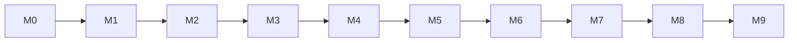

# Roadmap — M0 → M9

Each milestone ends with a **human gate**: `pnpm gate:full`, E2E where applicable, the demo
checklist, `10-roadmap.md` updated, tag `m<N>-<name>` on `main`. No milestone starts before its
predecessor's tasks are `DONE`.

| M | Name | Goal / exit criteria | Key tasks (see `docs/08-project/tasks/`) | Human gate |
|---|---|---|---|---|
| **M0** | Bootstrap | Repo, blueprint, agent config, CI skeleton, scripts, lanes, CODEOWNERS all merged; `pnpm gate:full` runs clean | TMU-OPS-001..021, TMU-META-001..003 (**DONE**) | Tag `m0-bootstrap`; repo protected |
| **M1** | Docs | Every `docs/01-product/**` and `docs/02-design/**` doc merged and approved (PDF + logo added; OQ-1..OQ-5 answered or deferred with DEC) | TMU-DOC-001..020 | **Docs approved** — no code before this |
| **M2** | Contracts | `docs/03-architecture/**` + `docs/04-contracts/**` merged; `packages/contracts` builds; OpenAPI + client + MSW generated; `contracts:check` green | TMU-ARC-001..015, TMU-CTR-001..006 | Contract tag `contract-v1.0.0` |
| **M3** | Walking skeleton | Auth (Google, domain allowlist), DB migrations, upload handshake, report create/read, `/home` shell, seeds, docker compose up | TMU-DB-001..005, TMU-BE-001..008, TMU-FE-001..006 | Demo: login → create report → read it back |
| **M4** | Reporting | Full LOST/FOUND wizards, photo pipeline (EXIF strip, thumbs, masking), browse + filters + text search, my-reports, cancel/renew | TMU-BE-009..020, TMU-FE-007..018, TMU-ML-001..003 | Demo: report both types, browse and search |
| **M5** | Matching | ML service (YOLO/CLIP/NLP), feature tables, match job, bands + reasons, notifications, eval harness baseline | TMU-ML-004..012, TMU-BE-021..026, TMU-FE-019..023 | Eval report ≥ target; demo: match appears |
| **M6** | Claims | Challenge, claim lifecycle, chat, handover plan, two-sided confirmation, dispute routing | TMU-BE-027..038, TMU-FE-024..032, TMU-QA-010..015 | Demo: end-to-end return (E2E-06/08/09) |
| **M7** | Admin & moderation | Queue, flags, disputes, users, places, audit, stats | TMU-BE-039..048, TMU-FE-033..039 | Demo: moderation + dispute resolution |
| **M8** | Hardening | Security review, privacy review, a11y audit, performance budget, rate limits, retention sweeps, incident docs | TMU-SEC-001..008, TMU-QA-016..022, TMU-OPS-011..016 | `gate:full` + audits clean |
| **M9** | Launch & UAT | UAT sessions, deployment runbook, backups drill, demo day, course report | TMU-OPS-022..026, TMU-QA-023..026, TMU-DOC-021..024 | Tag `v0.1.0`; UAT report |

## Release slicing

| Release | Milestones | Contents |
|---|---|---|
| MVP | M0–M8 | Everything in `VISION.md` "In scope" |
| v1 | M9 + follow-ups | SSE chat, refined digest, model refresh, analytics |
| Later | post-course | OCR owner notification (legal review), YOLO fine-tuning, native app |

## Dependency graph (milestone level)

## Standing rules

1. **Docs before code** (P1) and **contracts before implementation** (P2) — enforced by task `deps`.
2. One lane per task; max 3–5 parallel worktrees (Blueprint §7.5).
3. Every milestone updates `status.md` and the risk register; scores ≥15 need actions.
4. Anything not finished by its milestone moves to the next one **or** is explicitly cut
   (recorded in `decisions-log.md`), never silently dropped.
