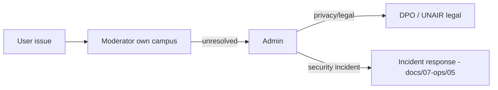

# Operations model

How the service is actually run by humans on campus. Everything marked `OPEN` must be
confirmed with UNAIR stakeholders before M3 (seed data) and M8 (SLA review).

## 1. Roles in the operation

| Role | Who (suggested) | Responsibilities | System role |
|---|---|---|---|
| Campus moderator | Student volunteer / admin staff per campus | Clear the moderation queue, resolve disputes, keep drop-point info accurate | `MODERATOR` (campus-scoped) |
| Service admin | Project team / UNAIR IT liaison | Users, roles, locations, drop points, reindex, audit review | `ADMIN` |
| Drop-point keeper | Security post staff | Receive items, hand over to verified owners, mark custody | not a system user (moderator records on their behalf if needed) |
| DPO / legal contact | `OPEN` | Privacy requests, legal review | not a system user |

`OPEN`: exact staffing per campus and whether security staff get moderator accounts.

## 2. Drop points (DEC-005)

| Question | Answer |
|---|---|
| What is a drop point? | An admin-managed, publicly listed location where found items can be left (e.g. security post, lobby) |
| Who can set one? | `ADMIN` via `/admin/places` (`API-ADM-13`) |
| What data is stored? | Name, campus, linked location, operating hours (`jsonb`), contact note, active flag |
| What is shown publicly? | Name, campus, hours, map link — **never** a phone number unless provided as an explicit contact note |
| Fallback until real data exists | Synthetic drop points clearly labelled "contoh" in seed data (M3) |

## 3. Service levels (targets)

| Process | Target | Measured by |
|---|---|---|
| Report verification (PENDING_REVIEW → decision) | ≤ 48 h | MET-008 |
| Disputed claim resolution | ≤ 5 working days | claims + audit |
| Flag triage | ≤ 24 h | flags table |
| Privacy/deletion request acknowledged | ≤ 3 working days; executed after 7-day cool-off | `account.delete` logs |
| Drop-point info review | every semester | ops checklist |

## 4. Escalation path

- **Fraud / false claim**: moderator resolves via `API-ADM-06` with a note; repeat offenders suspended.
- **PII exposure**: treat as a security incident (severity high) — remove content, audit the
  exposure, notify affected users, post-mortem (`05-incident-response.md`).
- **Physical safety concern at a handover**: advise using a drop point; moderators can move the
  handover plan; repeated issues → suspend the account.

## 5. Moderator onboarding checklist

1. Campus assignment recorded (`moderator_campus`).
2. Walkthrough of `/admin/reports`, `/admin/claims`, `/admin/places` (guide: `06-admin-operations-guide.md`).
3. Rules read: community guidelines + sensitive-item handling (never unmask publicly, never
   share hint answers).
4. Test actions on the staging environment with seeded data.
5. Audit log review habit: every week, skim `audit_logs` for anomalies.

## 6. Open operational questions

| # | Question | Owner | Needed by |
|---|---|---|---|
| O-1 | Real drop-point list + hours per campus | Stakeholders | M3 seeds |
| O-2 | Moderator staffing per campus | Team | M7 |
| O-3 | Who owns the mailbox for privacy requests | Team | M8 |
| O-4 | Physical handover policy for high-value items (laptops, phones) | Stakeholders | M6 |
