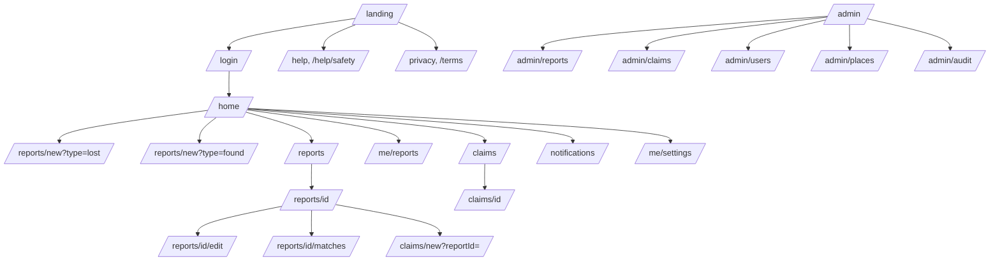

# Information architecture

## Sitemap

## Navigation model

| Viewport | Pattern | Items |
|---|---|---|
| Mobile (< 768 px) | Bottom nav, 5 items, icons + labels | **Beranda** `/home` · **Cari** `/reports` · **Lapor** (center, primary, opens type chooser) · **Klaim** `/claims` · **Akun** `/me/settings` |
| Desktop (≥ 768 px) | Top nav | Logo · Cari · Lapor (primary button) · Klaim · Notifikasi (bell) · Avatar menu (Profil, Laporan saya, Pengaturan, Keluar) |
| Admin | Separate left sidebar under `/admin` | Ringkasan · Laporan · Klaim · Pengguna · Lokasi · Audit |
| Unauthenticated | Minimal header | Logo · Masuk · Bantuan |

The center "Lapor" action opens a sheet: **Saya Kehilangan** / **Saya Menemukan** (two large
choices), matching the PDF vocabulary.

## URL scheme

| Rule | Example |
|---|---|
| Lowercase, kebab-case, plural nouns | `/me/reports`, `/admin/drop-points` (redirect to `/admin/places`) |
| Filters live in query params, not paths | `/reports?campus=KAMPUS_A&category=BAG&sort=-createdAt` |
| Search state is shareable | `/reports?q=tas%20biru&type=FOUND` |
| IDs are opaque UUIDs | `/reports/018f2c…` |
| Locale is a user preference, not a path prefix (MVP) | `/home` in `id` or `en` per profile + `LocaleSwitcher` |

## Content hierarchy rules

1. Every page has exactly one `<h1>` and one primary action.
2. Lists are cards on mobile, rows/tables on desktop (admin).
3. Detail pages lead with photo, title, status badge, then location/time, then actions.
4. The claim room is the most information-dense page: stepper → answers → chat → handover.
5. Admin pages are table-first with drawer details (never leave the queue to act).

## Deep-link targets (notifications)

| Notification | Opens |
|---|---|
| `MATCH_SUGGESTED` | `/reports/{reportId}/matches` |
| `MATCH_INVITE` | `/reports/{foundReportId}` |
| `CLAIM_SUBMITTED` / `CLAIM_REMINDER` | `/claims/{claimId}` |
| `CLAIM_APPROVED` / `CLAIM_REJECTED` | `/claims/{claimId}` |
| `MESSAGE_RECEIVED` | `/claims/{claimId}` (scrolled to newest) |
| `HANDOVER_*` | `/claims/{claimId}` (handover panel focused) |
| `REPORT_EXPIRING` / `REPORT_EXPIRED` | `/me/reports` (filtered to expiring) |
| `REPORT_REMOVED` / `REPORT_APPROVED` | `/reports/{reportId}` |
| `ADMIN_DISPUTE` | `/admin/claims` |
