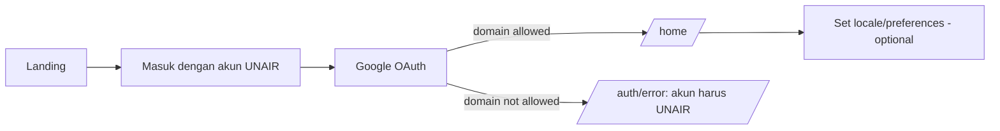
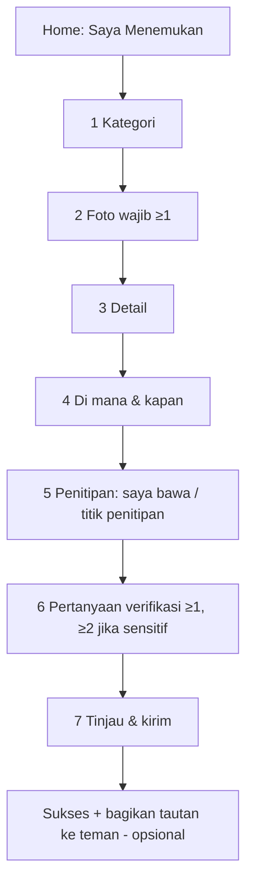
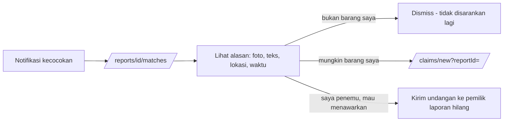
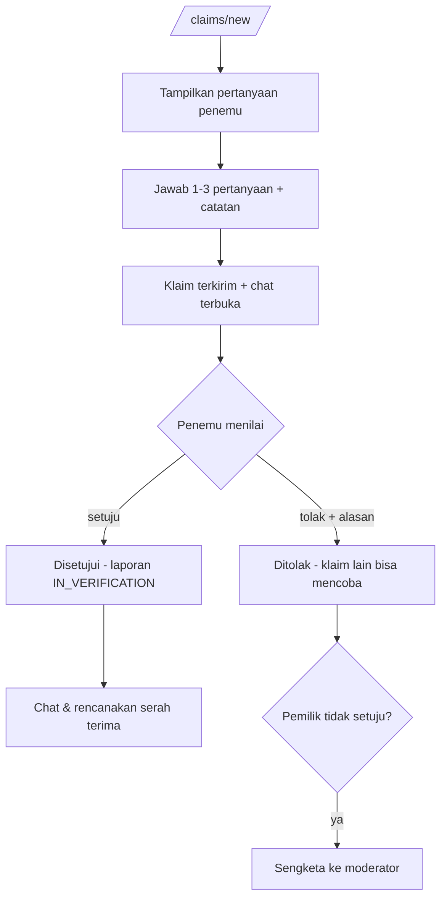
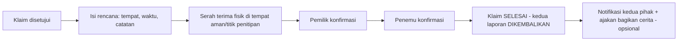
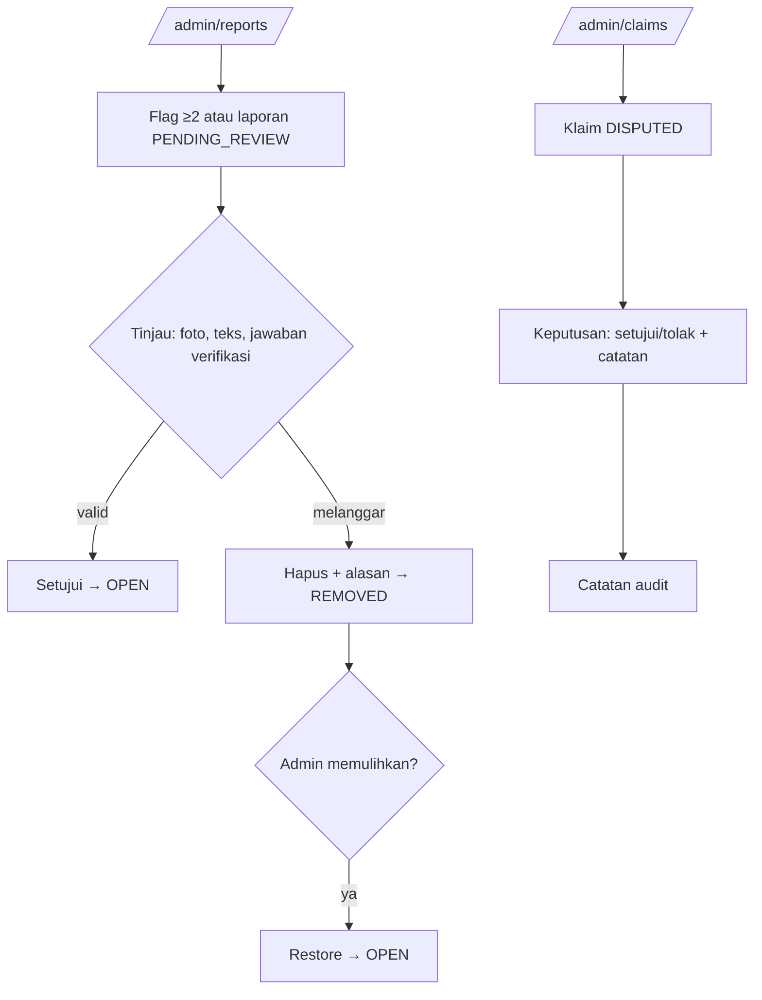
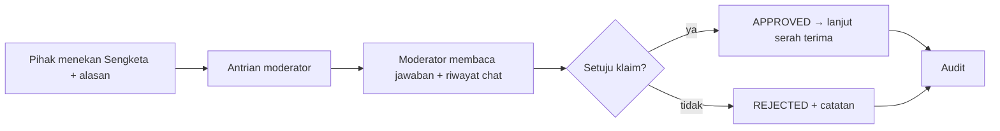

# User flows

Mermaid flows mirroring the PDF's 8-step "Cara Kerja". Each flow cites the state machine rows
(R1–R12, C1–C9) it drives.

## 1. Login (PDF step 1)



## 2. Report lost (R1)

```mermaid
flowchart TD
  S[Home: Saya Kehilangan] --> C1[1 Kategori]
  C1 --> C2[2 Foto opsional]
  C2 --> C3[3 Detail: judul, deskripsi, warna, merek]
  C3 --> C4[4 Di mana & kapan]
  C4 --> R[5 Tinjau & kirim]
  R --> D{Ada laporan ditemukan mirip?}
  D -->|ya| P[Pratinjau SRC-01 - lihat dulu]
  D -->|tidak| OK[Sukses: kami beri tahu jika ada kecocokan]
  P --> OK
  OK --> M[/reports/id/matches/ menunggu kecocokan]
```

## 3. Report found (R1)



## 4. Match review (R2, R3)



## 5. Claim + verification (C1–C5, R4)



## 6. Handover and return (C6, R6)



## 7. Admin moderation (R10–R12)



## 8. Dispute resolution (C5)



## Edge flows

| Case | Behaviour |
|---|---|
| Report edited after a match | Text/image change → `report.process` re-run → matches recomputed (R2 again) |
| Claim expires (C8) | 48 h reminder → 72 h `EXPIRED`; report returns to `OPEN`/`MATCHED`; claimant notified |
| Both parties stall after approval (C9) | One-sided confirmation > 72 h → `DISPUTED`, never auto-complete |
| Sensitive item (DEC-014) | Public view masked + generalized; claim requires ≥2 hints; moderator can see the challenge |
| Account deleted mid-claim | Active claims stay for the counterpart with the display name anonymized; audit stubs remain |
| ML unavailable | Report stays usable; processing marked `needs_reprocess`; retried by the worker |
