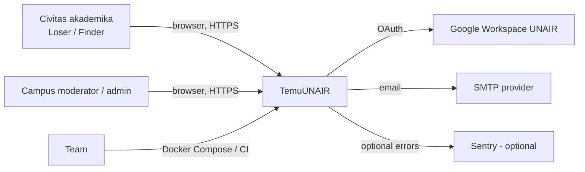
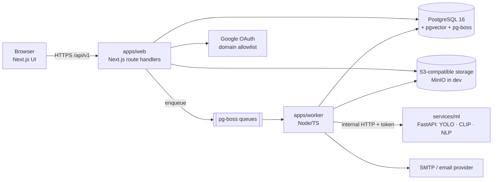

# System overview

## C4 level 1 — System context



## C4 level 2 — Containers



| Container | Technology | Responsibility | Scales by |
|---|---|---|---|
| `apps/web` | Next.js App Router, TS strict | UI + `/api/v1` route handlers; auth; presigned uploads | horizontal (stateless) |
| `apps/worker` | Node/TS, pg-boss consumers | matching, notifications, sweeps, deletion, cleanup | horizontal (pg-boss locking) |
| `services/ml` | Python 3.11, FastAPI | image analysis (YOLO+CLIP), text embeddings, attribute extraction | horizontal (stateless, CPU) |
| PostgreSQL | 16 + pgvector + pg-boss | relational data, vectors, queue | vertical first |
| Object storage | S3-compatible | original/thumb/masked images | managed |

## C4 level 3 — Components (inside `apps/web`)

```mermaid
flowchart TD
  R[app/api/v1 route handlers<br/>thin: auth, validate, map] --> S[src/server/services/*<br/>business rules + state machines]
  S --> REPO[src/server/repositories/*<br/>Drizzle queries]
  REPO --> DB[(Postgres)]
  S --> JOBS[src/server/jobs/enqueue<br/>pg-boss]
  S --> STORE[src/server/storage<br/>presign, validate, EXIF, thumbs]
  S --> NOTIF[src/server/notifications]
  UI[app/(app)/* pages] --> API[src/lib/api<br/>generated openapi-fetch client]
  API --> R
```

Rules: route handlers never contain business logic; services never touch `req/res`; repositories
are the only place with SQL; mappers strip private fields (never the handler).

## Trust boundaries

| # | Boundary | Threats | Controls |
|---|---|---|---|
| TB-1 | Browser ↔ web API | CSRF, IDOR, injection, scraping | session cookie + Origin check, RBAC per endpoint, Zod validation, rate limits, login-only browsing |
| TB-2 | Web ↔ object storage | leaked URLs, oversized/malicious files | presigned PUT (scoped, short TTL), magic-byte validation, size caps, EXIF strip, private bucket + signed GET |
| TB-3 | Worker ↔ ML service | SSRF via image URL, data leakage | bearer token, short-lived presigned URLs, ML service stateless and no logging of inputs |
| TB-4 | Web/worker ↔ database | credential theft, injection | parameterised queries (Drizzle), least-privilege role, no `DELETE` on audit tables, TLS in prod |
| TB-5 | Admin ↔ system | abuse of power, repudiation | RBAC, mandatory reasons, append-only audit log, campus scoping |
| TB-6 | Email/notifications out | PII leakage via email | payloads contain ids and titles only; no hint answers, no emails of others |

## Deployment context (dev → prod)

| Environment | Composition |
|---|---|
| Dev (laptop) | `docker compose` (postgres+pgvector, minio, mailpit, ml) + `pnpm dev` + `apps/worker` |
| CI | services on GitHub Actions; `ML_MODE=stub` for E2E |
| Staging | same compose on a single host; seeded demo data |
| Production | TBD (DEC-011): 1 host with compose, or managed Postgres + object storage; deploys human-triggered |

## Key architectural decisions

See ADRs: monorepo (0001), Next.js as API (0002), Postgres+pgvector (0003), CLIP text encoder
(0004), pg-boss (0005), auth (0006), hidden-detail verification (0007), storage & masking (0008),
YOLO role & licence (0009), chat transport (0010).
