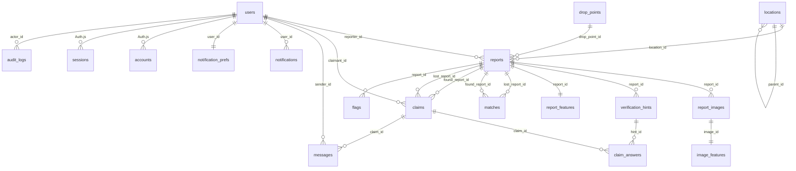

# Data model and ERD

Canonical DDL lives in `docs/04-contracts/backend/BE-05-database-contract.md`. This document
explains the model and classifies PII per column.

## ERD

## Table purposes

| Table | Purpose | Growth | Notes |
|---|---|---|---|
| `users` | accounts, roles, locale, status | low | email citext unique; `unair_ref` never exposed |
| `accounts`, `sessions`, `verification_tokens` | Auth.js adapter | low | session cookie `__Secure-temuunair.session` |
| `locations` | campus place tree | low | `parent_id` self-reference; soft `active` |
| `drop_points` | custody locations | low | `hours jsonb`, `contact_note` |
| `reports` | LOST/FOUND records | medium | status machine §5A.6; `search_tsv` FTS; `needs_reprocess` marker (BE-07) |
| `report_images` | uploads per report | medium | `storage_key`, `thumb_key`, `masked_key`, `sha256`, status |
| `verification_hints` | hidden-detail prompts | low | `answer_enc bytea` AES-GCM (DEC-004) |
| `image_features` | per-image embeddings + detections | medium | `vector(512)`, HNSW |
| `report_features` | per-report aggregate features | medium | image mean + CLIP text + sentence embeddings |
| `matches` | AI suggestions | high | unique pair, `algo_version`, components |
| `claims` | verification + return | medium | partial unique indexes (one active, one approved) |
| `claim_answers` | answers per hint | medium | cascade on claim delete |
| `messages` | claim chat | high | ≤1000 chars, retention policy |
| `notifications` | in-app + email ledger | high | `dedupe_key` unique |
| `notification_prefs` | channel preferences | low | per user |
| `flags` | abuse reports | low | threshold → PENDING_REVIEW |
| `audit_logs` | privileged actions | high | append-only (REVOKE UPDATE/DELETE) |
| `pgboss.*` | queue internals | medium | owned by pg-boss |

## PII classification

| Column | Class | Exposure | Retention |
|---|---|---|---|
| `users.email` | PII (high) | self + admin only | account life + cool-off |
| `users.display_name` | PII | first name + initial shown publicly | account life |
| `users.unair_ref` | PII (high) | never exposed (dispute use only) | account life |
| `users.moderator_campus` | internal | admin only | account life |
| `reports.title/description` | user content, may contain PII | public (generalized when sensitive) | TTL + grace |
| `reports.lat/lng` | sensitive geo | owner/moderator only; hidden for sensitive | TTL |
| `report_images.storage_key` | media | signed URLs only; masked for sensitive | until report removal |
| `verification_hints.answer_enc` | secret | finder + moderator only | until report removal |
| `claim_answers.answer` | secret-ish | finder + moderator only | claim life |
| `messages.body` | private comms | claim parties + moderators | retention policy |
| `notifications.payload` | internal | recipient only | 6 months |
| `audit_logs.ip_hash` | pseudonymous | admin only | 12 months |
| `image_features.embedding` | derived (reversible-ish) | never exposed via API | until report removal |

## Design rules

1. Every table has `id uuid pk`, `created_at`, `updated_at` (except join/log tables where noted).
2. Enums are Postgres types for the core state fields; category is `text` + Zod enum (easier to extend).
3. Soft lifecycle: reports never hard-deleted by users; images cascade with the report.
4. Embeddings live only server-side; no API returns vectors or scores.
5. Indexes: browse composite, reporter, GIN FTS, partial expiry, HNSW per vector column.
6. Migrations forward-only, `NNNN_description.sql`, never edited after merge.
