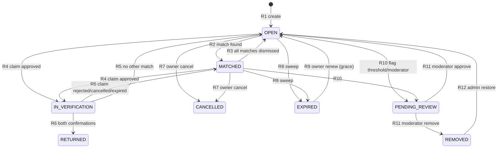
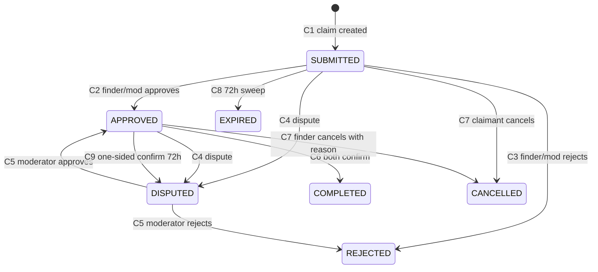
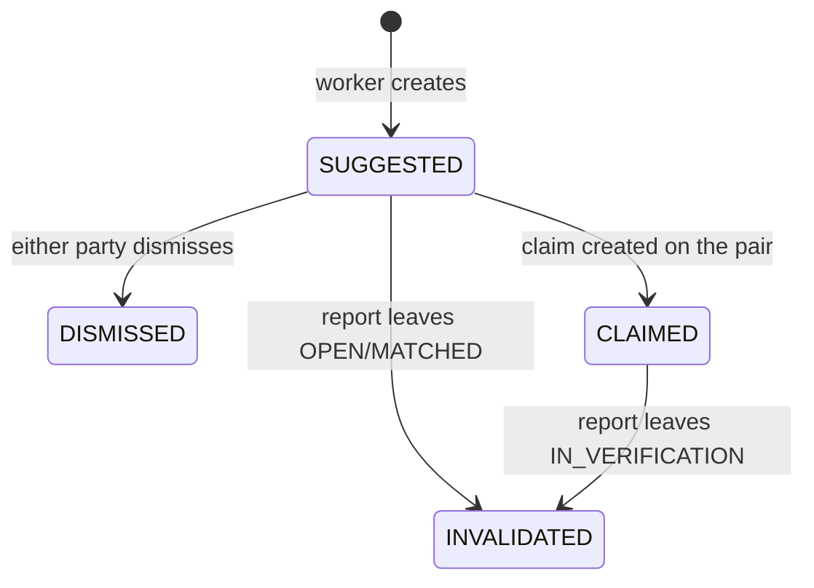

# State machines

Authoritative source: Blueprint §5A.6. Implemented in `apps/web/src/server/services/*` with one
unit test per transition. Any change requires a contract task and an ADR.

## Report

`Terminal` = `RETURNED`, `CANCELLED`, `REMOVED` (and `EXPIRED` until renewed).

| # | Transition | Trigger | Guard | Side effects |
|---|---|---|---|---|
| R1 | ∅ → `OPEN` | `POST /reports` | schema valid, rate ok | enqueue `report.process`; audit |
| R2 | `OPEN` → `MATCHED` | worker | ≥1 match band ≥ POSSIBLE | notify owner |
| R3 | `MATCHED` → `OPEN` | dismiss/invalidate | no `SUGGESTED` left | — |
| R4 | `OPEN`/`MATCHED` → `IN_VERIFICATION` | claim approved | claim `APPROVED` | other SUBMITTED claims rejected; matches → `CLAIMED` |
| R5 | `IN_VERIFICATION` → `MATCHED`/`OPEN` | claim rejected/cancelled/expired | no other approved claim | notify parties |
| R6 | `IN_VERIFICATION` → `RETURNED` | claim completed | both confirmations | `resolved_at`; linked LOST → `RETURNED`; invalidate other matches; notify |
| R7 | `OPEN`/`MATCHED` → `CANCELLED` | owner | no `APPROVED` claim | invalidate matches; reject open claims |
| R8 | `OPEN`/`MATCHED` → `EXPIRED` | daily sweep | `now ≥ expires_at` | notify owner; invalidate matches |
| R9 | `EXPIRED` → `OPEN` | owner renew | within 30-day grace | extend TTL; enqueue `report.match` |
| R10 | non-terminal → `PENDING_REVIEW` | ≥2 distinct flaggers / moderator | — | hide from browse/search |
| R11 | `PENDING_REVIEW` → `OPEN`/`REMOVED` | moderator | — | audit; notify owner |
| R12 | `REMOVED` → `OPEN` | admin restore | — | audit |

## Claim

| # | Transition | Actor | Guard | Side effects |
|---|---|---|---|---|
| C1 | ∅ → `SUBMITTED` | claimant | report claimable, not own, hints answered, ≤3/day, no 3 prior rejections | notify finder; create chat thread; `expires_at = now + 72h` |
| C2 | `SUBMITTED` → `APPROVED` | finder/moderator | no other `APPROVED` (unique index) | report → `IN_VERIFICATION`; notify claimant |
| C3 | `SUBMITTED` → `REJECTED` | finder/moderator | reason required | notify claimant |
| C4 | `SUBMITTED`/`APPROVED` → `DISPUTED` | either party | — | moderator queue + notification |
| C5 | `DISPUTED` → `APPROVED`/`REJECTED` | moderator | note required | audit |
| C6 | `APPROVED` → `COMPLETED` | both parties confirm | both timestamps set | reports → `RETURNED` |
| C7 | `SUBMITTED`/`APPROVED` → `CANCELLED` | claimant (finder for APPROVED with reason) | — | revert report per R5 |
| C8 | `SUBMITTED` → `EXPIRED` | sweep at 72 h (reminder 48 h) | no decision | revert per R5 |
| C9 | `APPROVED` + one-sided confirmation > 72 h | sweep | — | escalate to `DISPUTED` (never auto-complete) |

## Match

- Dismissed pairs are not re-suggested unless `algo_version` changes deliberately.
- A match never changes report state by itself (DEC-012).

## Invariants (tested)

1. At most one `APPROVED` claim per found report (`claims_one_approved_per_report`).
2. At most one active claim per claimant per found report (`claims_one_active_per_claimant`).
3. `RETURNED` reports have `resolved_at` set; both linked reports reach `RETURNED` together.
4. `IN_VERIFICATION` implies exactly one `APPROVED` claim.
5. No transition out of `RETURNED`/`CANCELLED` except `REMOVED`→`OPEN` admin restore (report) or
   terminal claim states (claims).
6. Every transition writes an audit row when actor is a moderator/admin.
