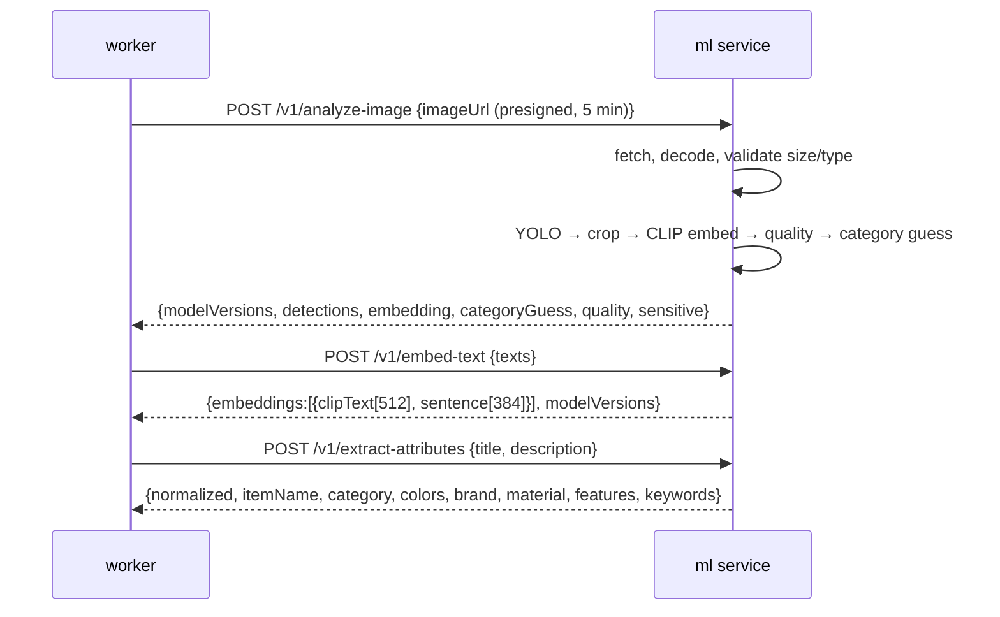

# ML service design (`services/ml`)

FastAPI, stateless, CPU-only (DEC-011). Contract: `BE-06-ml-service-contract.md`. No image or
text is logged or persisted by this service.

## Endpoints (summary of `BE-06`)

| Endpoint | Purpose |
|---|---|
| `GET /health`, `GET /ready` | liveness/readiness with per-model load state |
| `GET /v1/models` | `models.lock.json` contents (name, version, sha256, licence) |
| `POST /v1/analyze-image` | YOLO detections, primary-object crop, CLIP embedding, category guess, quality, sensitive hint |
| `POST /v1/embed-text` | multilingual CLIP text vector (512) + sentence vector (384) |
| `POST /v1/extract-attributes` | rule/lexicon attributes (name, category guess, colours, brand, material, features, keywords) |

## Models and preprocessing

| Task | Model | Input | Output | Notes |
|---|---|---|---|---|
| Detection | ultralytics YOLO small (COCO) | image ≤ 1024 px longest side | boxes (normalised) + labels + conf | **crop helper only** (DEC-015); AGPL (DEC-016, ADR-0009) |
| Image embedding | open_clip ViT-B/32 | crop if `primaryObject` conf ≥ 0.35 else full image | 512-d L2-normalised | "source" reported as `crop`/`full` |
| Text↔image embedding | multilingual CLIP-aligned sentence encoder | report text (title+description+attrs) | 512-d aligned to image space | DEC-003, ADR-0004 |
| Text↔text embedding | multilingual sentence encoder | same text | 384-d | |
| Attributes | rules + Indonesian lexicon | title, description | structured JSON | no LLM (would need ADR: privacy + cost) |
| Category guess | CLIP zero-shot prompts over the 19 categories | image | top-3 scores | fallback when YOLO has no class |
| Quality | Laplacian variance + brightness histogram | image | `{blur, brightness, width, height, usable}` | `usable=false` skips image-image scoring |
| Sensitive hint | aspect-ratio + text-density heuristic | image | `{cardLikely}` | advisory; the category flag is authoritative |

## Request flow



## Model registry and startup

- `models.lock.json` (committed) lists every model: `name`, `version`, `sha256`, `licence`,
  `source`. Files download at build/startup into `services/ml/models/` (gitignored).
- Startup verifies checksums; a mismatch fails readiness (`503` on `/v1/*`, `ready=false`).
- Warm-up: one dummy image + one dummy text per model on boot so the first real request is fast.
- `GET /v1/models` exposes the lockfile so the worker can store `model_versions` per feature row.

## Performance budget (CPU)

| Operation | Budget p95 | Notes |
|---|---|---|
| `analyze-image` | ≤ 3 s | 1024 px input, batch size 1 |
| `embed-text` (≤20 texts) | ≤ 400 ms | batched |
| `extract-attributes` | ≤ 50 ms | pure Python/lexicon |
| Cold start (warm-up) | ≤ 60 s | container start |
| Memory | ≤ 2 GB RSS | torch CPU + models |

Strategies: resize before inference, `torch.set_num_threads` capped, no GPU code paths,
optional batching for multiple images of one report, timeouts (8 s) enforced by the worker.

## Safety and privacy

1. **SSRF:** only fetch `imageUrl` that is a presigned URL on our storage host (allowlist) and
   reject redirects; cap response size and content-type.
2. **No persistence:** images decoded in memory, never written to disk; texts not logged.
3. **Determinism:** same input + same `modelVersions` ⇒ identical vectors (fixed seeds, eval mode).
4. **Errors:** `400/413/415/422/503` per `BE-06`; the service never returns stack traces.
5. **Auth:** `Authorization: Bearer $ML_SERVICE_TOKEN`; health endpoints are open inside the
   compose network only (not exposed publicly).

## Repository layout

```
services/ml/
├─ pyproject.toml          # uv
├─ models.lock.json
├─ app/
│  ├─ main.py              # FastAPI app + routes
│  ├─ config.py            # env, model paths
│  ├─ models/              # loaders per model
│  ├─ pipelines/           # analyze_image, embed_text, extract_attributes
│  ├─ lexicon/             # id colours/brands/materials
│  └─ schemas.py           # pydantic models mirroring BE-06
├─ tests/                  # pytest, fixtures in tests/fixtures/ml
└─ scripts/                # download_models.py, warmup.py
```

## Testing

- Unit: preprocessing, attribute extraction, quality heuristics (fixed images).
- Contract: response schemas validated against `BE-06`; Schemathesis fuzzes `ml-openapi.json`.
- Determinism test: same input twice → identical vectors (exact equality after rounding).
- `ML_MODE=stub` (in the worker/web) bypasses this service with deterministic vectors for E2E.

## Open items

| # | Item | Owner | Note |
|---|---|---|---|
| ML-1 | Confirm the multilingual CLIP-aligned text model and its 512-d alignment (ADR-0004) | ML | verify model card |
| ML-2 | Pick the YOLO variant (n/s) after latency measurement | ML | CPU budget |
| ML-3 | Decide the blur/brightness thresholds with the eval set | ML | quality gate |
| ML-4 | Confirm licence of every model in `models.lock.json` | SR | AGPL flagged |
