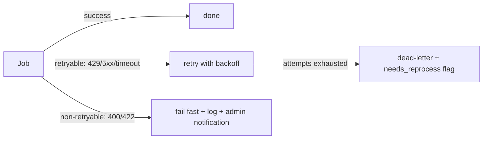

# Async jobs and queues

Queueing runs on PostgreSQL via **pg-boss** (DEC-013) — no Redis. Canonical payload/retry
contract: `docs/04-contracts/backend/BE-07-job-and-event-contract.md`.

## Queues

| Queue | Payload | Trigger | Behaviour | Retry |
|---|---|---|---|---|
| `report.process` | `{reportId}` | R1 create, PATCH text/images | wait images READY → ML calls → write features → enqueue `report.match` | 3×, exp 30 s base → dead-letter + `needs_reprocess` |
| `report.match` | `{reportId, reason}` | after process, rematch, renew | retrieve + score + upsert → R2 → notify | 3× |
| `notify.send` | `{notificationId}` | any notification | email if enabled; dedupe | 5×, 1 min → 1 h |
| `report.expire-sweep` | cron `0 2 * * *` Asia/Jakarta | schedule | R8 + day-76 warnings | — |
| `claim.expire-sweep` | cron `*/30 * * * *` | schedule | C8, C9, 48 h reminders | — |
| `media.cleanup` | cron daily | schedule | delete unattached uploads > 24 h, orphan objects | — |
| `account.delete` | `{userId}` | `DELETE /me` after 7-day cool-off | anonymize, remove images, keep audit stubs | 3× |
| `matching.reindex` | `{scope}` | admin | recompute features/matches for new `algo_version` | — |

## Idempotency rules

Every handler must be safe to run twice:

1. Mutations use `INSERT … ON CONFLICT` or guarded updates (`WHERE status = expected`).
2. `report.process` checks `report_features.model_versions` — if the same versions are already
   present and no input changed, it exits early.
3. `report.match` upserts on `(lost_report_id, found_report_id)` and never duplicates.
4. `notify.send` relies on the unique `dedupe_key`; a duplicate is a no-op.
5. `account.delete` re-checks user status before anonymizing.
6. All handlers log `jobId`, `reportId`/`entityId`, `durationMs`, `attempt`.

## Failure handling

- Retryable: network, ML `429/5xx`, storage timeouts, DB serialization failures.
- Non-retryable: schema/validation errors, missing report, forbidden — logged once.
- Dead-lettered `report.process` sets `reports.needs_reprocess = true` (admin visible) and keeps
  the report usable with text-only matching.
- Cron jobs are idempotent by construction (state-guarded sweeps) and log counts.

## Ordering and concurrency

- pg-boss singleton keys: `report.process:<reportId>` and `report.match:<reportId>` so the same
  report is never processed twice concurrently.
- Worker concurrency defaults: `report.process` 2, `report.match` 4, `notify.send` 4,
  sweeps 1. Tunable by env; bounded by the CPU budget (§17).
- ML calls are sequential per report (image → text) with an 8 s timeout each.

## Scheduling and time zones

- Cron schedules use `Asia/Jakarta` (WIB) explicitly in pg-boss config.
- Daily digest (POSSIBLE matches, unread chat) sends at 07:00 WIB via `notify.send` batches.

## Observability

| Signal | Where | Alert |
|---|---|---|
| Queue depth per queue | pg-boss tables + admin dashboard | > 100 for 15 min |
| Dead-letter count | logs + `needs_reprocess` count | any non-zero → investigate |
| Job duration p95 | structured logs | `report.process` p95 > 30 s |
| Sweep counts | logs (`expired`, `reminded`) | anomaly vs 7-day average |

## Testing

- Unit: handler logic with faked deps.
- Integration (testcontainers): enqueue → run → assert DB state, including double-run idempotency.
- Contract: payloads validated against `BE-07` schemas in CI.
- E2E: `ML_MODE=stub` keeps job timing deterministic.
