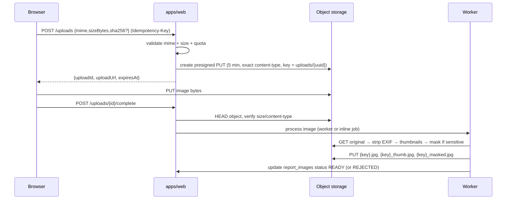

# Storage and media pipeline

## Upload handshake (two-step presigned)

## Validation

| Check | Rule | Error |
|---|---|---|
| MIME allowlist | `image/jpeg`, `image/png`, `image/webp`, `image/heic` | `UPLOAD_INVALID_TYPE` (415) |
| Magic bytes | must match declared MIME (HEIC converted to JPEG server-side) | `UPLOAD_INVALID_TYPE` |
| Size | ≤ 8 MB per image | `UPLOAD_TOO_LARGE` (413) |
| Count | ≤ 5 images per report | `UPLOAD_LIMIT_REACHED` (409) |
| Ownership | only the uploader can complete/attach an upload | `NOT_FOUND` |
| Dimensions | ≥ 320 px shortest side; else `REJECTED` with reason | `UPLOAD_INVALID_TYPE`-like UI message |
| Duplicate | same `sha256` on the same report is deduped | — |

## Processing steps

1. **Decode** with `sharp` (no shell, no ImageMagick).
2. **EXIF strip:** remove all metadata including GPS (DEC-010); keep only orientation applied
   to pixels.
3. **Normalize:** rotate per orientation, convert to sRGB JPEG quality 82.
4. **Thumbnail:** 480 px longest side, quality 75.
5. **Masking (sensitive categories):** detect likely card/ID regions (aspect ratio + text
   density heuristic from the ML service `sensitive.cardLikely`), apply a strong blur/black
   overlay to the sensitive region, or if uncertain, mask the whole image. Produce `_masked`.
6. **Store keys:**
   `reports/{reportId}/{imageId}.jpg`, `…_thumb.jpg`, `…_masked.jpg`.
   Pending uploads live under `uploads/{uploadId}` until attached.
7. **Status:** `PENDING → READY | REJECTED` on `report_images.status`.

## Serving rules

| Audience | Gets |
|---|---|
| Public/other users | `thumbUrl` always; `url` only for non-sensitive READY images |
| Sensitive reports | `masked` image only, `url: null`, non-zoomable |
| Owner/moderator | original + thumb (moderator access is audited) |
| ML worker | short-lived presigned GET (5 min) to the original |

- Bucket is **private**; every GET is a signed URL with short TTL.
- No directory listing; keys are unguessable UUIDs.
- `Content-Disposition: inline` for images; no user-supplied filenames.

## Retention and cleanup

| Artifact | Lifecycle |
|---|---|
| Unattached uploads | deleted by `media.cleanup` after 24 h |
| Rejected images | deleted after 24 h |
| Report images | deleted when the report is removed by a moderator or the account is deleted |
| Orphan objects | daily sweep compares storage keys with DB rows |
| Masked variants | regenerated if masking rules change (`matching.reindex`-like admin job) |

## Failure modes

| Failure | Behaviour |
|---|---|
| Upload never completed | expires; cleanup removes the object |
| Processing fails | image `REJECTED` with a reason; the report still saves (LOST can live without photos; FOUND requires ≥1 READY image, so the wizard blocks submission) |
| Storage unavailable | `POST /uploads` returns 503; no partial state |
| EXIF strip fails | treat as rejection (never store unstripped GPS) |

## Security notes (see `14-security-threat-model.md`)

- Presigned PUT is scoped to one key + content-type + size; cannot overwrite existing keys.
- Worker validates again on `complete` (never trust the client).
- ML fetch allowlists the storage host and rejects redirects (SSRF, TB-3).
- No original file is ever served to a non-owner for sensitive items.
