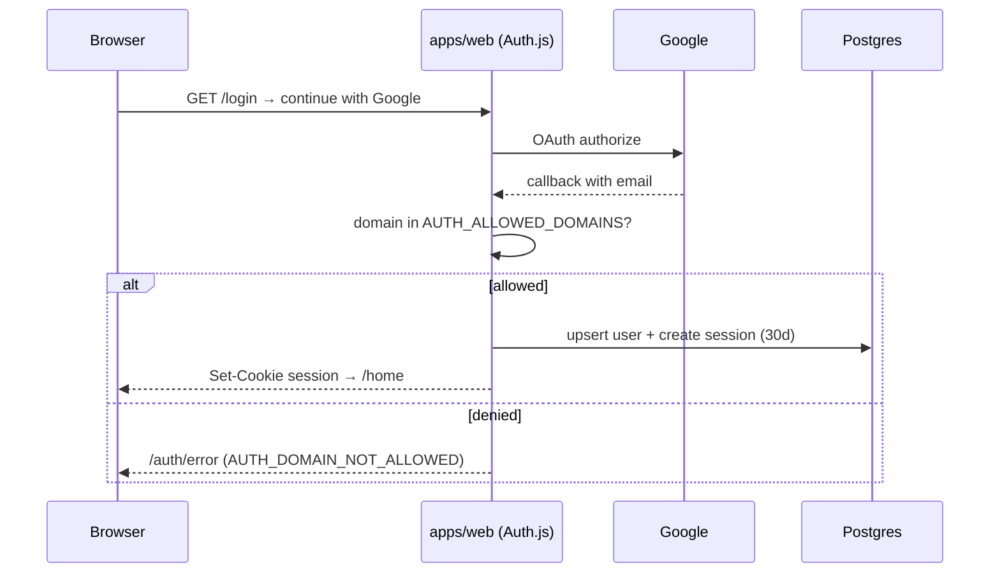

# Auth and RBAC

## Session model

| Aspect | Decision |
|---|---|
| Provider | Auth.js (NextAuth v5) with Google OAuth (DEC-001) |
| Domain allowlist | after callback, reject emails whose domain ∉ `AUTH_ALLOWED_DOMAINS` → `AUTH_DOMAIN_NOT_ALLOWED` (403), no user row created |
| Dev fallback | email magic link, `NODE_ENV=development` only, still domain-checked |
| Sessions | **database sessions**, 30 days sliding, cookie `__Secure-temuunair.session` (httpOnly, Secure, SameSite=Lax) |
| CSRF | SameSite=Lax + same-origin `Origin` check + `X-Requested-With: temuunair` on all mutations |
| Suspension | `users.status = SUSPENDED` → every API returns `ACCOUNT_SUSPENDED` (403) |
| Logout | destroys the session row + clears the cookie |

## Roles

| Role | Scope | Granted how |
|---|---|---|
| `USER` | own data | default |
| `MODERATOR` | one campus (`moderator_campus`) | admin grants via `API-ADM-10` |
| `ADMIN` | global | admin grants; cannot demote self |

## Permission matrix (authoritative server-side; mirrored in UI)

| Action | USER | Owner | Party | MODERATOR | ADMIN |
|---|---|---|---|---|---|
| Create report/claim/message | ✔ | | | ✔ | ✔ |
| View public report | ✔ | ✔ | ✔ | ✔ | ✔ |
| Edit/cancel/renew report | | ✔ | | | ✔ |
| View hint prompts | | ✔ | ✔ | ✔ | ✔ |
| View hint **answers** | | ✔ (finder) | finder | ✔ (own campus) | ✔ |
| Approve/reject claim | | | finder | ✔ (own campus) | ✔ |
| Moderation queue, flags, disputes | | | | ✔ (own campus) | ✔ |
| Manage users, locations, drop points, reindex | | | | | ✔ |
| Audit logs | | | | | ✔ |

## Enforcement layers

1. **Middleware** (`apps/web/src/middleware.ts`): redirect unauthenticated users to
   `/login?next=`; attach a role hint for layout guards. Convenience only.
2. **Route handlers:** every handler calls `requireUser()` / `requireRole()` / ownership checks
   before touching services. `NOT_FOUND` is used instead of `FORBIDDEN` when the resource's
   existence must be hidden.
3. **Services:** state guards (e.g. only the finder can approve) re-checked inside the
   transaction; DB constraints (unique indexes) are the last line of defence.
4. **UI:** hides actions the role cannot perform; never a substitute for 2–3.

## Campus scoping

- Moderators carry `moderator_campus`; admin queries add `AND campus = $moderator_campus` for
  moderation endpoints (`API-ADM-01`, `ADM-05`, `ADM-11`, `ADM-16`).
- Cross-campus moderation attempts return `FORBIDDEN` (tested).

## Account deletion

`DELETE /me` → `202`; a 7-day cool-off begins. `account.delete` then: anonymizes
`display_name` ("Pengguna dihapus"), clears `email`/`unair_ref`, sets `status=DELETED`, deletes
images and objects, keeps audit stubs and claim history (counterpart still sees the claim with an
anonymized name). Re-login within cool-off cancels the deletion.

## Security notes

- No tokens in localStorage; session is cookie-only.
- OAuth state + PKCE handled by Auth.js; redirect URIs pinned per environment.
- Auth endpoints rate-limited to 20/min/IP (§5A.13).
- Failed domain checks are logged with a hashed email for abuse detection (never the raw email).
