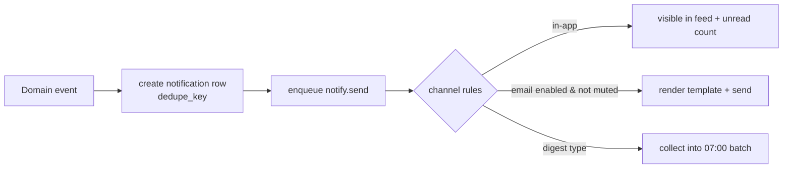

# Notification design

## Channels

| Channel | Mechanism | Latency | Notes |
|---|---|---|---|
| In-app | `notifications` row + unread count poll (30 s) | immediate | deep-links per `IA` |
| Email | `notify.send` job via SMTP | immediate or digest | opt-out per type |
| Digest | batched `notify.send` at 07:00 WIB | daily | POSSIBLE matches, unread chat |
| SSE (phase 2) | `API-CHT-03` | realtime | claim room only |

## Flow

## Dedupe and batching

- Every type has a `dedupe_key` (e.g. `claim:{id}:decision`, `msg:{claimId}:{window}`,
  `report:{id}:expiring`). The unique index makes duplicate events a no-op.
- `MESSAGE_RECEIVED` batches per 15-minute window per claim: one in-app row per window, email
  only if still unread.
- `MATCH_SUGGESTED` with band POSSIBLE collects into the daily digest; STRONG sends immediately.
- Sweeps (`report.expire-sweep`, `claim.expire-sweep`) create at most one reminder per period
  via dedupe keys.

## Preferences

| Setting | Effect |
|---|---|
| `email_enabled=false` | no emails at all; in-app continues |
| `muted_types[]` | per-type mute; in-app still created (mute hides email and, if the type is
  purely informational, may hide the in-app row — see BE-08 notes) |
| Locale | templates render in the recipient's locale |

Preferences are edited at `/me/settings` (`API-ME-04/05`) and apply to the next job run.

## Payload discipline

- Payloads carry **ids, titles and band only** — never hint answers, other users' emails,
  exact geo, or embeddings.
- Email bodies use the recipient's display name and the report title they already can see.
- Notification rows are pruned after 6 months by a cleanup job (retention §15).

## Failure handling

- Email send failure → retry 5× (1 min → 1 h) then dead-letter; the in-app row already exists,
  so the user is never fully missed.
- Bounced/undeliverable email addresses are logged (hashed) and surfaced in admin stats.
- Digest job failure → retried next run; no duplicate emails thanks to `dedupe_key` including
  the digest date window.

## Testing

- Unit: template rendering per locale; dedupe collisions.
- Integration: event → row → job → email (Mailpit) with assertions on payload fields.
- Contract: notification payloads validated against `BE-08`.
- E2E: `E2E-08` asserts the bell updates after a message; email assertions via Mailpit API.
