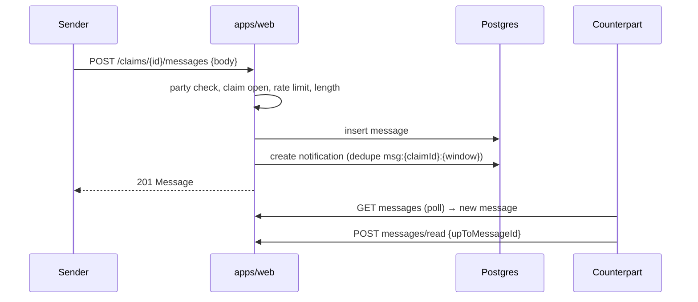

# Chat design

In-app text chat tied to a claim (DEC-009). No phone numbers, no attachments, no voice/video.
Polling first; SSE is a later upgrade that must not change components.

## Scope and access

| Rule | Detail |
|---|---|
| Thread | exactly one per claim; created at C1 |
| Participants | claimant, finder, moderators (read-only unless resolving) |
| Access check | party to the claim (or moderator) — others get `FORBIDDEN`/`NOT_FOUND` |
| Message | text ≤ 1000 chars, trimmed, no markup rendering (plain text only) |
| Rate limit | 20 messages/min/user |
| Closed claim | sending blocked (`CONFLICT_STATE`); history readable per retention |

## Transport

| Phase | Mechanism | Behaviour |
|---|---|---|
| MVP (polling) | `GET /claims/{id}/messages?cursor=` every 5 s while the room is open | pauses when tab hidden; cursor-based so no duplicates |
| Phase 2 (SSE) | `GET /claims/{id}/stream` emits `message` and `claim.updated` | same component API (`ChatThread` props unchanged) |
| Fallback | if SSE fails, fall back to polling automatically | feature-flagged, no UI change |

## Message lifecycle

## Data and indexing

- `messages(id, claim_id, sender_id, body, created_at, read_at)`.
- Index `(claim_id, created_at DESC)` for pagination; read receipts are per-message `read_at`
  (set when the counterpart marks up to a message id).
- `mine` is computed per requester; `senderId` is returned but display uses display names.

## Moderation and safety

- Moderators can read a thread when a claim is `DISPUTED` (or during review); reads are audited
  when performed from the admin console.
- No automated content scanning in MVP; flags on reports cover the surrounding content.
- Safety banner in the room; a "laporkan pengguna" path routes to a moderator via a flag on the
  claim (open item: dedicated abuse flow is post-MVP).
- PII guidance: users are reminded not to share banking/OTP details.

## Retention

- Messages follow the claim lifecycle and the retention policy in
  `15-privacy-and-data-retention.md`: readable while the claim exists; deleted with account
  deletion (sender anonymized) or when a moderator removes the claim context.
- `OPEN`: exact retention (currently: claim life + 12 months for dispute evidence, then purge).

## Failure modes

| Failure | Behaviour |
|---|---|
| Send fails | optimistic bubble marked "gagal" with retry; no fake success |
| Poll fails | keep last data; banner "menyambung ulang…"; retry with backoff |
| Claim closed mid-session | composer disabled with explanation; history stays |
| Duplicate send (double click) | composer disables during flight; server keeps one row per POST |

## Testing

- Unit: access checks, length/rate limits, closed-claim guard.
- Integration: insert → list ordering → read receipts.
- E2E: `E2E-08` exchange and notification bell; `E2E-06/09` include chat within claim flows.
