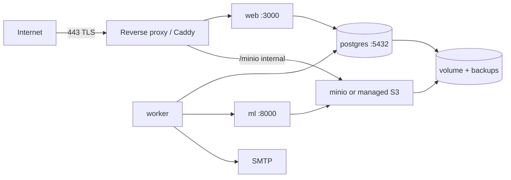

# Deployment topology

> Production target is **TBD** (DEC-011). This document defines the intended topology so code is
> written to fit it; the hosting decision is an ADR before M9.

## Environments

| Environment | Purpose | Composition | Data |
|---|---|---|---|
| Local | development | `docker compose` (postgres+pgvector, minio, mailpit, ml) + `pnpm dev` + worker | synthetic seeds |
| CI | verification | GitHub Actions services; `ML_MODE=stub` for E2E | fixtures |
| Staging | demo/UAT | single host, same compose; public URL | seeded demo data |
| Production | live | **TBD**: single host compose or managed Postgres + object storage | real |

## Topology (single-host compose, the default plan)

- Only the reverse proxy is public; `postgres`, `minio`, `ml` stay on the internal network.
- TLS via the proxy (Let's Encrypt) with HSTS.
- `/healthz` and `/readyz` exposed for the uptime check; `/metrics` internal only.

## Configuration and secrets

| Secret | Storage | Rotation |
|---|---|---|
| `AUTH_SECRET`, `AUTH_GOOGLE_*` | environment (host secret store or `.env` not in git) | quarterly / on incident |
| `DATABASE_URL` | environment | on password change |
| `S3_*` | environment | quarterly |
| `ML_SERVICE_TOKEN` | environment | quarterly |
| `FIELD_ENCRYPTION_KEY` | environment | **rotation requires re-encrypt migration** (`OPEN`: procedure) |
| `SMTP_URL` | environment | on provider change |
| `SENTRY_DSN` | environment | — |

Rules: secrets never in git (gitleaks), never logged, never echoed in CI output; `.env.example`
documents names only (BE-11).

## Deploy process (human-triggered, §7.11)

1. Merge to `main` with `gate:full` green; tag `v<semver>`.
2. Build images (`infra/docker/*.Dockerfile`) — web, worker, ml.
3. Run migrations (`pnpm db:migrate`) with a **pre-migration backup**.
4. Rolling restart: worker first (drain), then web, then ml if changed.
5. Smoke tests: `/healthz`, `/readyz`, login, create report (staging account), match appears.
6. Announce in `docs/08-project/changelog.md`.

Rollback: redeploy the previous image tag; migrations are forward-only, so a rollback plan is
written per migration (rollback note requirement in BE-05). Data-destructive migrations are
forbidden without an explicit ADR.

## Backups

| Asset | Method | Frequency | Retention | Restore drill |
|---|---|---|---|---|
| Postgres | `pg_dump` (logical) + volume snapshot | daily | 14 days | monthly (staging) |
| Object storage | bucket sync to a second location | daily | 14 days | quarterly |
| Secrets | host secret store backup (encrypted) | on change | — | — |
| Audit logs | included in DB backups | daily | 12 months (DB) | — |

See `docs/07-ops/03-backup-restore.md` for commands.

## Scaling path (if needed)

1. Move Postgres to a managed instance; keep pgvector.
2. Move storage to managed S3.
3. Run 2 web replicas behind the proxy; worker replicas rely on pg-boss locking.
4. Only then consider a GPU host for ML (not planned; DEC-011).

## Domains and DNS

- `OPEN`: production domain (e.g. `temuunair.unair.ac.id` or a project domain) — requires UNAIR
  approval.
- Auth redirect URIs are pinned per environment in the Google console.

## Open items

| # | Item | Owner | Needed by |
|---|---|---|---|
| D-1 | Choose production host (VPS vs UNAIR server) — ADR | Advisor | M8 |
| D-2 | Domain + TLS ownership | Team/UNAIR | M9 |
| D-3 | `FIELD_ENCRYPTION_KEY` rotation procedure | SR | M8 |
| D-4 | Decide managed vs self-hosted Postgres/S3 | AR | M8 |
