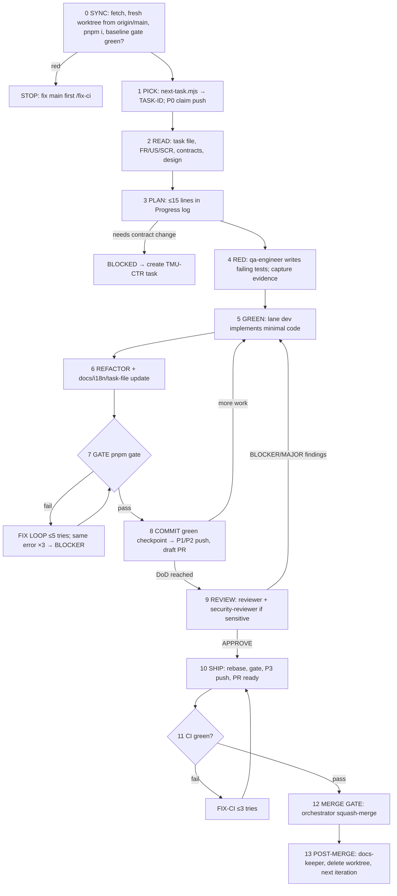

# The agent loop

This is the file agents actually read every iteration. Scheduling is deterministic code, not a
model: `scripts/next-task.mjs` reads task front-matter and prints the next runnable task; the
model only *executes* it.

| Step | Owner | Details and exit criteria |
|---|---|---|
| 0 SYNC | orchestrator | `git fetch`; new worktree from `origin/main`; `pnpm i --frozen-lockfile`; run `pnpm gate:quick`. **If red on a fresh `main`: stop the loop** (`/fix-ci`). |
| 1 PICK | script + git-steward | Task chosen deterministically; status → `IN_PROGRESS`; branch created; **P0 claim push** |
| 2 READ | orchestrator | Read task, linked FR/US/SCR, relevant contracts. List files to touch; verify they are inside the lane |
| 3 PLAN | orchestrator | ≤15-line plan in the task's Progress log. If the plan needs a contract/DB/design change that is not merged → mark `BLOCKED`, open the prerequisite task, stop |
| 4 RED | qa-engineer | Tests derived from acceptance criteria; run them; record failing output ("red evidence"). No implementation yet |
| 5 GREEN | lane dev | Smallest change that makes the tests pass; run the focused tests after each edit |
| 6 REFACTOR | lane dev | Clean up, add i18n keys/docs/test-ids, update the task file |
| 7 GATE | anyone | `pnpm gate`. Every failure enters the fix loop |
| 8 COMMIT/PUSH | git-steward | Green checkpoint → Conventional Commit; push per §7.3 (P1/P2). Loop 5–8 until DoD is met |
| 9 REVIEW | reviewer (fresh context) | Writes `reviews/<ID>.md`. Any BLOCKER/MAJOR → back to step 5 (max **2** review cycles, then `needs-human`). Sensitive tasks (auth, claims, uploads, privacy) also get `security-reviewer` |
| 10 SHIP | git-steward | Rebase, re-gate, push, mark PR ready with the template filled (evidence links) |
| 11 CI | git-steward | `gh pr checks --watch`; red → `/fix-ci` (max **3** attempts) then `needs-human` |
| 12 MERGE GATE | orchestrator | Reviews the diff, labels and the CI result, then squash-merges (DEC-019: the orchestrator holds merge authority; a human may still merge). Contract/migration PRs get extra scrutiny and are stopped for a human when the change is breaking or irreversible |
| 13 POST-MERGE | docs-keeper | Task `DONE`, backlog/status/traceability/changelog updated; worktree and branch deleted; loop returns to step 0 |

## Fix loop rules

1. Read the *first* error, fix the root cause, re-run only the failing step, then the full gate.
2. Maximum **5** attempts per failing step. Compute an *error signature* (tool + rule/test name +
   file); the **same signature 3 times ⇒ blocker**.
3. Never: skip/disable a test, loosen a lint rule, add `any`/`@ts-ignore` to silence errors, or
   hand-edit generated files.
4. If a failure is in code outside the lane → blocker, do not fix it.
5. Soft time budget **60 min per task** (checkpoint note at 30). Exceeded ⇒ write a handoff note
   + push green work + stop.

## Resume protocol (new session / crash)

`git branch --show-current` → task ID → read the task file Progress log → `git status` +
`git diff --stat origin/main...HEAD` → continue at the first unfinished step (`/resume`).

## Loop safety

| Guard | Behaviour |
|---|---|
| `.agent/STOP` exists | stop immediately (create with `touch .agent/STOP`) |
| Open blocker with `blocking: all` | do not start new work |
| Same error signature ×3 | write a blocker and stop the task |
| 5 fix attempts on one step | blocker |
| 3 CI fix attempts | `needs-human` label, stop |
| Budget exceeded | handoff note, push green work, stop |
| Tree contains unexplained changes | stop and write a blocker |

## Milestone loop

When every task of a milestone is `DONE` → human runs `pnpm gate:full`, E2E, the milestone demo
checklist, updates `10-roadmap.md`, tags `m<N>-<name>`; the orchestrator starts the next
milestone.

## Running modes

**A. Interactive with Orca (recommended M0–M5):** `/next` → create the worktree in Orca →
`opencode` → `/task TMU-XXX`. Watch the diff, answer blockers, merge PRs. 2–4 lanes in parallel.

**B. Unattended headless loop (only after the loop has proven reliable):**
`scripts/agent-loop.sh` picks tasks, creates worktrees and runs `opencode run --agent
orchestrator` with hard caps. It never merges and stops at blockers, the STOP file, a non-zero
exit, or `MAX_TASKS`.
