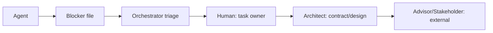

# Blockers and escalation

An agent that cannot proceed writes a blocker file and **stops that task**. Guessing is never an
option (P6).

## Blocker classes

| Class | Example | Agent action |
|---|---|---|
| `SPEC_AMBIGUITY` | FR unclear, DEC missing | Write `BLK-###` with the question, options and a recommended default; stop |
| `CONTRACT_GAP` | Endpoint field missing | Create `TMU-CTR-###`; mark the task `BLOCKED`, update `deps` |
| `ENV_FAILURE` | Docker/DB/ML container won't start | Capture logs; retry once; then blocker |
| `FLAKY_TEST` | Passes/fails randomly | Quarantine with a blocker; never retry-until-green |
| `MODEL_ISSUE` | Eval below target, model download fails | ml-dev blocker with metrics; human decides |
| `EXTERNAL_DEP` | UNAIR domains, drop-point list, OAuth credentials | Blocker labelled `needs-human`; continue unrelated tasks |
| `LOOP_STUCK` | Same error ×3 or budget exceeded | Blocker with attempts + hypotheses; push green work |

## Blocker file format

`docs/08-project/blockers/BLK-###.md`:

```markdown
---
id: BLK-001
title: Confirm UNAIR email domains for the auth allowlist
status: open            # open | resolved
class: EXTERNAL_DEP
blocking: all           # all | lane:be | task:TMU-BE-005
task: TMU-BE-005
owner: human
created: 2026-09-29
---

## Question
## Options
1. …
2. …
## Recommended default
## Evidence
## Resolution (filled when closed)
```

## Rules

1. `status: open` with `blocking: all` halts the headless loop and `/next` from starting new work.
2. A blocker always names a concrete question, options, and a recommended default — not "it does
   not work".
3. The blocked task's `status` becomes `BLOCKED`; its `deps` may gain the prerequisite task.
4. Resolution is recorded in the file and in `docs/08-project/decisions-log.md` if it changed a
   decision.
5. The human answers by editing the blocker (or by creating a DEC/ADR) and marking it `resolved`.

## Escalation ladder



- Time sensitivity: `blocking: all` gets a human ping immediately; lane blockers are batched.
- If the same class of blocker recurs 3 times, it becomes a process task (docs/ops lane).

## Blocker hygiene

- One question per file; split unrelated questions.
- Link the task, the doc, and the exact line that is ambiguous.
- Update the blocker if the situation changes; do not open duplicates.
- When resolved, record what was decided and which docs were updated.
