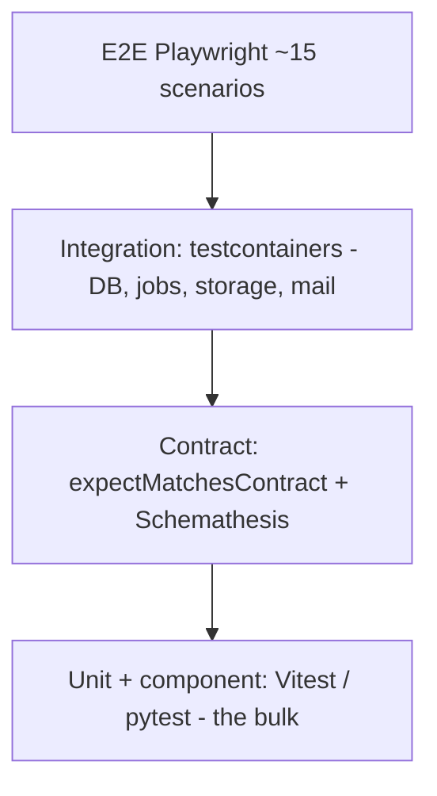

# Test strategy

## Pyramid

| Layer | Scope | Tools | Runs in |
|---|---|---|---|
| Unit | pure logic, state transitions, validators, mappers | Vitest, pytest | `pnpm gate` (quick) |
| Component | every UI state, a11y (axe), keyboard | Vitest + Testing Library + jest-axe | quick |
| Integration | services + real Postgres/MinIO/Mailpit | Vitest + testcontainers | `gate:full` + CI |
| Contract | response shapes, OpenAPI fuzz (web + ML) | `expectMatchesContract`, Schemathesis | full + CI |
| E2E | user journeys with `ML_MODE=stub` | Playwright | full + CI |

## Coverage targets

| Area | Target |
|---|---|
| `server/services/**` | 90% lines, 100% state-machine branches |
| Route handlers | one contract test per endpoint per auth class |
| Jobs | idempotency test per queue |
| Components | every `FE-06` state rendered |
| Repositories | via integration tests |

Coverage is a floor, not a goal; untested branches need a commented reason in the review file.

## Ownership of tests

| Situation | Owner |
|---|---|
| New behaviour in a task | qa-engineer writes red tests inside the task branch (step 4) |
| QA lane tasks | qa-engineer (E2E, fixtures, audits) |
| Test-only refactors | qa-engineer |

Developers may extend tests while going green but may not weaken them.

## Fixtures and data

- Synthetic only: `Pengguna Contoh`, `example.test` emails, generated images (CC0) in
  `tests/fixtures/`.
- Seeds for demo (`/seed-demo`) are separate from test fixtures.
- ML fixtures live in `tests/fixtures/ml/<split>/…` with `labels.csv`.
- No real people, no real UNAIR data, no real KTM/ATM numbers (synthetic or redacted).

## Determinism

| Source of flakiness | Control |
|---|---|
| Time | injectable clock; fixed timestamps in tests |
| ML models | `ML_MODE=stub` with fixed vectors |
| Random ids | UUIDv7 with a seeded clock in tests |
| Network | MSW in frontend tests; testcontainers locally |
| Async jobs | run handlers synchronously in tests; integration queues for job tests |
| Animations | reduced-motion in Playwright config |

## Flake policy

1. A test that fails intermittently is quarantined with a blocker file (never retry-until-green).
2. Quarantined tests are fixed within the same milestone or deleted with a decision note.
3. CI re-runs infra-caused failures once; a second failure is treated as a real failure.

## Performance and security testing

| Test | Tool | When |
|---|---|---|
| API p95 budgets | perf script / k6 (optional) | M8 |
| Bundle size | build check | `gate:full` |
| Lighthouse LCP | Lighthouse CI | M8 |
| Dependency audit | `pnpm audit`, `pip-audit` | advisory in CI |
| Secret scan | gitleaks | pre-commit + CI |
| OpenAPI fuzz | Schemathesis (web + ML) | `gate:full` |

## Reporting

- Test cases: `docs/06-quality/02-test-cases/TC-<MOD>-###.md`, mapped to FRs and automated paths.
- E2E list: `03-e2e-scenarios.md`.
- Coverage snapshots per milestone in `status.md`.
- ML eval: `10-ml-eval-report-<date>.md`.
